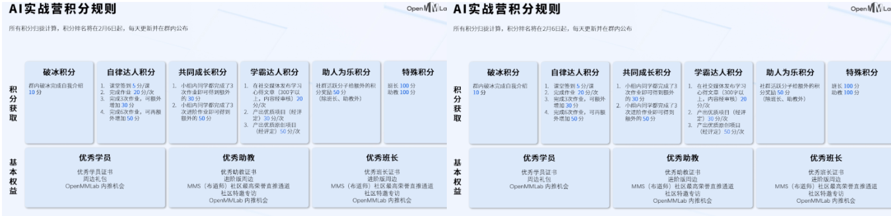

# OpenMMlab实战营

## 第五次课2023.2.7

此次实战营的积分规则介绍：

## 学习参考

笔记建议结合ppt来学习使用，ppt中对应知识可以参照笔记的标题进行查看。

ppt（ppt_03的后半部分）：[lesson5_ppt](https://github.com/lyc686/OpenMMlab_AI_2023.2/blob/main/ppt/03%20%E7%9B%AE%E6%A0%87%E6%A3%80%E6%B5%8B%E4%B8%8EMMDetection.pdf)

b站回放：[OpenMMLab AI 实战营](https://space.bilibili.com/1293512903/channel/collectiondetail?sid=1068652)

往期笔记：[笔记回顾](https://github.com/lyc686/OpenMMlab_AI_2023.2/tree/main/OpenMMlab_notes)

相关学习推荐：

* 同济子豪兄（大佬）：[子豪兄b站主页](https://space.bilibili.com/1900783?spm_id_from=333.337.0.0)
* OpenMMlab主页：[OpenMMla主页](https://space.bilibili.com/1293512903)
* OpenMMlab Github仓库链接：[Github OpenMMlab](https://github.com/open-mmlab)

* MMDetection Github仓库链接：[Github MMDetection](https://github.com/open-mmlab/mmdetection)

* OpenMMlab 此次AI实战营的仓库：[AI实战营github](https://github.com/open-mmlab/OpenMMLabCamp)

## 上课内容总结

本次课程主要讲解了OpenMMlab开源体系中的MMDetection目标检测相关的知识，以及如何完整的进行一次自己的目标检测任务。

主要分为一下几个方面的内容：

* MMDetection的环境搭建
  * 下载mim工具包
  * 通过mim下载mmdet
  * 在configs目录下下载实验所需模型
* 通过api函数测试一张图片的目标检测效果
  * init_model：加载预训练模型
  * inference_model：执行推理
* 通过修改.py配置文件进行对特定数据集进行迁移学习
  * 修改data部分
    * 数据集的路径（json文件）
  * 修改model部分
    * 分类头数量
    * 添加预训练参数
  * 修改优化器部分
    * 学习率根据实际使用的gpu数量进行合理调整
    * epoch大小（通常由于预训练epoch都比较大，所以我们迁移学习epoch通常小一点就可以达到比较好的训练结果）
    * 打印日志的频次
* COCO数据集的json文件格式讲解
  * images：图像的信息
  * annotations：所有标注信息存储在一个列表中，每个标注对应图像上一个物体标注
  * categories：所有类别信息
* 最后还介绍了一些MMDetection中的常用训练策略
  * 随机裁剪的使用
  * 学习率升温、退火策略
