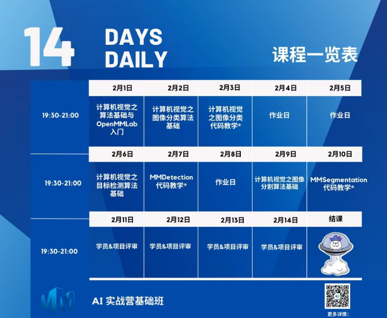
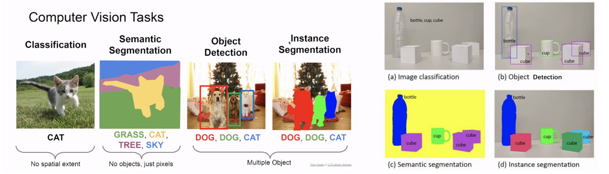
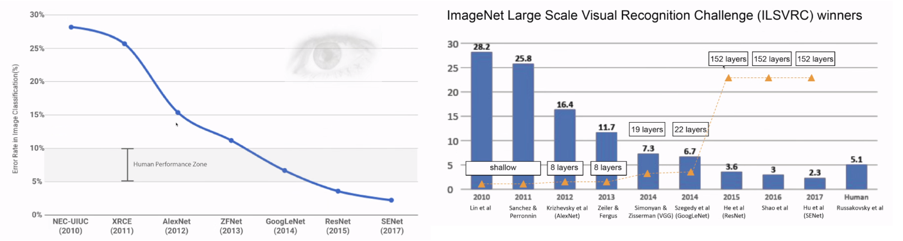
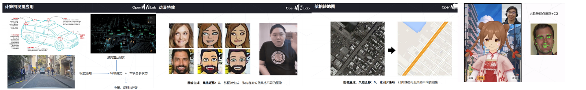
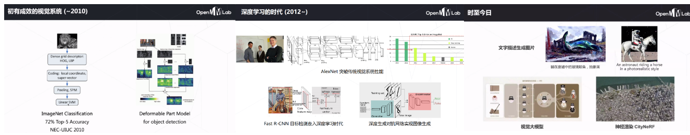
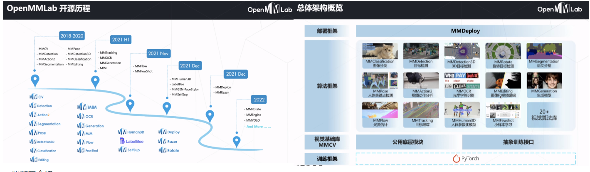
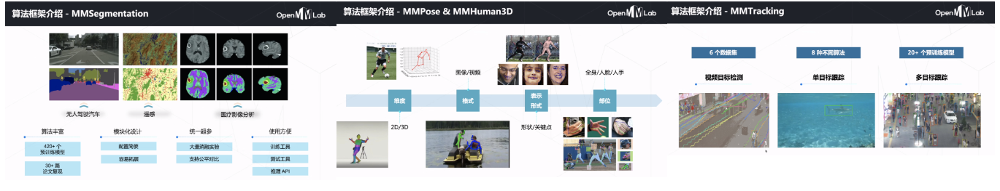
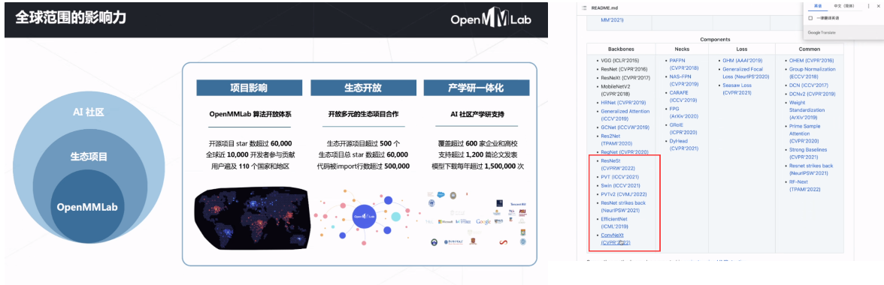

# OpenMMlab实战营

## 第一次课2023.2.1

此次实战营的任务安排：

## 学习参考

笔记建议结合ppt来学习使用，ppt中对应知识可以参照笔记的标题进行查看。

ppt：[lesson1_ppt](https://github.com/lyc686/OpenMMlab_AI_2023.2/blob/main/ppt/01%20%E8%AE%A1%E7%AE%97%E6%9C%BA%E8%A7%86%E8%A7%89%E7%AE%97%E6%B3%95%E5%9F%BA%E7%A1%80%E4%B8%8EOpenMMLab%E4%BB%8B%E7%BB%8D.pdf)

b站回放：[OpenMMLab AI 实战营](https://space.bilibili.com/1293512903/channel/collectiondetail?sid=1068652)

相关学习推荐：

* 同济子豪兄（大佬）：[子豪兄b站主页](https://space.bilibili.com/1900783?spm_id_from=333.337.0.0)
* OpenMMlab主页：[OpenMMla主页](https://space.bilibili.com/1293512903)
* OpenMMlab Github仓库链接：[Github OpenMMlab](https://github.com/open-mmlab)

## 一、计算机视觉领域的应用

### 1.从大的角度来分

1. 图像分类、
2. 图像检测、
3. 图像分割、
4. 较少用的Localization(把一个物体分出来)

下面的图示展示的就是一些用具体表现出来的应用场景。

### 2.从像素层面

**像素粒度**：又叫做--细粒度 / 与位置有关的精细粒度

1. 语义分割（不管像素重叠，也不区分单个物体）、
2. 实例分割（区分单个物体）
3. 此外还有关键点检测

更形象的看一下具体应用场景如下图所示：

### 3.历史发展

根据下面的统计图表我们可以看到随着2012年`Alexnet`的问世，深度学习逐渐发展，我们的模型训练**损失**逐渐下降，模型的层数也越来越深，模型逐渐变成了我们无法简单解释的**黑盒子**。

### 4.具体的应用领域

深度神经网络在不同的处理任务中就对应了不同的模型（RNN/Transformer/GNN等等），而且在许多领域不单单是使用了视觉，例如**无人驾驶领域**除了视觉还要综合各种传感器等等。

一些具体的应用领域例如：

* 无人驾驶
* 图像生成、风格迁移
* 航拍转地图
* 虚拟主播
* 甚至在**视频**中，我们如何剪辑出我们需要的部分区域，或者时间点也是视觉可以考虑的问题。

### 5.视觉系统的发展

* 初期的特征是人为给定的，告诉机器什么是可以学习的特征，让机器去学习
* 2012年之后的深度学习时代，人们就开始让机器去自己学习特征
* 到现在：用海量数据，非常深，参数非常多的大模型不断出现。

## 二、OpenMMlab发展

### 1.发展历程

下图所示的就是OpenMMlab的一些发展历程，可以看到OpenMMlab也是从最开始非常有限的函数功能，到现在能够包揽20+的视觉算法库。

### 2.OpenMMlab的算法框架

OpenMMlab包括有非常丰富的算法框架能够解决一系列的问题，例如：

* **MMDetection**（目标检测、实例分割、全景分隔）
* **MMDetection3D**（3D目标检测）
*  **MMClassification**（图像分类）
* **MMSegmentation**（语义分割）
* **MMPose & MMHuman3D**（姿态检测）
* **MMTracking**（目标追踪）
* **MMAction2**（行为识别）
* **MMOCR**（文本检测）
* 等等

下面给出了一部分的截图示例：

### 3.使用OpenMMlab的便利

1. 对于自己的数据集我们可以直接使用OpenMMlab中的算法来进行操作。可以看到里面的复现了很多最新论文的方法。OpenMMlab是基于pytorch的，但又不完全基于原生pytorch，因为有很多新方法仅靠pytorch无法完成。作为开发者我们仅需会**调包**即可。底层的内容如果不是做版本升级不是很需要学习。

2. 在OpenMMlab的官网或者github中给出的其实就是该领域中的**必读论文**，我们也可以不去读综述。

## 三、机器学习与神经网络

### 1.相关知识介绍

这一部分主要讲解了以下几方面内容，比较基础我就不展开来分析了：

* 什么是**机器学习**（从数据中学习经，已解决特定问题），
* 机器学习的**基本流程**（训练、验证、应用）、
* 简单的**分类问题**（从数据中学习）、
* **神经网络**的基本概念（线性分类器、非线性分类器）、
* 神经网络的**损失函数**（交叉熵损失函数）、
* **梯度下降法**（反向传播、Adam优化器、batch大小）、
* **卷积神经网络**的相关知识（局部连接、参数共享、池化、激活函数）

### 2.研究方向推荐

