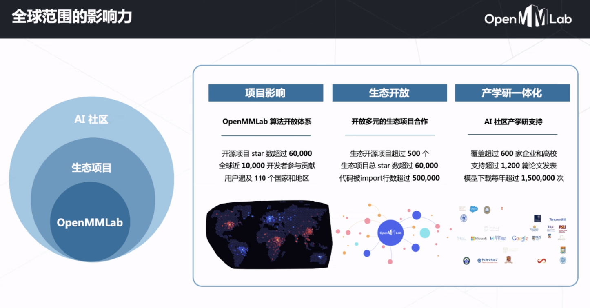

# OpenMMlab实战营

## 第一次课2023.2.1

图像分类、图像检测、图像分割、较少用的Localization(把一个物体分出来)

像素层面：语义分割（不管像素重叠，也不区分单个物体）、实例分割（区分单个物体）

此外还有关键点检测

更形象的看一下

像素粒度：细粒度 / 与位置有关的精细力度

深度神经网络在不同的处理任务中就对应了不同的模型（RNN/Transformer/GNN等等）

除了视觉还要综合各种传感器等等。

在视频的理解中，我们如何剪辑出我们需要的部分，或者时间点。

初期的特征是人为给定的

2012年之后的深度学习时代，人们就开始让机器去自己学

到现在：用海量数据，非常深，参数非常多的大模型不断出现。

我们可以做什么

OpenMMlab发展

一些部署介绍

一些OpenMMlab的算法框架

对于自己的数据集我们可以直接使用OpenMMlab中的算法来进行操作。可以看到里面的复现了很多最新论文的方法。

OpenMMlab是基于pytorch的，但又不完全基于原生pytorch，因为有很多新方法仅靠pytorch无法完成。

作为开发者我们仅需会掉包即可。

底层的内容如果不是做版本升级不是很需要学习。

在OpenMMlab的官网或者github中给出的其实就是该领域中的必读论文，我们也可以不去读综述。

机器学习与神经网络的简介

大道至简都是从数据出发去分类去挖掘去检测

机器学习的基本流程：

通常batch取2的指数次方

神经网络+CNN介绍了一会

研究方向推荐：

