# OpenMMlab实战营

## 第四次课2023.2.6

此次实战营的积分规则介绍：

## 学习参考

笔记建议结合ppt来学习使用，ppt中对应知识可以参照笔记的标题进行查看。

ppt：[lesson4_ppt](https://github.com/lyc686/OpenMMlab_AI_2023.2/blob/main/ppt/03%20%E7%9B%AE%E6%A0%87%E6%A3%80%E6%B5%8B%E4%B8%8EMMDetection.pdf)

b站回放：[OpenMMLab AI 实战营](https://space.bilibili.com/1293512903/channel/collectiondetail?sid=1068652)

往期笔记：[笔记回顾](https://github.com/lyc686/OpenMMlab_AI_2023.2/tree/main/OpenMMlab_notes)

相关学习推荐：

* 同济子豪兄（大佬）：[子豪兄b站主页](https://space.bilibili.com/1900783?spm_id_from=333.337.0.0)
* OpenMMlab主页：[OpenMMla主页](https://space.bilibili.com/1293512903)
* OpenMMlab Github仓库链接：[Github OpenMMlab](https://github.com/open-mmlab)

* MMDetection Github仓库链接：[Github MMDetection](https://github.com/open-mmlab/mmdetection)

* OpenMMlab 此次AI实战营的仓库：[AI实战营github](https://github.com/open-mmlab/OpenMMLabCamp)

## 一、什么是目标检测

与分类问题不同，目标检测的**目标**是在检测图像中物体类别的同时用**矩形框**狂出所有感兴趣的物体。

例如：

* 相机中的人脸拍照识别，就需要先把人脸识别出来
* 智慧城市，垃圾检测、违章停车检测、危险行为检测等等
* 自动驾驶，环境感知、路线规划与控制

### 1.目标检测下游视觉任务

目标检测的一些具体的下游任务，例如：

* 两阶段光学字符识别算法
  * 首先检测出文字出现的区域
  * 识别区域中的文子
* 两阶段人体姿态估计算法
  * 人体检测（把图像中的人框出来）
  * 单人姿态估计（具体分析每个人的姿态是什么样的）

### 2.图像分类 v.s. 目标检测

我们从下表所示的**不同点**与**相同点**的角度来比较图像分类与目标检测：

|        |                     图像分类                     |                     目标检测                     |
| :----: | :----------------------------------------------: | :----------------------------------------------: |
|        |                 通常只有一个物体                 |                  物体数量不固定                  |
| 不同点 |                 通常位于图像中央                 |                  物体位置不固定                  |
|        |                 通产占据主要面积                 |                  物体大小不固定                  |
| 相同点 | 需要算法“理解”图像的内容（即，深度神经网络实现） | 需要算法“理解”图像的内容（即，深度神经网络实现） |

## 二、目标检测实现

### 1.滑窗 Sliding Window

* 首先，设定一个固定大小的窗口
* 其次，遍历图像所有位置，所到之处使用已经训练好的分类模型，识别窗口的内容
* 为了检测不同大小、不同形状的物体，可以使用不同大小、长宽比的窗口来扫描图片

也就是下图所示的，我们通过窗口获取图像中一个区域的内容，然后将该区域的图像传入一个例如卷积神经网络去预测里面是什么东西，下图所示的窗口中没有任何物体，所有返回类别**“背景”**。随着窗口的滑动，我们的预测类别会有所不同。

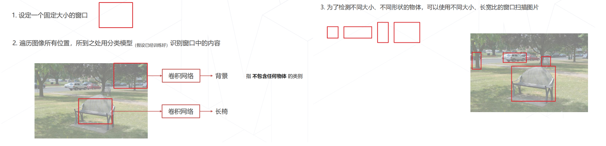

### 2.滑窗的效率问题

计算成本过于大，如下图所示：

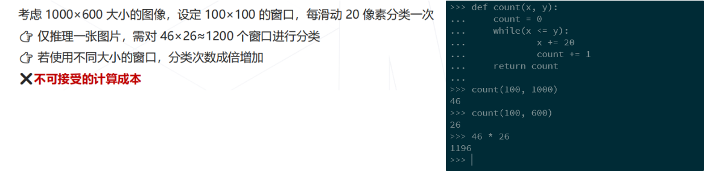

这1200个窗口都需要分别放入神经网络中去进行**前向预测**，所以计算量非常大。

### 3.改进思路

* 使用启发式算法替换暴力遍历
  * 例如 R-CNN，Fast R-CNN 中使用 Selective Search 产生提议框
  * 依赖外部算法，系统实现复杂，难以联合优化性能
* 减少冗余计算，使用卷积网络实现密集预测
  * **目前普遍采用的方式**

基于第二种改进的思路我们可以做这样的分析，如果两个窗口之间有重合的部分，能否设计一些算法使其避免计算重复部分。

#### （1）消除滑窗中的重复计算

思路：**用卷积一次性计算所有特征，再取出对应位置的特征完成分类**

解释：

* 首先使用两层的卷积层提取出**整张图片**的特征图
* 然后窗口扫到那一部分，就从第二层的卷积层中取出**相应区域的特征图**后续实现分类任务
* 效果就是可以避免一些重叠区域重复计算特征（提前一次性全算好，随用随取）
  * 原图滑窗 👉 重叠区域重复计算卷积 ❌
  * 特征图滑窗 👉 重叠区域只计算一次卷积特征，与窗的个数无关 ✔️

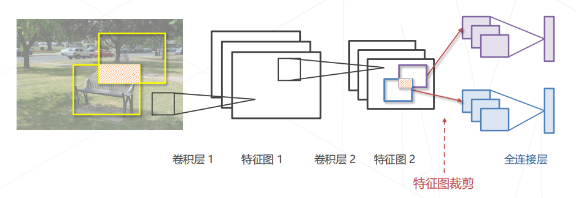

#### （2）在特征图上进行密集预测

思路：把特征图中某一个位置的特征取出来（由不同卷积核基于同一个感受野计算出来），随着**卷积核**的移动（卷积操作）由于**步长**（stride）的存在，我们的原图会在卷积核的平移过程中自然形成一系列**等距离分布的窗**。不同的窗产生了不同的特征，我们将不同的窗卷积之后产生的**特征**放入**线性分类器**去生产一个C+1维的概率向量来完成分类（+1的原因是考虑区域中可能没有物体，即背景）

解释：在上面通过**卷积**操作实现的**隐式的滑窗**的基础上，通过1x1的卷积实现维度变换，最终得到一个C+1维的概率图，使得计算效率远高于滑窗的一般实现。

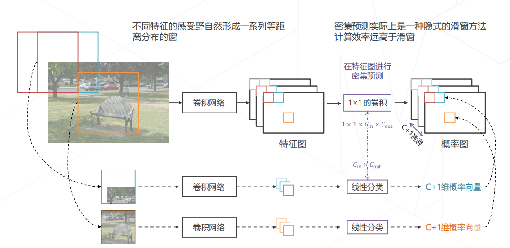

#### （3）目标检测的基本范式

* 两阶段方法
  * 基于区域的方法
  * 以某种方式产生窗，再基于窗口内的特征进行预测
* 单价段方法
  * 在特征图上基于单点特征实现密集预测
  * 隐式的滑窗

其中用于将原图计算出特征图的部分称为**主干网络（Backbone）**，从特征图计算特定区域（滑窗区域）的部分称为**检测头（Head）**。

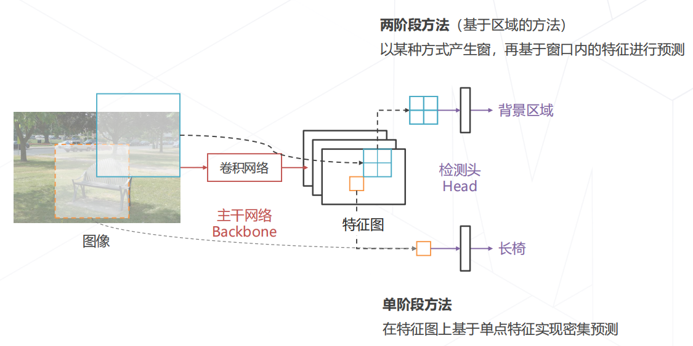

### 4.目标检测技术的演进

直接上图

这里子豪兄有推荐yolo v5是已经经过开源检测的模型，所以yolo系列推荐使用v5

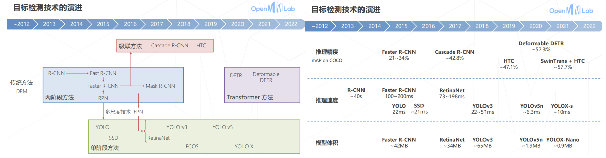

## 三、基础知识

### 1.框，边界框（Bounding Box）

#### （1）定义

**框**泛指图像上的**矩形框**，边界横平竖直

描述一个框需要 4 个像素值：

* 方式1：左上右下边界坐标 (𝑙,𝑡, 𝑟, 𝑏)

* 方式2：中心坐标和框的长宽(𝑥, 𝑦, 𝑤, ℎ)

**边界框**通常指紧密包围感兴趣物体的框（框的边界和图像平行，除非有一些特殊的旋转框）

检测任务要求为图中出现的每个物体预测一个边界框

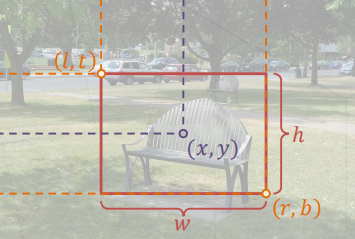

#### （2）常见概念

以下这些概念都指某种框，用在不同的上下文中：

1. 区域（Region）：框的同义词

2. 区域提议（Region Proposal，Proposal）：指算法预测的**可能包含**物体的框，某种识别能力不强的算法的初步预测结果

3. 感兴趣区域（Region of Interest，RoI）：当我们谈论需要进一步检测这个框中是否有物体时，通常称框为感兴趣区域

4. 锚框（Anchor Box，Anchor）：图中预设的一系列基准框，类似滑窗，一些检测算法会基于锚框预测边界框

#### （3）交并比 Intersection Over Unio

**交并比**（IoU）：两矩形框**交集面积**与**并集面积**之比，是矩形框**重合程度**的衡量指标

交并比∈[0, 1]

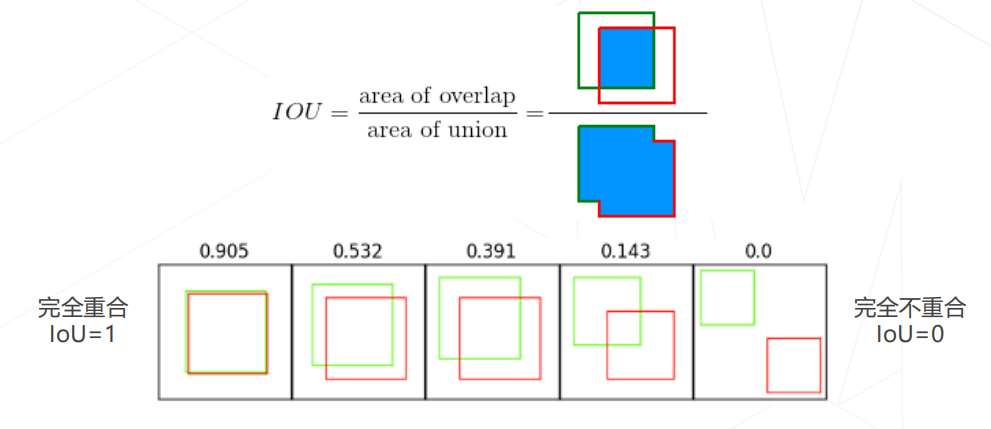

#### （4）置信度 Confidence Score

**置信度**（Confidence Score）：模型认可自身预测结果的程度，通常需要为每个框预测一个置信度

* 大部分算法取分类模型预测物体属于特定类别的概率

* 部分算法让模型独立于分类单独预测一个置信度

我们倾向认可置信度高的预测结果：

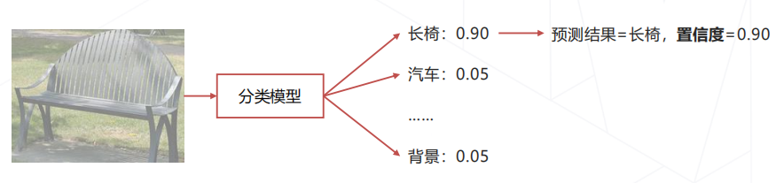

#### （5）非极大值抑制 Non-Maximum Suppression

滑窗类算法通常会在物体周围给出**多个相近的检测框**，这些框实际指向同一物体，只需要保留其中置信度最高的

通过非极大值抑制（NMS）**算法实现**：

**输入**：检测器产生的一系列检测框 𝐵 = {𝐵1, … , 𝐵𝑛 }及对应的置信度

𝑠 = {𝑠1, … , 𝑠𝑛} ，IoU 阈值 𝑡（通常0.7）

**步骤**：

1. 初始化结果集 𝑅 = ∅

2. 重复直至 𝐵 为空集

   * 找出 𝐵 中置信度最大的框 𝐵𝑖 并加入 𝑅

   *  从 𝐵 中删除 𝐵𝑖 以及与 𝐵𝑖 交并比大于 𝑡 的框

**输出**：结果集 𝑅

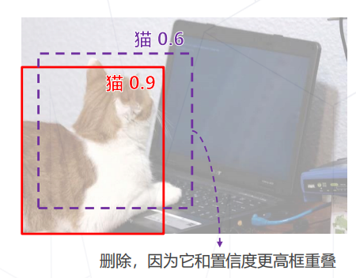

#### （6）边界框回归 Bounding Box Regression

**问题**

滑窗（或其他方式产生的基准框）与物体**精准边界**（回归问题）通常有偏差

**处理方法**

让模型在预测物体类别同时预测边界框相对于滑窗的**偏移量**，通常采用**多任务学习**：

同时对于提取的滑窗区域内的图像提取特征后进行分类任务和回归任务，然后将两个损失同时处理（也许求和），然后用于反向传播梯度下降。

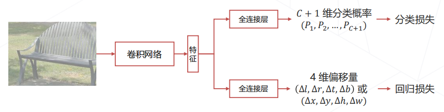

#### （7）边界框编码 Bbox Coding

**直观上理解：**

* 回归任务相较于分类任务比较难

* 边界框的绝对偏移量在数值上通常较大，不利于神经网络训练，通常需要对偏移量进行编码，作为回归模型的预测目标

**通常的方法：**

* 通常进行一些归一化或者对数尺度的归一化
* 让计算机使用编码后的结果（归一化后的结果）进行计算效率比较高
* 解码的时候再逆向使用编码的公式求回去，绘制编码框

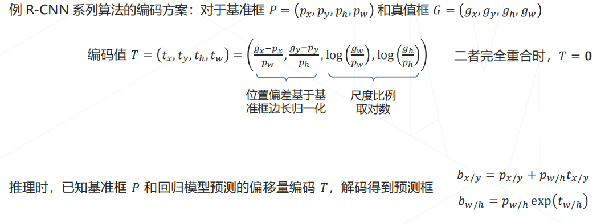

## 四、两阶段目标检测算法

### 1.两阶段算法的概述

直接上图

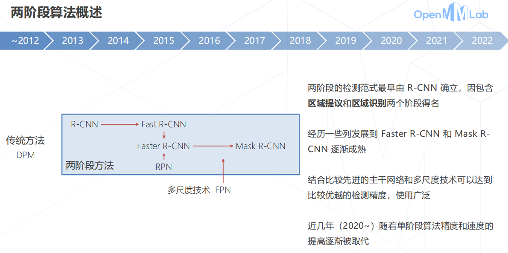

### 2.Region-based CNN (2013)

#### （1）R-CNN思路

**一阶段：**产生提议框

* 使用传统视觉算法，推测可能包含物体的框（约2000个）

* ✔️不漏：真正包含物体的框通常会被选中

* ❌不准：大部分大部分提议框并不包含物体

**二阶段：**识别提议框

* 将提议框内的图像缩放至固定大小（原始论文 227×227）

* 送入卷积网络进一步识别，得到准确结果

#### （2）R-CNN训练

直接上图

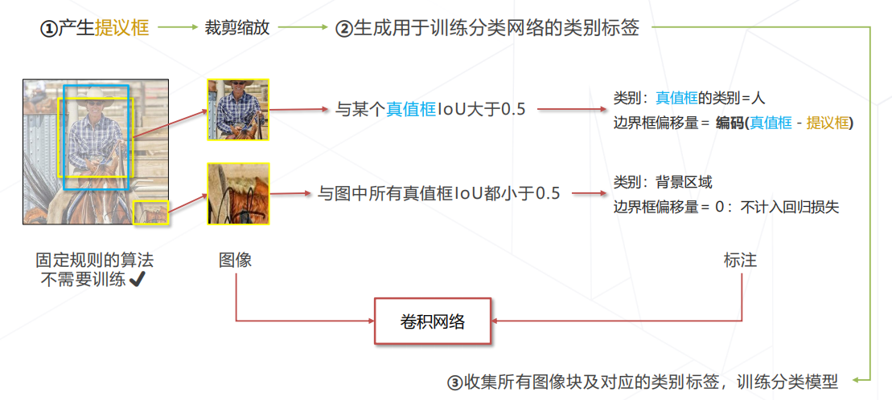

#### （3）R-CNN 的问题

**`慢`**：区域提议一般产生 2000 个框，每个框都需要送入 CNN 前传，推理一张图要几秒至几十秒

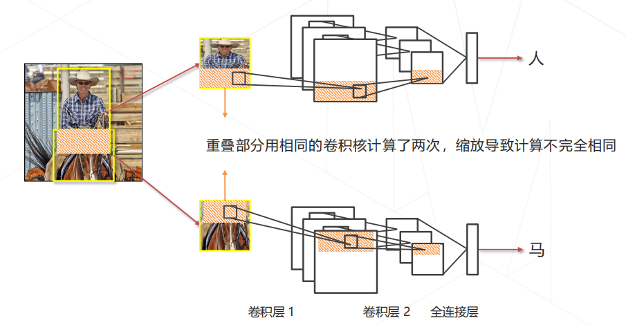

### 3.Fast R-CNN (2014)

➢ 改进 R-CNN：减少重复计算✔️

#### （1）Fast R-CNN思路

**一阶段：**产生提议框

* 仍然依赖传统CV方法

**二阶段：**识别提议框

* 卷积层应用于全图，一次性计算所有位置的图像特征
* 剪裁提议框对应的特征图送入全连接层计算分类

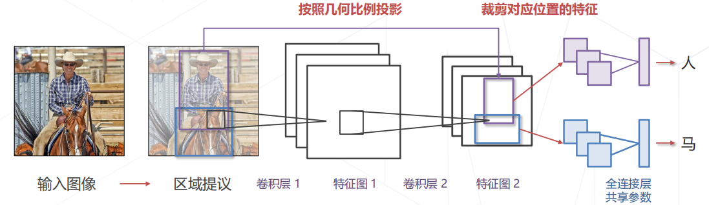

**`问题`：**提议框大小不同，需要处理成**固定尺寸**才能送入**全连接层**

#### （2）RoI Pooling

**目标**：将不同尺寸的提议框处理成相同尺寸，使之可以送入后续的全连接层计算分类和回归

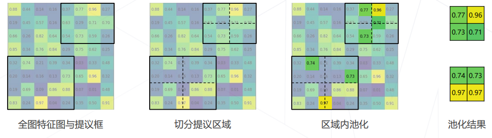

**算法**：

1. 将**提议框**切分成**固定数目**的格子（上图中 2×2，实际常用 7×7，对齐ResNet等经典结构）

2. 如果格子边界不在整数坐标，则膨胀至整数坐标

3. 在每个格子内部池化，得到**固定尺寸**的输出特征图

#### （3）RoI Align

**RoI Align 比 RoI Pooling 在位置上更精细**

* 将提议区域切成固定数目的格子，例如 7×7

* 在每个格子中，均匀选取若干采样点，如 2×2=4 个
* **通过插值方法得到每个采样点处的精确特征**
* 所有采样点做 Pooling 得到输出结果

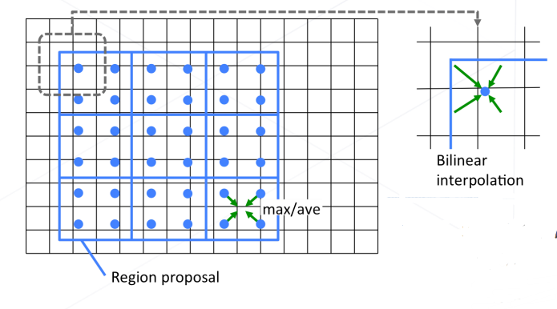

#### （4）Fast R-CNN 的训练

➢ **多任务学习、端到端训练**

直接上图

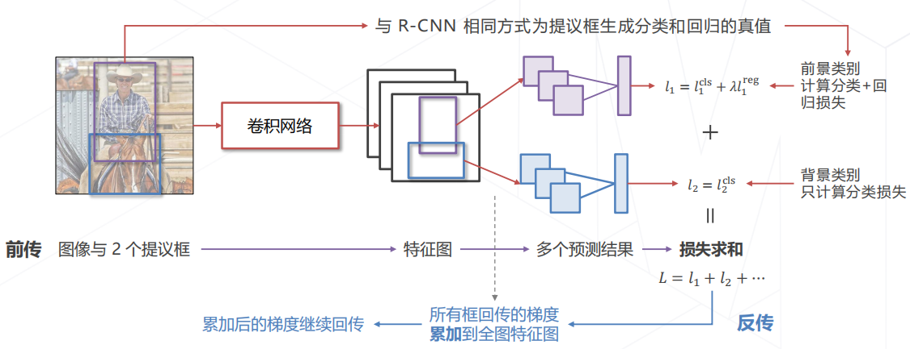

### 3.朴素方法的局限

上面提到的都是基于滑窗思想的朴素方法（最后都是一个**二分类器**），这会带来的局限就是当我们的图像

1. 图中有不同大小的物体，区域提议算法需要产生不同尺寸的提议框，以适应不同尺寸的物体

2. 物体可能有一定程度重合，区域提议算法要有能力在同一位置产生不同尺寸的提议框，以适应重合的情况（框中既有人也有摩托车，那么识别为哪一类呢）

下面两张图分别对应了两个问题

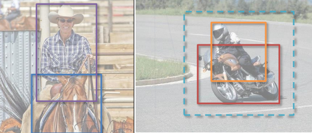

#### （1）锚框 Anchor

在原图上设置不同尺寸的基准框，称为**锚框**，基于特征独立预测**每个锚框**中是否包含物体

* 可以生成不同尺寸的提议框

* 可以在同一位置生成多个提议框覆盖不同物体

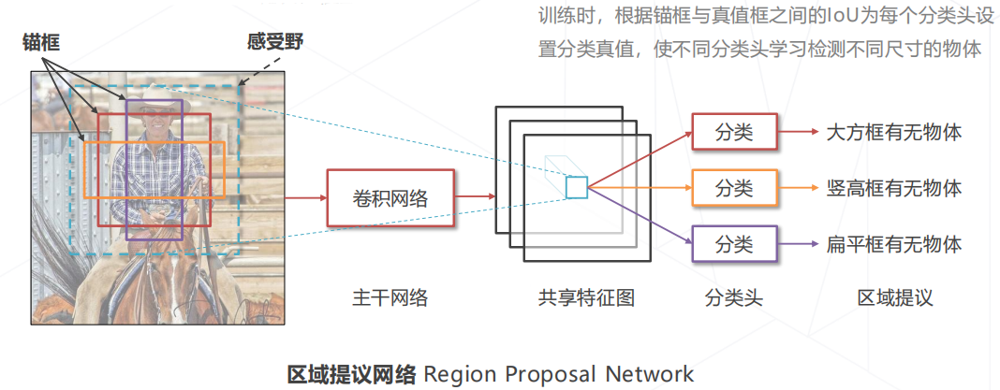

### 4.Faster R-CNN (2015)

#### （1）Faster R-CNN (2015)思路

➢ Faster R-CNN **=** RPN **+** Fast R-CNN **二者共享主干网络和特征**

直接上图

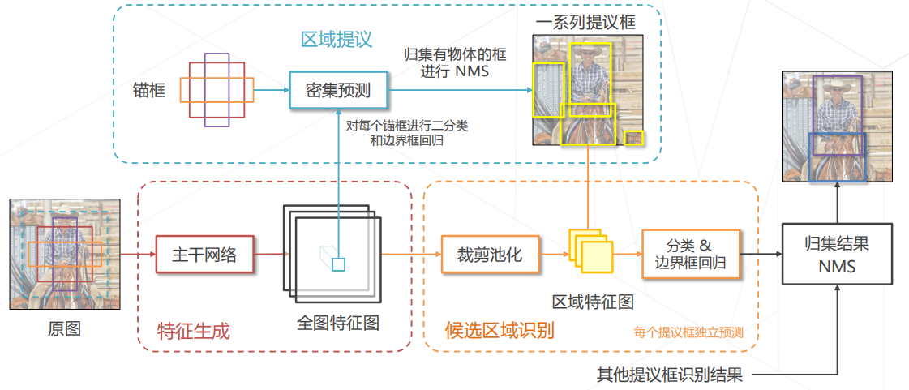

#### （2）Faster R-CNN (2015)训练

➢ **联合学习 RPN 与 Fast R-CNN**

注：为锚框和预测框产生分类和回归真值的方法与 R-CNN相同，即基于 IoU 为锚框和预测框匹配真值框

直接上图

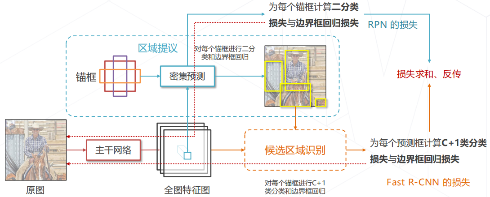

### 5.两阶段方法的发展与演进 (2013~2017)

直接上图

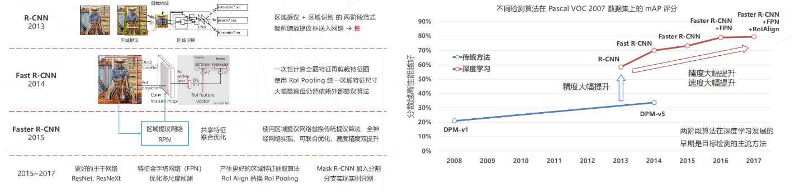

## 五、多尺度检测技术

### 1.多尺度检测技术的提出

图像中物体大小可能有很大差异 (10 px ~ 500 px) 

多尺度技术出现之前，模型多基于单级特征图进行预测，通常为主干网络的倒数第二层，受限于结构（感受野）和锚框的尺寸范围，只擅长中等大小的物体。另一方面，高层特征图经过多次采样，位置信息逐层丢失，小物体检测能力较弱，定位精度较低。

### 2.图像金字塔 Image Pyramid

由于卷积操作会使得图像逐渐变小，卷积核所包含的信息越来越全局。所以提取的特征会越来越**具体**，越来越具有**语义特征**。

而**图像金字塔**就是基于卷积操作的这种特性提出来的：

* 将图像缩放到不同大小，形成图像金字塔

* 检测算法在不同大小图像上即可检测出不同大小物体
* **优势**：算法不经改动可以适应不同尺度的物体
* **劣势**：计算成本成倍增加
* 可用于模型集成等不在意计算成本的情况

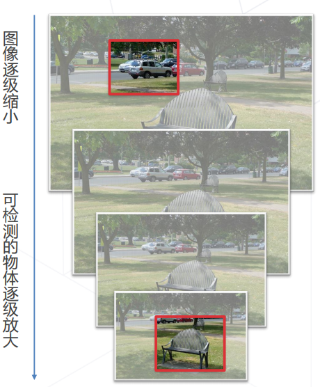

### 3.层次化特征

基于主干网络自身产生的多级特征图产生预测结果

由于不同层的感受大小不同，因此不同层级的特征天然适用于检测不同尺寸的物体

* **优势**：计算成本低

* **劣势**：**低层特征抽象级别不够**，预测物体比较困难

* **改进思路：**高层次特征包含足够抽象语义信息。将

* 高层特征融入低层特征，补充低层特征的语义信息

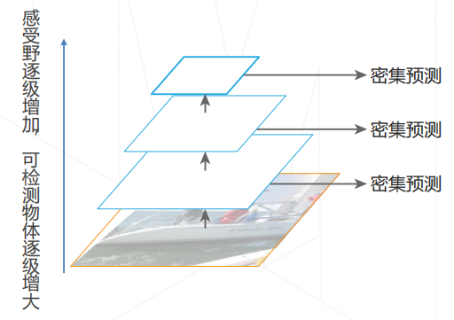

### 4.特征金字塔网络 Feature Pyramid Network (2016)

* **改进思路**：高层次特征包含足够抽象语义信息。将高层特征融入低层特征，补充低层特征的语义信息

* **融合方法**：特征求和

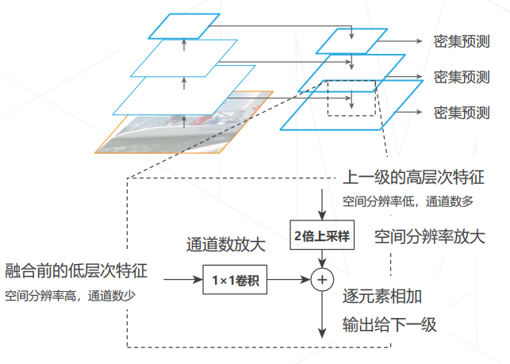

### 5.在 Faster R-CNN 模型中使用 FPN

直接上图

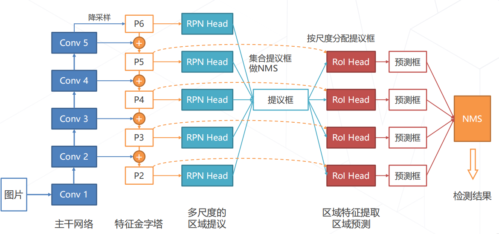

## 六、单阶段目标检测算法

### 1.单阶段算法的概述

直接上图，在单阶段的目标检测算法中最成功的就是YOLO。

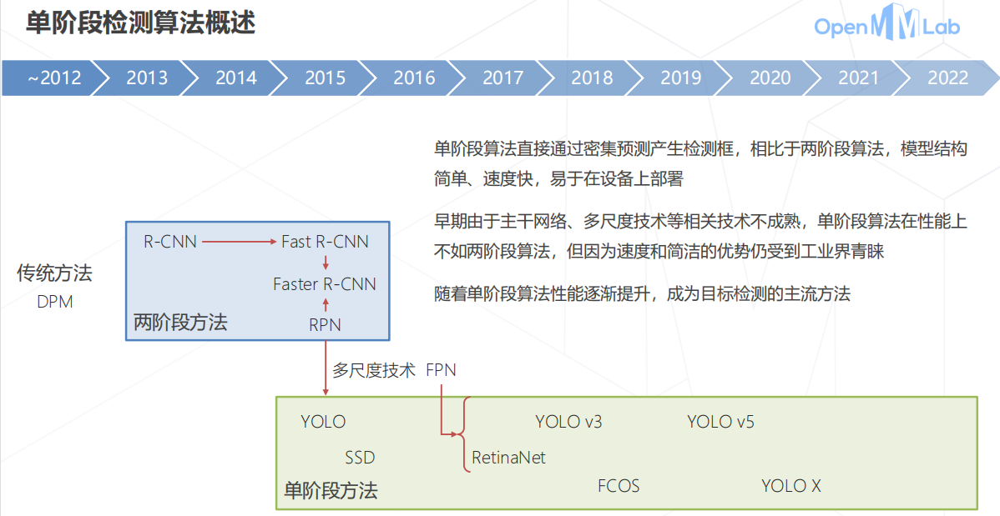

### 2.**YOLO: You Only Look Once (2015)** 

#### （1）YOLO(2015)思想

最早的单阶段算法之一

* **主干网络**：自行设计的 DarkNet 结构，产生 7×7×1024 维的特征图

* **检测头**：2 层全连接层产生 7×7 组预测结果，对应图中 7×7 个空间位置上物体的类别和边界框的位置
* 最终不只是判断出该区域是否有物体，而且能够预测出是什么物体

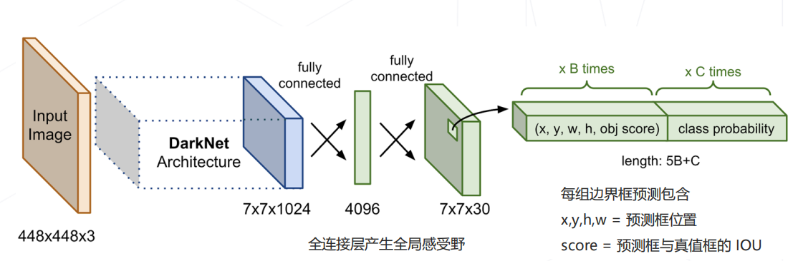

#### （2）优缺点：

* 优点
  *  **`快！`**在Pascal VOC 数据集上，使用自己设计的 DarkNet 结构可以达到实时速度，使用相同的 VGG可以达到 3 倍于 Faster R-CNN 的速度
  * 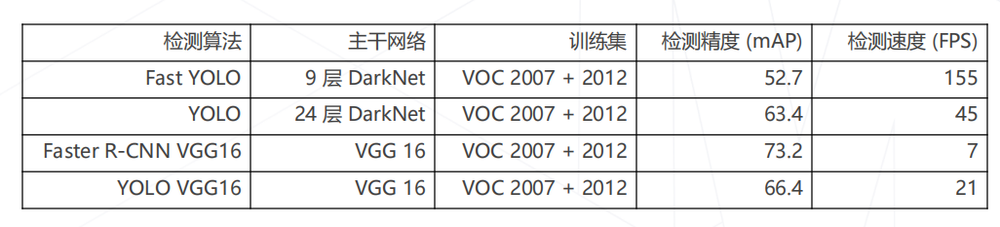
* 缺点
  * 由于每个格子只能预测 1 个物体，因此对重叠物体、尤其是大量重叠的小物体容易产生漏检
  * 直接回归边界框有难度，回归误差较大，YOLO v2 开始使用锚框
  * 对于小目标的检测效果可能比较差

### 3.**SSD: Single Shot MultiBox Detector (2016)** 

#### （1）SSD思想

同期的另一个单阶段目标检测算法：

* **主干网络**：使用 VGG + 额外卷积层，产生 11 级特征图

* **检测头**：在 **6 级特征图**上，使用密集预测的方法，产生所有位置、不同尺度、所有**锚框**的预测结果

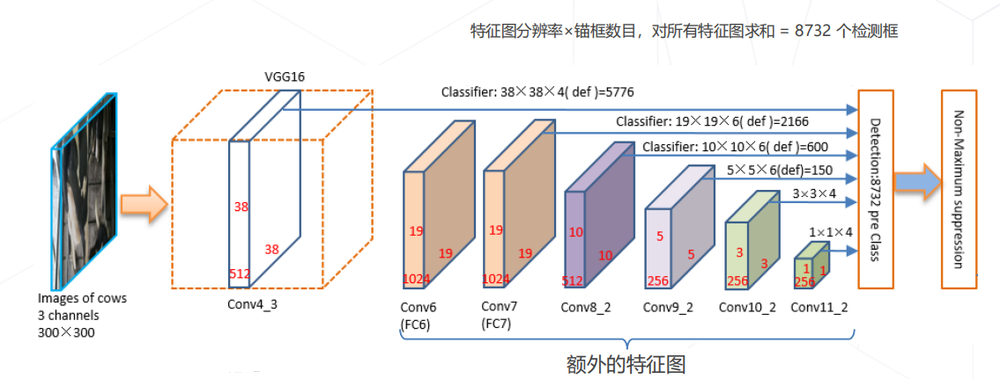

#### （2）SSD的损失函数：

**训练** 👈 为 8732 个锚框上的分类和回归预测计算损失

* 为每个预测值设定分类、回归设定真值
* 比对锚框和真值框的 IoU ，为每个锚框设定分类、回归真值
* 总损失 = 所有分类损失 ＋ 所有正样本的边界框回归损失

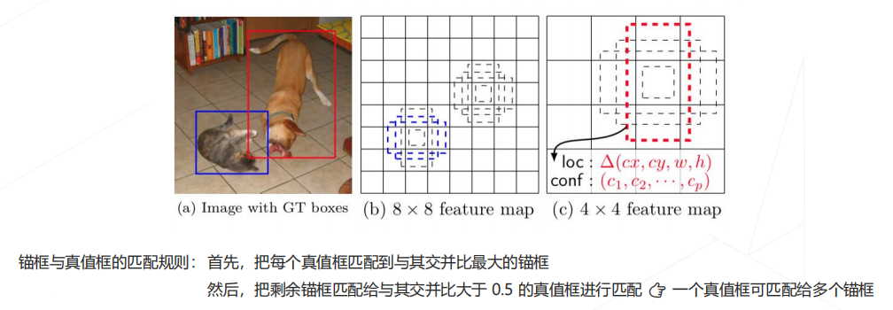

例如只有红色的锚框预测出来了是狗，那么就在这个锚框中计算狗这一类别的损失，其他锚框没有预测出来狗，就和背景这一类别计算损失，最后所有损失求和计算梯度更新参数。

#### （3）SSD正负样本不均衡问题

单阶段算法需要为每个位置的每个锚框预测一个类别，训练时需要为每个预测计算分类损失。图中锚框的数量远远大于真值框（数万 vs 数个），大量锚框的预测真值为背景（负样本）

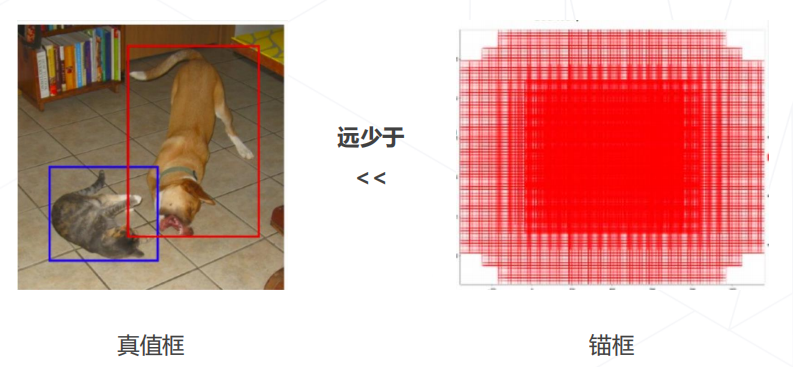

使用类别不平衡的数据训练出的分类器倾向给出背景预测，导致**漏检**（该区域应该有物体但是预测为背景）。**朴素的分类损失不能驱动检测器在有限的能力下达到漏检和错检之间的平衡**

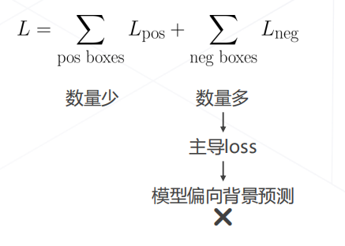

#### （4）解决样本不均衡问题

两阶段检测器通过**区域提议**拒绝了大量负样本，区域检测头接收的正负样本比例并不悬殊

单阶段检测器则需要**专门处理样本不均衡问题**

* YOLO 正负样本使用不同的权重比例不悬殊时可以这样用
  * 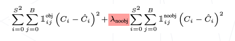

* SSD 采用**困难负样本挖掘**（Hard Negative Mining）策略：
  * 即，选取分类损失最大的部分负样本（困难负样本）计入损失，正负样本比例在 1:3
  * 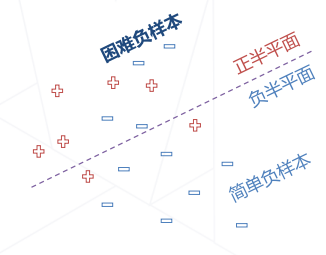
  * 困难样本 = 分类器难以分类正确的样本 = loss 大的样本
  * 负样本 = 真值为背景的样本
  * **困难负样本** = 真值为背景，但被分类为前景，且置信度非常高的样本，可能是真值框周围但 IoU 并不高的候选框
  * 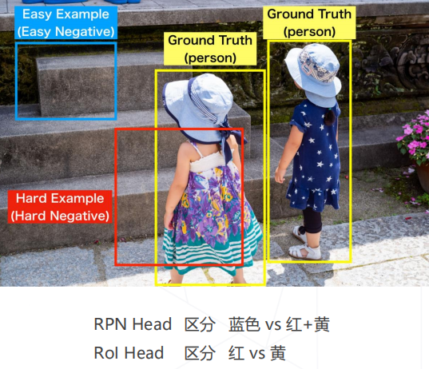

* “比较复杂、不太优雅”

#### （5）Focal Loss

由于原来分类任务的交叉熵损失函数在单阶段目标检测问题中无法起到比较好的效果，所以提出了Focal Loss，取得了更好的效果。

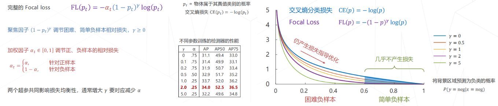

### 4.RetinaNet(2017)

基于 focal loss 的单阶段检测器

* **特征生成**：ResNet 主干网络 + FPN 产生 P3~P7 共 5 级特征图，对应降采样率 8~128 倍

* **多尺度锚框**：每级特征图上设置 3 种尺寸×3 种长宽比的锚框，覆盖 32~813 像素尺寸

* **密集预测头**：两分支、5 层卷积构成的检测头，针对每个锚框产生 K 个二类预测以及 4 个边界框偏移量

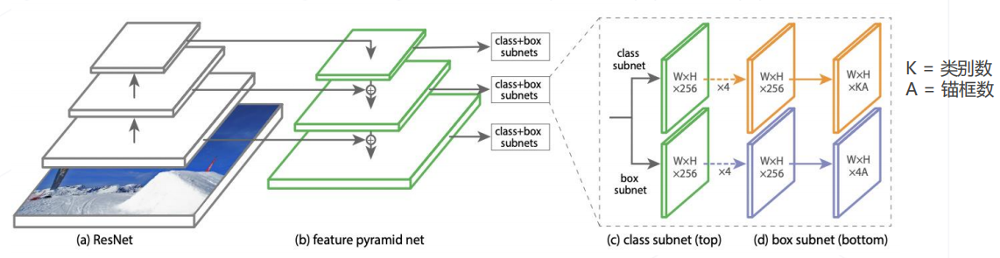

最终性能也是超过了Fast R-CNN的两阶段目标检测算法

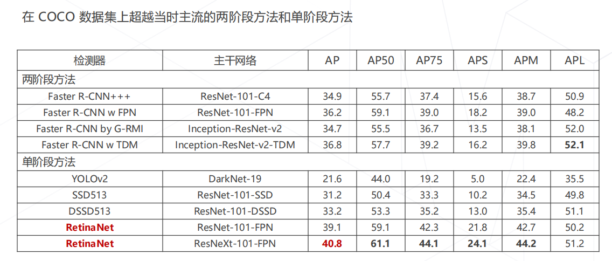

之后又不断进化产生了YOLO V3~V8

## 七、无锚框目标检测算法

引入**锚框**是考虑到图像中的物体存在重叠，图中的物体存在不同的大小等等。而**无锚框**的目标检测算法：指的是我们直接**基于特征**去预测原图中**真正的物体**和我们的框中心有多少的**偏移**。

### 1.锚框 v.s. 无锚框

**基于锚框（Anchor-based）：**

* Faster R-CNN、YOLO v3 / v5、RetinaNet 都是基于锚框的检测算法

* 模型基于特征预测对应位置的锚框中是否有物体，以及精确位置相对于锚框的偏移量

* 需要手动设置锚框相关的超参数（如大小、长宽比、数量等），设置不当影响检测精度 ❌

**无锚框（Anchor-free）：**

* 不依赖锚框，模型基于特征直接预测对应位置是否有物体，以及边界框的位置

* 边界框预测完全基于模型学习，不需要人工调整超参数 ✔️

* YOLO v1 是无锚框算法，但由于提出时间较早，相关技术并不完善，性能不如基于锚框的算法

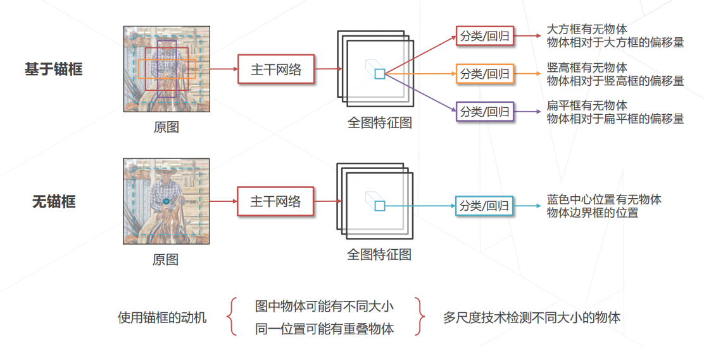

### 2.FCOS, Fully Convolutional One-Stage (2019)

由于多尺度检测技术的发展，我们知道虽然图像中可能有不同大小的物体，但是由于**特征图随着深度的变化**所表示的原图中图像的范围也是在时刻变化的，所以并不一定要使用锚框来进行目标检测。

* **特征生成**：主干网络 + FPN 产生 P3~P7 共 5 级特征图，对应降采样率 8~128 倍

* **密集预测头**：两分支、5 层卷积构成的密集预测头，对于每个位置，预测**类别**、**边界框位置**和**中心度**三组数值（与 Anchor-based 有所不同）

如下图所示，整个过程在FCOS中就是通过**卷积**来完成的。

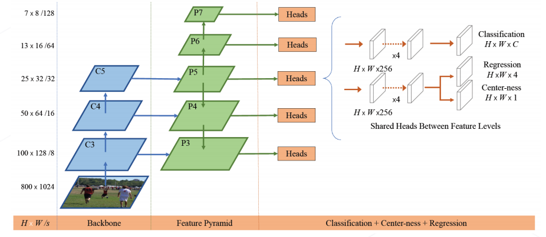

### 3.CenterNet (2019)

针对 2D 检测的算法，将传统检测算法中的“以框表示物体”变成“以中心点表示物体”，将 2D 检测建模为**关键点检测**和额外的回归任务，一个框架可以同时覆盖 2D 检测、3D 检测 、姿态估计等一系列任务。

* 将检测问题从**框** -> **关键点**+一些辅助信息

* 这个模型除了目标检测也可以解决一些其他问题

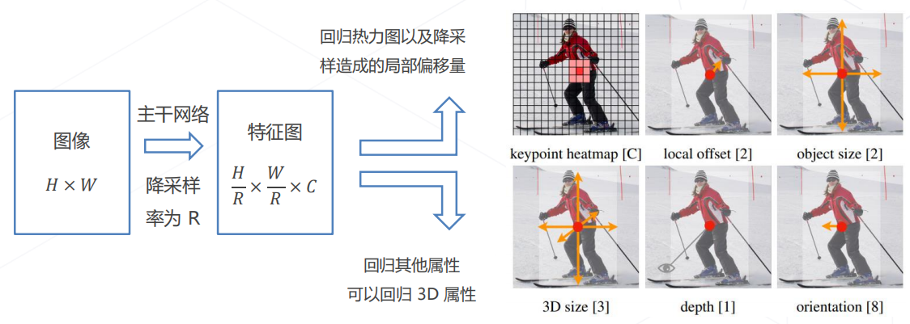

## 八、Detection Transformers

### 1.DETR（2020）

* **传统方法**：在特征图上进行密集预测的范式，依赖 Anchor 设计、NMS 后处理等额外操作

* **DETR**：脱离密集预测范式，将检测建模为从**特征序列**到**框序列**的**翻译**问题，用 Transformer 模型解决
* DETR认为所有的框可以看成是一个序列的问题，特征也可以看作一系列的序列，所以定义了一个序列到序列的问题
* DETR经常在工业质检的缺陷检测中用到

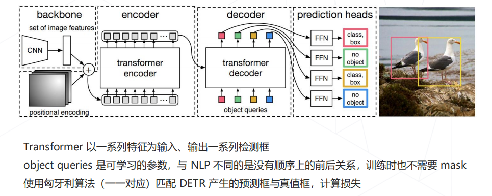

**问题**：**`慢！`**，由于attention聚焦到特定的特征上过程非常**慢**，所以整个DETR也是很慢的。

### 2.Deformable DETR (2021)

直接基于**query**的特征去关注图像的位置和权重，而不是用query、key、value做内积再去计算attention

* DETR 的注意力机制收敛很慢，收敛 ≈ 注意力机制注意到特定的位置

* Deformable DETR 借鉴 Deformable Conv 的方式，显示建模 query 注意的位置，收敛速度更快

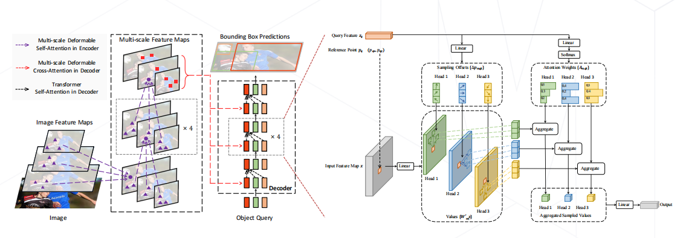

## 九、目标检测模型的评估方法

这部分内容在**机器学习**相关知识有更详细的解释

### 1.检测结果的正确/错误类型

* 正确结果 (True Positive)：算法检测到了某类物体 (Positive)，图中也确实有这个物体，检测结果正确 (True)

* 假阳性 (False Positive)：算法检测到了某类物体 (Positive)，但图中其实没有这个物体，检测结果错误 (False)

* 假阴性 (False Negative)：算法没有检测到物体 (Negative)，但图中其实有某类物体，检测结果错误 (False)

* **检测到**的衡量标准：对于某个检测框，图中存在同类型的真值框且与之交并比大于阈值（通常取0.5）

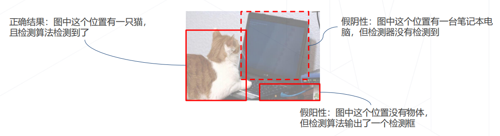

### 2.准确率 Precision 与 召回率 Recall

结合上面的TP、FP、FN我们就可以计算准确率和召回率

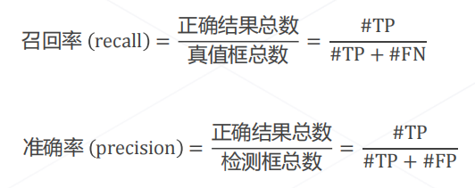

真值框总数与检测算法无关，因此只需将检测结果区分为 TP 和 FP 即可计算 recall 和 precision

**准确率与召回率的平衡：**

两种极端情况：

1.  检测器将所有锚框都判断为物体：召回率≈100%，但大量背景框预测为物体，FP很高，准确率很低

2.  检测器只输出确信度最高的1个检测框：以很大概率检测正确，准确率=100%，但因为大量物体被预测为背景，FN很高，召回率很低

一个完美的检测器应该有100%召回率和100%的精度；在算法能力有限的情况下，应该平衡二者

**通常做法**：将检测框按置信度排序， 仅输出置信度最高的若干个框

置信度 = 分类概率，或修正后的分类概率（YOLO、FCOS）

### 3.PR 曲线 与 AP 值

AP是PR曲线下方的面积，PR曲线越靠近右上方，说明预测效果越好。

## 子豪兄的补充

### 1.目标检测算法的改进思路

**数据集：**

* 数据集扩增（YOLO V5中的马赛克拼接）

**骨干网络提取：**

* 骨干网络中的三个部分都可以做相应修改

**后处理：**

* 各种后处理方法或者评价指标

**针对小目标/密集目标进行改进**

* 比如哪些部分开始用了后来不用了再后来又用了
* 比如Anchor

**针对特定数据集：**

* 添加一些人工标注的先验特征（人工构造的特征）来进行目标检测
