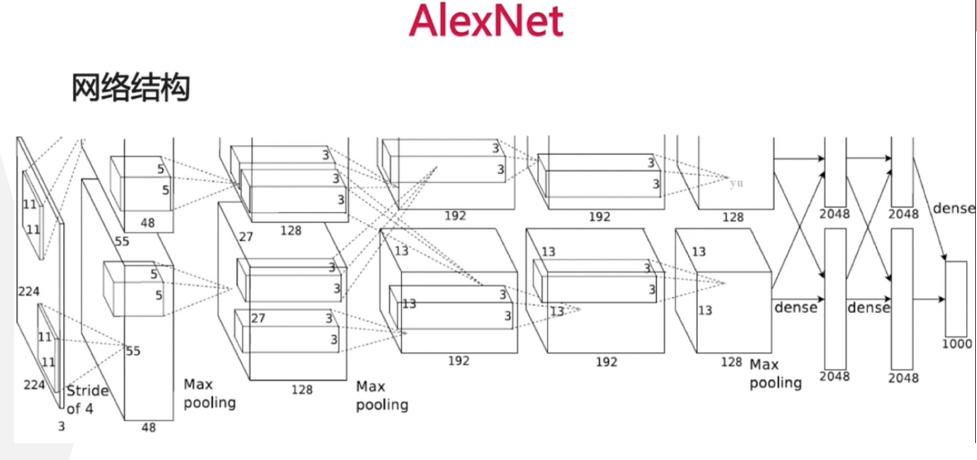
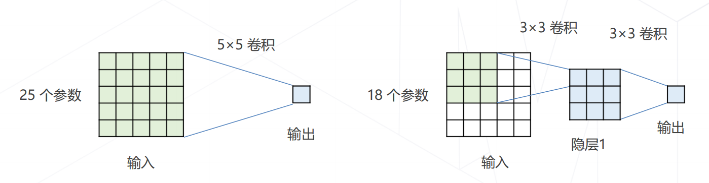
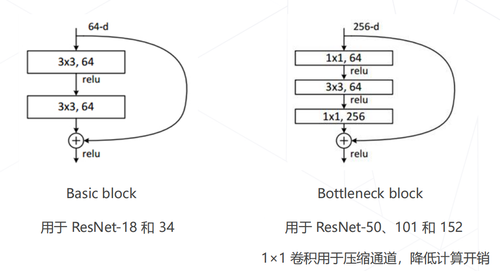
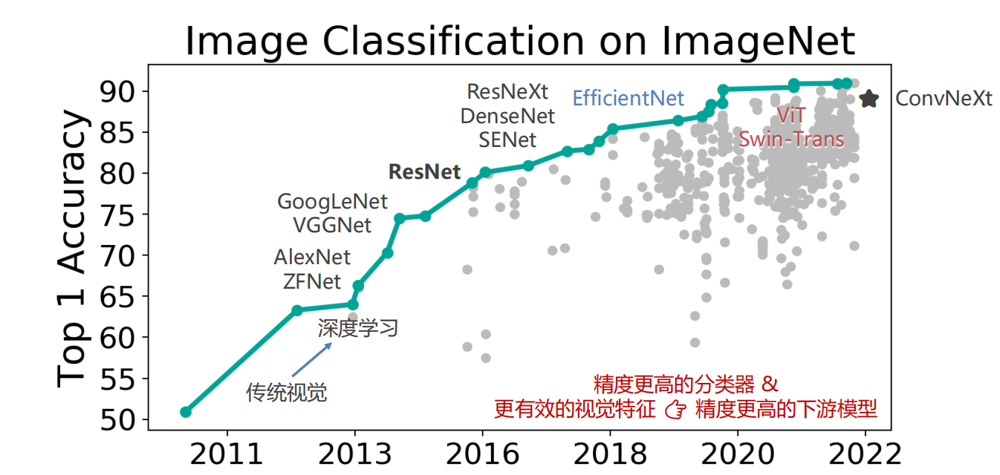
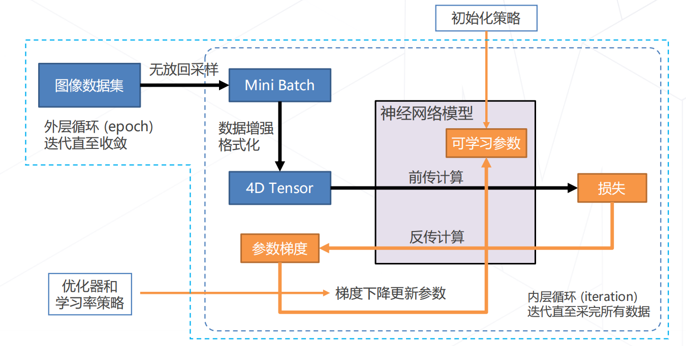
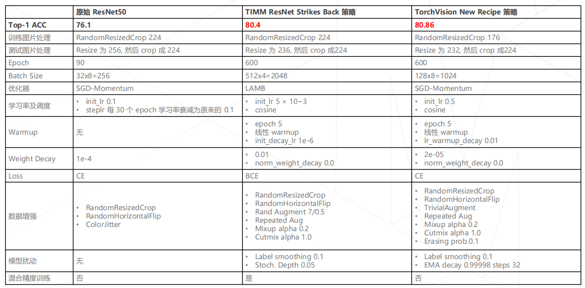
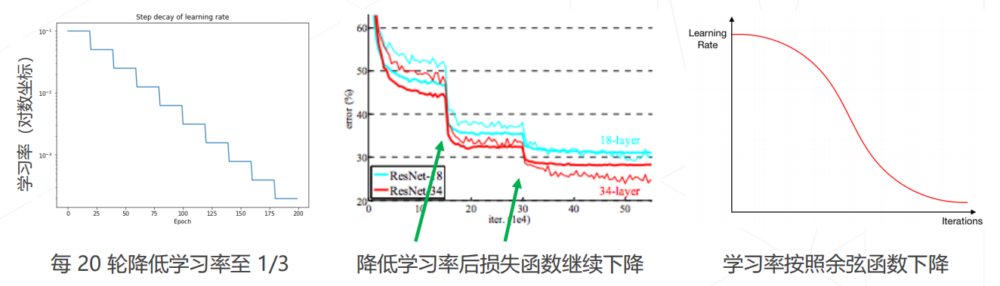
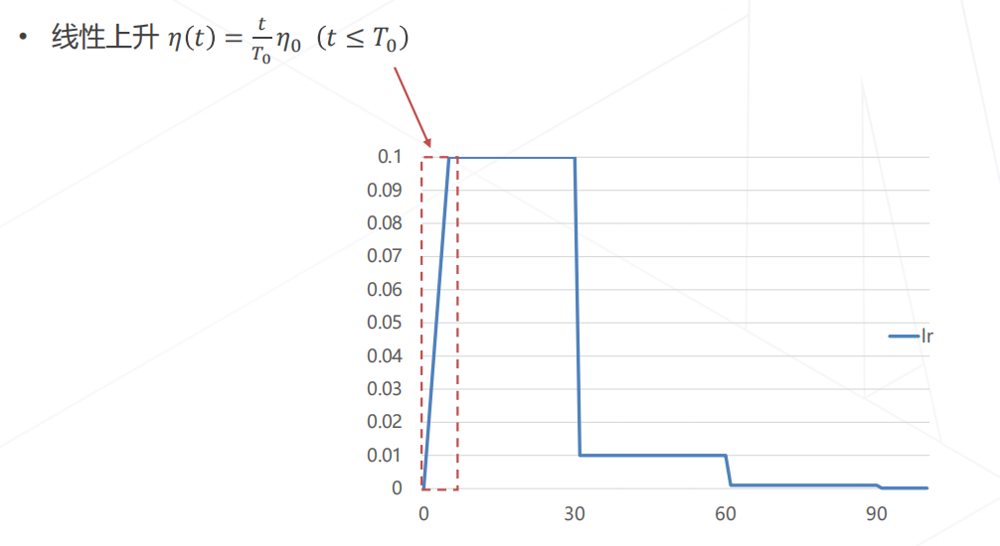
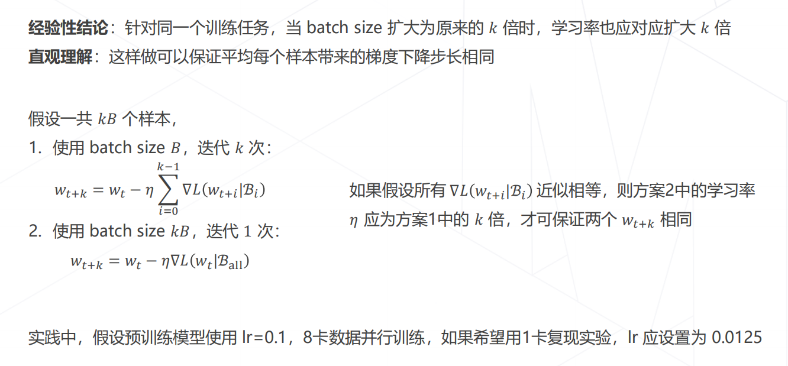

# OpenMMlab实战营

## 第二次课2023.2.2

此次实战营的积分规则介绍：

## 学习参考

笔记建议结合ppt来学习使用，ppt中对应知识可以参照笔记的标题进行查看。

ppt：[lesson2_ppt](https://github.com/lyc686/OpenMMlab_AI_2023.2/blob/main/ppt/02%20%E5%9B%BE%E5%83%8F%E5%88%86%E7%B1%BB%E4%B8%8E%20MMClassification.pdf)

b站回放：[OpenMMLab AI 实战营](https://space.bilibili.com/1293512903/channel/collectiondetail?sid=1068652)

往期笔记：[笔记回顾](https://github.com/lyc686/OpenMMlab_AI_2023.2/tree/main/OpenMMlab_notes)

相关学习推荐：

* 同济子豪兄（大佬）：[子豪兄b站主页](https://space.bilibili.com/1900783?spm_id_from=333.337.0.0)
* OpenMMlab主页：[OpenMMla主页](https://space.bilibili.com/1293512903)
* OpenMMlab Github仓库链接：[Github OpenMMlab](https://github.com/open-mmlab)

## 一、图像分类任务

### 1.什么是图像分类任务

图像分类任务就是：**给定一张图片，识别图像中的物体是什么**

### 2.问题的数学表示

分类任务用数学表达的形式展示出来就是下图所示的样子。

### 3.视觉任务的难点

由于图像的内容是像素**整体**呈现出的结果，和**个别**像素的值没有直接关联，所以难以遵循具体的规则来设计算法。

所以我们要做的就是**`超越规则`**（让机器从数据中学习）

## 二、特征工程到特征学习

### 1.机器学习的局限

* 机器学习算法善于处理低维、分布相对简单的数据
* 图像数据在几十万维的空间中以复杂的方式"缠绕"在一起，常规的机器学习算法难以处理这种复杂数据分布

### 2.特征工程 v.s. 特征学习

1. 传统方法设计图像特征（1990s~2000s）

在传统的方法中我们设计图像的特征，通过对图像采用**人工设计**的算法计算梯度（往往是对于一个区域计算梯度，而不是每个像素值计算梯度），然后统计**梯度方向分布**，最后可以将这些特征向量化，提供给机器学习完成分类任务。

在传统方法中我们通过可视化可以发现，通过计算梯度的方式确实可以很好的保留下来数据的表达，而且极大降低了数据的维度。

其中特征工程的**天花板**就是在ImageNet图像识别的比赛中冠军队伍使用的：基于**手工设计的特征 + 机器学习算法**实现图像分类，Top-5 错误率在 25% 上下。

2. 特征学习

在前人**特征工程**的基础上，我们后续的想法是如何**省去人工提取特征**的步骤，而是选择让**机器自己去学习特征**，即**`端到端`**的实现。

其中最常用的层次化特征的实现方式就是：

* 卷积神经网络
  * 特征和图像一样具有二维空间结构
  * 后层特征为空间邻域内前层特征的加权求和
* 注意力机制
  * 现在比较火的是Transformer，主要应用于对自然语言的特征全局特征提取，近两年也被应用在视觉领域。

补充：卷积和注意力都是加权求和的算子

## 三、骨干网络结构的发展

### 1.AlexNet（深度学习时代的开始）

在2012年之前我们主流使用的都是传统的视觉算法，而且性能已经达到了瓶颈。在2012年的ImageNet图像分类的大赛中一匹**黑马**脱颖而出 -- `AlexNet`来自多伦多大学的团队首次使用**深度学习**方法，一举将错误率降低至 15.3% 。

在AlexNet网络中，3x224x224的图像输入放在两个gpu中独立计算，到第三步有一个求和，后面继续独立，然后再合在一起做全连接。

`AlexNet`网络结构的一些**创新点**如下所示：

* 第一个成功实现大规模图像的模型，在 ImageNet 数据集上达到 ~85% 的 top-5 准确率
* 5 个卷积层，3 个全连接层，共有 60M 个可学习参数
* 使用 ReLU 激活函数，大幅提高收敛速度
* 实现并开源了 cuda-convnet ，在 GPU 上训练大规模神经网络在工程上成为可能

### 2.VGGNet（更深）

在`VGGNet`中，人们频繁的使用**3x3的卷积**来拆解大尺寸的卷积，意思是：**相同的感受野、更少的参数量、更多的层数和表达能力**。

如下图所示的一个5x5的卷积可以用两个3x3的卷积来进行替换，他们最终具有相同的**感受野**。但是替换之后参数量减少了(25 - 18) / 25 ≈ 28%

同时VGGNet也有多个版本对应于多个不同的深度，有兴趣的小伙伴可以自行了解一下。

### 3.InceptionNet（如何更有效率的解决问题）

在VGGNet问世之后，人们又提出了一种想法：**并不是所有特征都需要同样大小的感受野，在同一层中混合使用不同尺寸的特征可以减少参数量**。也就是`InceptionNet`的**分组卷积**的提出。

而且大名鼎鼎的**GoogLeNet**就是基于InceptionNet的结构。

在此基础上人们提出了很多个不同的版本：

* InceptionNet V1
* InceptionNet V2（用两个3x3的卷积替换一个5x5的卷积）
* InceptionNet V3（用1x3和3x1的卷积替换一个3x3的卷积）
* InceptionNet V4（引入残差的概念）

### 4.ResNet（残差引入）

基于之前的模型，人们提出的残差建模的思想：让新增加的层拟合浅层网络与深层网络之间的差异，更容易学习梯度可以直接回传到浅层网络监督浅层网络的学习。没有引入额外参入，让参数更有效贡献到最终的模型中。

使用残差的**好处**：

* **残差**：观测值与估计值之间的差。
  * 我们需要求解的是映射：H(x)。
  * 残差结构将这个问题转换为求解网络的残差映射函数，也就是F(x)，其中F(x) = H(x)-x。

* 如果是采用**一般的卷积神经网络**（没有+x），原先需要求解的是 H(x) = F(x) 。那么假设在网络达到某一个深度时，网络已经达到最优状态了，再往下加深网络就会出现退化问题（错误率上升的问题）。此时要更新下一层网络的权值/权重就会变得很麻烦。
* 但是,采用**残差网络**就能很好的解决**退化问题**。假设当前网络的深度能够使得错误率最低，如果继续增加上图的 ResNet 结构，为了保证下一层的网络状态仍然是最优状态，我们只需要令 F(x)=0 即可，因为 x 是当前输出的最优解，为了让它成为下一层的最优解也就是希望咱们的输出H(x)=x的话，只要让F(x)=0就行了。采用ResNet 的话，也只需要小小的更新F(x)部分的权重值即可。不用像一般的卷积层一样大幅度更新参数。

常用的两种残差结构如下图所示：

### 5.一些更强的图像分类模型

这部分平时我也没有学习到，听直播也没有一些比较深入的理解，所有就先把对应知识总结在这里。

* 神经结构搜索 Neural Architecture Search (2016+)
  * **基本思路**：借助强化学习等方法搜索表现最佳的网络
  * **代表工作**：NASNet (2017)、MnasNet (2018)、EfficientNet (2019) 、RegNet (2020) 等
* Vision Transformers (2020+)
  * **基本思路**：使用 Transformer 替代卷积网络实现图像分类，使用更大的数据集训练，达到超越卷积网络的精度
  * **代表工作**：Vision Transformer (2020)，Swin-Transformer (2021 ICCV 最佳论文)
* ConvNeXt (2022)
  * **基本思路**：将 Swin Transformer 的模型元素迁移到卷积网络中，性能反超 Transformer

### 6.图像分类 & 视觉基础模型的发展

根据下面的图片我们可以看到图像分类任务随着模型的不断完善与提出，**准确率**逐渐上升，但是现在也到了一些难以提升的情况。

## 四、轻量化卷积神经网络

这一部分主要涉及了卷积操作中的一些**参数量**的计算方式以及一些**网络压缩**相关的内容。

### 1.卷积的参数量

卷积层的**可学习参数**包括：卷积核 + 偏置值。

**参数量**计算公式： 𝐶 ′ × (𝐶 × 𝐾 × 𝐾 + 1) = 𝐶 ′𝐶𝐾 2 + 𝐶 ′

其中：

* 输入特征图 𝐗 ∈ ℝ𝐻×𝑊×𝐶
* 输出特征图 𝐘 ∈ ℝ𝐻′×𝑊′×𝐶 ′
* 𝐶 ′ 个 𝐶 通道的卷积核 𝐊 ∈ ℝ𝐶 ′×𝐾×𝐾×C
* 𝐶 ′ 个 偏置值 𝐛 ∈ ℝ𝐶 ′

### 2.卷积的计算量（乘/加次数）

输出特征图每个通道上的每个值都是输入特征图和 1 个𝐶 通道的卷积核进行一次卷积的结果。

**乘加次数**计算公式：𝐻 ′ × 𝑊′× 𝐶 ′ × (𝐶 × 𝐾 × 𝐾) = 𝐻 ′𝑊′𝐶 ′𝐶𝐾 2

其中：

* 输入特征图 𝐗 ∈ ℝ𝐻×𝑊×𝐶
* 输出特征图 𝐘 ∈ ℝ𝐻′×𝑊′×𝐶 ′
* 𝐶 ′ 个 𝐶 通道的卷积核 𝐊 ∈ ℝ𝐶 ′×𝐾×𝐾×C
* 𝐶 ′ 个 偏置值 𝐛 ∈ ℝ𝐶 ′

### 3.降低模型的参数量和计算量的方法

从公式中的**变量**入手，降低参数量和计算量主要有以下两种方法：

1. 降低通道数 𝐶 ′ 和 𝐶（平方级别）
2. 减小卷积核的尺寸 𝐾（平方级别）

### 4.GoogLeNet使用不同大小的卷积核

参照我们上述InceptionNet的笔记，通过使用大小不同的卷积核确实可以起到削减参数的目的。

### 5.ResNet 使用1×1卷积压缩通道数

**1x1卷积**：相当于**非线性变换**。在保持feature map尺寸不变的(即不损失分辨率)的前提下大幅增加非线性特性(利用后接的非线性激活函数),把网络做的很deep。1x1卷积核可以通过控制卷积核数量实现**降维**或**升维**。

### 6.MobileNet（可分离卷积）

这部分内容我之前在整理**李宏毅2021年的机器学习视频课笔记的第12部分网络压缩**的时候有专门整理过，感兴趣的小伙伴可以去查看一下，链接放在这里：[李宏毅机器学习课程笔记](https://github.com/lyc686/blog/blob/main/notes/2022%E6%9D%8E%E5%AE%8F%E6%AF%85%E6%9C%BA%E5%99%A8%E5%AD%A6%E4%B9%A0%E8%AF%BE%E7%A8%8B%E7%AC%94%E8%AE%B0(lyc).md)

## 五、Vision Transformers

这部分主要是**Transformer**相关的知识以及**注意力机制**的使用，就先不整理笔记了（不是特别会），但是这部分笔记其实我在**李宏毅2021年的机器学习视频课笔记的第三部分、Network网络架构**也做过笔记，链接放在这里：[李宏毅机器学习课程笔记](https://github.com/lyc686/blog/blob/main/notes/2022%E6%9D%8E%E5%AE%8F%E6%AF%85%E6%9C%BA%E5%99%A8%E5%AD%A6%E4%B9%A0%E8%AF%BE%E7%A8%8B%E7%AC%94%E8%AE%B0(lyc).md)。

## 六、模型学习

### 1.模型学习范式

模型的学习范式主要有：

* 有监督学习
* 无监督学习
* 自监督学习
* 等等（细分的话还有弱监督学习）

这部分内容也比较基础，包括梯度下降的部分也完全可以在我之前李宏毅机器学习的笔记中查看，链接放在这里：[李宏毅机器学习课程笔记](https://github.com/lyc686/blog/blob/main/notes/2022%E6%9D%8E%E5%AE%8F%E6%AF%85%E6%9C%BA%E5%99%A8%E5%AD%A6%E4%B9%A0%E8%AF%BE%E7%A8%8B%E7%AC%94%E8%AE%B0(lyc).md)。

注意：这里我想说一下这个4D Tensor其实就是因为使用Pytorch的时候它里面的模型要求输入Tensor要保持这样也就是如下四个参数：[读入图片数量, 图片通道数, 图像分辨率(x * y)]

### 2.训练技巧

直接上图：

### 3.学习率与优化器策略

这里我比较新奇的是学到了两个概念：**学习率退火**和**学习率升温**

* 学习率退火：在训练初始阶段使用较大的学习率，损失函数稳定后下降学习率
  * 按步长下降
  * 按比例下降 𝜂(𝑡) = 𝜂0𝑒−𝑘t
  * 按倒数下降 𝜂(𝑡) = 𝜂0 / (𝜖+t )
  * 按余弦函数下降

最终的效果就是模型损失变得更低了。

* 学习率升温：在训练前几轮学习率逐渐上升，直到预设的学习率，以稳定训练的初始阶段，通常后续需要和**学习率退火**结合使用。

### 4.一些经验结论

直接上图：

***

最后是一些数据增强、模型相关的策略（如，Dropout、随机深度）以及自监督学习相关知识的简单介绍，这里也不具体展开来分析了，后续随着学习的深入上面的笔记肯定会得到实际的应用。