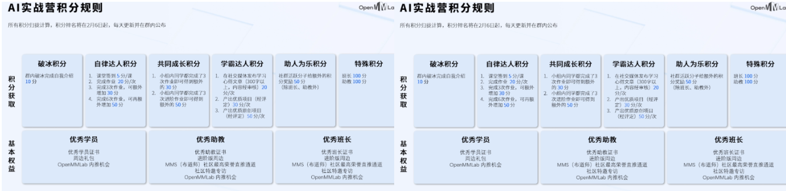
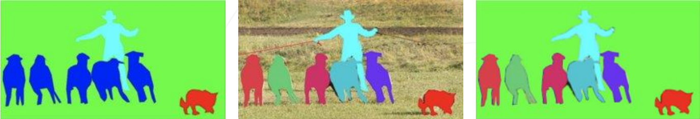

# OpenMMlab实战营

## 第七次课2023.2.10

此次实战营的积分规则介绍：

## 学习参考

笔记建议结合ppt来学习使用，ppt中对应知识可以参照笔记的标题进行查看。

ppt（ppt_04的后半部分）：[lesson7_ppt](https://github.com/lyc686/OpenMMlab_AI_2023.2/blob/main/ppt/04%20%E8%AF%AD%E4%B9%89%E5%88%86%E5%89%B2.pdf)

b站回放：[OpenMMLab AI 实战营](https://space.bilibili.com/1293512903/channel/collectiondetail?sid=1068652)

往期笔记：[笔记回顾](https://github.com/lyc686/OpenMMlab_AI_2023.2/tree/main/OpenMMlab_notes)

相关学习推荐：

* 同济子豪兄（大佬）：[子豪兄b站主页](https://space.bilibili.com/1900783?spm_id_from=333.337.0.0)
* OpenMMlab主页：[OpenMMla主页](https://space.bilibili.com/1293512903)
* OpenMMlab Github仓库链接：[Github OpenMMlab](https://github.com/open-mmlab)

* MMSegmentation Github仓库链接：[Github MMSegmentation](https://github.com/open-mmlab/mmsegmentation)

* MMDeploy Github仓库链接：[Github MMDeploy](https://github.com/open-mmlab/mmdeploy)

* OpenMMlab 此次AI实战营的仓库：[AI实战营github](https://github.com/open-mmlab/OpenMMLabCamp)

## 一、全流程的语义分割实战

### 1.回顾**语义分割**、**实例分割**、**全景分割**

* **语义分割** 
  * 仅考虑像素的类别
  * 不分割同一类的不同实体

* **实例分割**
  * 分割不同的实体
  * 仅考虑前景物体
  * 由于是实例分割首先需要对物体进行检测，所以实例分割代码库包含在MMDetection中
* **全景分割**
  * 背景仅考虑类别
  * 前景需要区分实体

如下图所示从左往右依次是”语义分割“、”实例分割“、”全景分割“

### 2.代码模板的全流程

* MMSegmentation仓库首页README中可以看到
  * `Benchmark`部分是用于**分类**的主干网络
  * 下面`model zoo`是具体的**语义分割**的算法，比如上次笔记中我们提到的：
    * FCN
    * UNet
    * DeepLab

  * 最后`datasets`是一些常见的语义分割**数据集**，比如语义分割中最常用的三个：
    * ADE20K（咖啡店门口的西班牙老太太）
    * Cityscapes
    * PASCAL VOC

### 3.数据集推荐：

* **单类别语义分割数据集：**
  * [组织病理切片小鼠肾小球](https://zihao-openmmlab.obs.cn-east-3.myhuaweicloud.com/20230130-mmseg/dataset/Glomeruli-dataset.zip)
  * [乳腺癌](https://www.kaggle.com/datasets/aryashah2k/breast-ultrasound-images-dataset)
  * [电子显微镜粒子](https://www.kaggle.com/datasets/batuhanyil/electron-microscopy-particle-segmentation)
  * [农作物病虫害叶片](https://www.kaggle.com/datasets/fakhrealam9537/leaf-disease-segmentation-dataset)
  * [农作物地块](https://www.kaggle.com/datasets/khlaifiabilel/pastis)
  * [洪水航拍区域](https://www.kaggle.com/datasets/faizalkarim/flood-area-segmentation?select=Image)
  * [指甲](https://www.kaggle.com/datasets/vpapenko/nails-segmentation)
  * [水下场景](https://www.kaggle.com/datasets/ashish2001/semantic-segmentation-of-underwater-imagery-suim)
  * [西红柿种子](https://www.kaggle.com/datasets/juanma9901/tomatoseedsdatasetjm)
  * [肾小球](https://www.kaggle.com/datasets/baesiann/glomeruli-hubmap-external-1024x1024)
  * [卫星建筑物](https://www.kaggle.com/datasets/hyyyrwang/buildings-dataset)
  * [荧光显微镜小鼠脑切片发光神经元-实例分割](https://www.kaggle.com/datasets/nbroad/fluorescent-neuronal-cells)
  * [混凝土裂缝](https://www.kaggle.com/datasets/jakubniemiec/concrete-crack-images)
  * [核磁共振脑瘤分割](https://www.kaggle.com/datasets/awsaf49/brats2020-training-data)
  * [腹部CT肝脏病变分割](https://www.kaggle.com/datasets/andrewmvd/liver-tumor-segmentation)
* **多类别语义分割数据集：**
  * [迪拜卫星航拍六类别](https://www.kaggle.com/datasets/humansintheloop/semantic-segmentation-of-aerial-imagery)
  * [高分辨率航拍-多类别](https://www.kaggle.com/datasets/titan15555/uavid-semantic-segmentation-dataset)
  * [无人机航拍](https://www.kaggle.com/datasets/bulentsiyah/semantic-drone-dataset)
  * [衣物](https://www.kaggle.com/datasets/rajkumarl/people-clothing-segmentation)
  * [海洋生物](https://www.kaggle.com/datasets/crowww/a-large-scale-fish-dataset)
  * [腿和脚趾](https://www.kaggle.com/datasets/tapakah68/legs-segmentation)
  * [无人机航拍](https://www.kaggle.com/datasets/santurini/semantic-segmentation-drone-dataset)
* **图像分类数据集：**
  * [气胸](https://www.kaggle.com/c/siim-acr-pneumothorax-segmentation)

### 4.代码全流程

子豪兄提供的全流程代码：[子豪兄MMSegmentation](https://github.com/TommyZihao/MMSegmentation_Tutorials)

* 首选安装配配置环境

  * 实验平台：[Featurize云GPU平台](https://featurize.cn/))
  * 选择服务器：GPU RTX 3060、CUDA v11.2

* 安装所需的包

  * pytorch
  * mim包管理
  * mmcv（如果提示可以使用更高版本可以冲洗下载一个最高版本）
  * 从git hub克隆mmsegmentation
    * 代码中的 -b 部分在2023.4月mmsegmentation库1.x版本变成master主分支之后就可以不加上-b 部分了
  * mmsegmentation
  * 预训练模型权重
  * 实验素材用来后续预测
  * 最后检查安装是否成功

* 用**命令行的方式**执行语义分割任务（通过导入参数的形式执行）

  * 测试图片
  * .py模型配置文件
  * .pth参数文件
  * 上面这两个都能在对应目录下的configs最下面的表格中找到（打开复制链接即可使用）
  * out-file输出结果位置
  * device cuda配置
  * opacity透明度

* **Python API方式**执行语义分割任务

  * 导入必要的包
  * 载入测试图像（from PIL import Image）
  * 载入模型（init_model），需要指定：
    * 配置文件
    * 参数文件
    * 运算设备
  * 如果没有CUDA需要执行（revert_sync_batchnorm）
  * 执行推理（inference_model）
    * 结果存在result中
    * result.keys():
      * 第一部分：语义分割图（单通道，每个像素值都对应分类类别中的一个，和原图大小一致，表示每个像素模型预测是什么类别）
        * 可以通过np.unique去重打印出所有类别
        * 同时可以用matplotlob画出来
      * 第二部分：置信度（有类别数量的通道数，表示每个像素属于哪个类别，和原图大小一致）
  * 可视化语义分割预测结果
    * 方法一
      * 用show_result_pyplot将原图和预测图叠加在一起显示，用透明度控制叠加效果
    * 方法二
      * 加上图例
  * 对视频进行处理逐帧串成新视频
    * 命令行方式
    * Python API方式
  * 修改配置文件
    * 修改分类头数量
    * 修改训练集和测试集的dataset
    * 修改使用的.py配置文件
    * 修改使用的.pth参数文件、
    * 修改迭代次数、日志记录间隔、模型权重保存间隔
    * 设置随机数种子
  * 训练
    * 把所有模块注册在mmengine的Runner中
    * runner.train()执行训练
      * 遇到Out of memory可以选择显存更高的实例或者关掉一些其他的jupyter
    * 将训练得到的最终结果应用在自己的语义分割的数据集上
  * 最后是一些扩展阅读
    * 最近的前沿在半监督、无监督、自监督上（主要就是针对无label标注的数据进行语义分割）
    * 语义分割的可解释性分析
    * 语义分割的显著性分析

  

