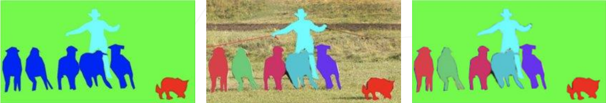
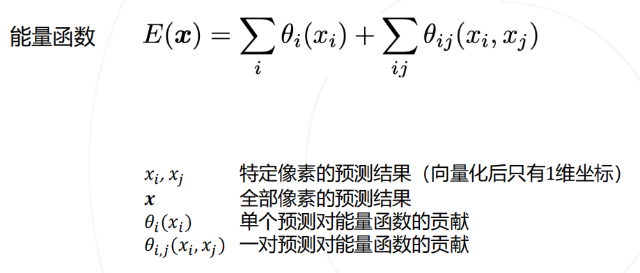

# OpenMMlab实战营

## 第六次课2023.2.9

此次实战营的积分规则介绍：

## 学习参考

笔记建议结合ppt来学习使用，ppt中对应知识可以参照笔记的标题进行查看。

ppt：[lesson6_ppt](https://github.com/lyc686/OpenMMlab_AI_2023.2/blob/main/ppt/04%20%E8%AF%AD%E4%B9%89%E5%88%86%E5%89%B2.pdf)

b站回放：[OpenMMLab AI 实战营](https://space.bilibili.com/1293512903/channel/collectiondetail?sid=1068652)

往期笔记：[笔记回顾](https://github.com/lyc686/OpenMMlab_AI_2023.2/tree/main/OpenMMlab_notes)

相关学习推荐：

* 同济子豪兄（大佬）：[子豪兄b站主页](https://space.bilibili.com/1900783?spm_id_from=333.337.0.0)
* OpenMMlab主页：[OpenMMla主页](https://space.bilibili.com/1293512903)
* OpenMMlab Github仓库链接：[Github OpenMMlab](https://github.com/open-mmlab)

* MMSegmentation Github仓库链接：[Github MMSegmentation](https://github.com/open-mmlab/mmsegmentation)

* OpenMMlab 此次AI实战营的仓库：[AI实战营github](https://github.com/open-mmlab/OpenMMLabCamp)

## 一、什么是语义分割

表面上看语义分割的效果就是**抠图**，但是实际上图像分割就是**在像素级别的细粒度图像分类**，把每一个像素的分类结果连在一起就是最终的语义分割结果

应用：

* 医学分割
  * 通过图像分割技术，辅助进行医疗诊断。如右图，识别脑部肿瘤异物的位置。
* 无人驾驶
  * 自动驾驶车辆，会将行人，其他车辆，行车道，人行道、交通标志、房屋、草地与树木等等按照类别在图像中分割出来，从而辅助车辆对道路的情况进行识别与认知。
* 智能遥感
  * 分辨地表物体的类别，通过右侧分割之后的图像可以看到，红色的部分属于湖泊水流。通过智能遥感。能够监测不同季节地表水域的变化，从而辅助农业生产，以及旱灾洪灾的预测等等。
* 腾讯会议人像模式等等
  * 把人可以抠出来

## 二、语义分割 v.s. 实例分割 v.s. 全景分割

* **语义分割** 
  * 仅考虑像素的类别
  * 不分割同一类的不同实体

* **实例分割**
  * 分割不同的实体
  * 仅考虑前景物体
  * 前一节任务中学的MMDetection就是实例分割
* **全景分割**
  * 背景仅考虑类别
  * 前景需要区分实体

如上图所示从左往右依次是”语义分割“、”实例分割“、”全景分割“

## 三、语义分割经典模型

### 1.语义分割的基本思路

* **按颜色分割**
  * 先验知识：物体内部颜色相近，物体交界颜色变化
  * 存在的问题--**可解释性差**：
    * 先验知识不完全准确
    * 不同物体颜色可能相近，物体内也会包含多种颜色，如下图所示一个人同时红衣服黑裤子就无法清晰的分割
  * 改进
    * 添加一些额外的手段确定物体类别

* **逐像素分割（滑动窗口）**
  * 滑动窗口
    * 对一个**窗口**做分类，其类别代表了窗口中心元素的类别
    * 滑窗每次滑动就输入到CNN中进行一次预测
  * 优势
    * 可以充分利用已有的图像分类模型
  * 问题
    * 效率低，重叠区域重复计算卷积

* ****

### 2.**复用卷积计算**

* **基本思路**
  * 先在全图得到一个feature map
  * 滑窗的时候去feature map中去扣出自己需要的部分
  * 优势
    * 原来每次都需要输入一个固定大小的区块给CNN
    * 现在可以输入任意大小的原图
  * 问题
    * 全连接层要求固定输入大小

### 3.全连接层的卷积化

* **基本思路**
  * 参考全连接层的操作
    * 将最后一层的特征图**拉直**
    * 拉直之后的向量和全连接层神经元分别**相乘**再相加得到下一层的输入
    * 相乘再相加这个过程其实就是一个卷积操作
  * 全连接层卷积化
    * 全连接层用原来神**经元数量**个和最后一层特征图一样**分辨率大小**的卷积核
    * 与最后一层特征图进行卷积操作
    * 由于卷积核和特征图**大小一致**所以会变成**1x1x卷积核数量**的输出
  * 优势
    * 由于没有使用全连接层，所以可以兼容任意尺寸的输入，输入的尺寸大，最后的feature map大。输入的尺寸小，最后的feature map小。

**全卷积网络（Fully Convolutional Network 2015）**

### 4.预测图的升采样

* 原始思路
  * 使用步长>1的卷积核进行**降采样**
  * 使得大的特征图逐渐变小
* **升采样**基本思路
  * 最终要求结果是一个大图
  * 解决方案：
    * **双线性插值**
      * 类似word、ppt中放大缩小的思想，**不需要可学习的参数**
    * **转置卷积**（可学习的升采样层）
      * 别名：升卷积/反卷积
      * **但数学上和卷积并不是逆运算**

### 5.双线性插值

例如下图，我们已知红点的像素值想要求得绿点的像素值

* 通过**相似三角形**按比例由上面两个红点求出`R2`的像素值
* 通过**相似三角形**按比例由下面两个红点求出`R1`的像素值
* 通过**相似三角形**按比例由`R1`和`R2`求出绿点`P`的像素值

图中白色的值就是使用双线性插值法填充出来的值

双线性插值可以通过一个**卷积操作实现**

例如下图中使用卷积对目标5x5的矩阵进行卷积操作，就可以得到最终的矩阵

### 6.转置卷积

之前的**双线性插值**的卷积核是**人为定义**的，其中的参数不可以进行学习，而**转置卷积**具有**可学习的参数**。

转置卷积：输入一个小图 ➢ 得到一个大图

注：转置卷积旨在形状上有互逆的关系，数值结果没有互逆关系

一个完整的**全卷积网络**的预测与训练如下图所示，参数逐渐迭代优化实现了一个**端到端**学习的语义分割神经网络：

## 四、完成精细的分割任务

* 一般分割任务的缺陷
  * 随着下采样（卷积操作）的进行，会**丢失**很多的特征，使得分割效果不是很好
* 解决思路
  * 高层次和低层次采样进行结合
    * 从**浅层和底层**的下采样中获取更多的特征信息（空间信息、细节信息）
    * 从高层的下采样中获取更多的**语义信息**

### 1.基于多层特征的上采样

解决方案 **FCN**：

基于低层次和高层次特征图分别产生类别预测，升采样到原图大小，再平均得到最终结果

成功的应用：**U-Net**

* 左边相当于编码器encoder：逐级降采样获取**语义信息**
* 右边相当于解码器decoder：逐级升采样恢复**细节信息**

### 2.上下文信息

上下文：

* NLP中一个文字周围的文字
* 图像上：一个图块周围的图块

有了**上下文**（图像周围的内容），可以帮助我们对图片内容做出更加精确的判断，而**滑动窗口**刚好就是丢失了这部分信息

### **4.PSPNet 2016（提出多尺度池化）**

* 对特征图进行不同尺度的池化，得到不同尺度的上下文特征
* 上下文特征经过通道压缩和空间上采样之后拼接回原特征图 → 同时包含局部和上下文特征
* 基于融合的特征产生预测图

即，通过不同**大小的特征图**进行**卷积操作**得到不同的feature map再把他们通过`concat`摞在一起，就相当于考虑了**上下文**的信息

### 5.空洞卷积与 DeepLab 系列算法

DeepLab 是语义分割的又一系列工作，其主要贡献为：

* 使用空洞卷积解决网络中的下采样问题
* 使用条件随机场 CRF 作为后处理手段，精细化分割图
*  使用多尺度的空洞卷积（ASPP 模块）捕捉上下文信息

DeepLab v1 发表于 2014 年，后于 2016、2017、2018 年提出 v2、v3、v3+ 版本。

#### （1）空洞卷积

**空洞卷积解决下采样问题**

图像分类模型中的下采样层使输出**尺寸变小**

* 如果将池化层和卷积中的**步长**去掉：

  * 可以减少下采样的次数

  * 特征图就会变大，需要对应增大卷积核，以维持相同的感受野，但会增加大量参数

  * 使用**空洞卷积**（Dilated Convolution/Atrous Convolution），在**不增加参数**的情况下增**大感受野**

具体过程如下图所示：

**特征图不变，膨胀卷积核（不会产生额外的参数）**

实际场景的效果对比

#### （2）DeepLab 模型

DeepLab 在图像分类网络的基础上做了修改：

* 去除分类模型中的后半部分的下采样层
*  后续的卷积层改为膨胀卷积，并且逐步增加rate来维持原网络的感受野

### 6.条件随机场 Conditional Random Field, CRF

条件随机场是一种对原始语义分割结果进行**后处理**的方法

* 模型直接输出的分割图较为粗糙，尤其在物体边界处不能产生很好的分割结果。

* DeepLab v1&v2 使用条件随机场 (CRF) 作为后处理手段，结合原图颜色信息和神经网络预测的类别得到精细化分割结果。

#### （1）条件随机场

CRF 是一种**概率模型**。DeepLab 使用 CRF 对分割结果进行建模，用能量函数用来表示分割结果优劣，通过最小化能量函数获得更好的分割结果。

其中能量函数中的**参数**，一部分是自己像素的贡献，另一部分是两两像素之间的贡献

如上图所示，能量函数鼓励在**边缘**产生变化，从而使得边缘更加清晰

### 7.空间金字塔池化 Atrous Spatial Pyramid Pooling ASPP

* PSPNet 使用不同尺度的池化来获取不同尺度的上下文信息

* DeepLab v2 & v3 使用不同尺度的空洞卷积达到类似的效果

### 8.DeepLab v3+

* DeepLab v2 / v3 模型使用 ASPP 捕捉上下文特征
* Encoder / Decoder 结构（如 UNet） 在上采样过程中融入低层次的特征图，以获得更精细的分割图
* DeepLab v3+ 将两种思路融合，在原有模型结构上增加了一个简单的 decoder 结构

融入了encoder和decoder的**DeepLab v3+**的想法直接上图：

## 五、语义分割模型的评估

* 分割任务和分类任务非常相似，也可以绘制出混淆矩阵，一些常见的评价指标如下所示
  * **比较预测与真值**
  * **基于交并集的评估指标**
    * Accuracy（类似分类任务中的召回率Recall）
    * IoU
    * Dice（类似分类任务中的F1-score）

## 总结

