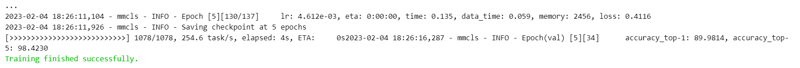

# OpenMMlab实战营

## 第三次课2023.2.2

此次实战营的积分规则介绍：


## 学习参考

笔记建议结合ppt来学习使用，ppt中对应知识可以参照笔记的标题进行查看。

ppt（第二次课ppt的后半部分）：[lesson2_ppt](https://github.com/lyc686/OpenMMlab_AI_2023.2/blob/main/ppt/02%20%E5%9B%BE%E5%83%8F%E5%88%86%E7%B1%BB%E4%B8%8E%20MMClassification.pdf)

b站回放：[OpenMMLab AI 实战营](https://space.bilibili.com/1293512903/channel/collectiondetail?sid=1068652)

往期笔记：[笔记回顾](https://github.com/lyc686/OpenMMlab_AI_2023.2/tree/main/OpenMMlab_notes)

相关学习推荐：

* 同济子豪兄（大佬）：[子豪兄b站主页](https://space.bilibili.com/1900783?spm_id_from=333.337.0.0)
* OpenMMlab主页：[OpenMMla主页](https://space.bilibili.com/1293512903)
* OpenMMlab Github仓库链接：[Github OpenMMlab](https://github.com/open-mmlab)

* OpenMMlab 此次AI实战营的仓库：[AI实战营github](https://github.com/open-mmlab/OpenMMLabCamp)

## 一、pytorch完整训练过程

`pytorch`是现在非常好用的一款深度学习的框架，其中集成了很多实现的模型和算法义工我们使用，完整的pytorch训练过程（以图像分类问题为例）包括：

1. 构建数据集
   * 搜集图片
   * 划分训练集和测试集
2. 数据预处理
   * 统一尺寸
   * 数据增强（旋转，缩减等等）
   * 归一化
   * 转换成Tensor类型
3. 构造模型/调用torch自带的模型
4. 在训练集上训练
   * 损失函数
   * 优化器
   * 反向传播三部曲（取消梯度累计、反向传播、更新参数）
5. 在测试集评估性能
6. 可解释性工具进行分析

如果想要完整的体验一下pytorch的训练流程可以参考我之前写的笔记，这里就不一步一步的介绍了：[Dog25数据集上完整进行pytorch训练](https://github.com/lyc686/datawhale_study/blob/main/classify_with_pytorch/4.New_picture_classify.md)

## 二、基于mmclassification做图像分类

`mmclassification`是OpenMMlab团队开发的开源算法库之一，主要基于ImageNet1000类数据集在各种模型上做预训练，我们可以通过`mim`包来进行操作，更加便捷的使用一些常见的和最新的模型。

mmclassification仓库地址：[mmclassification](https://github.com/open-mmlab/mmclassification)

### 1.安装mim工具包以及必备的库

```python
!pip install openmim mmengine
```

```python
!mim install  mmcv-full mmcls
```

测试是否成功导入包：

```python
import mmcv
import mmcls
```

不报错即为成功，<font color="blue">注意：</font>如果提示警告“有最新版本可以使用，但是不影响后续使用”。继续使用即可，不会影响后续操作。

### 2. OpenMMlab项目中的重要概念

#### （1）配置文件

1. **深度学习模型**的训练涉及几个方面：

   * 模型结构 模型有几层、每层多少通道数等等

   * 数据集 用什么数据训练模型：数据集划分、数据文件路径、数据增强策略等等

   * 训练策略 梯度下降算法、学习率参数、batch_size、训练总轮次、学习率变化策略等等

   * 运行时 GPU、分布式环境配置等等

   * 一些辅助功能 如打印日志、定时保存checkpoint等等

2. 在 OpenMMLab 项目中，所有这些项目都涵盖在一个配置文件中，一个配置文件定义了一个完整的训练过程，主要包含：

   * model 字段定义模型
   * data 字段定义数据
   * optimizer、lr_config 等字段定义训练策略
   * load_from 字段定义与训练模型的参数文件

#### （2）下载配置文件

模型都存放在OpenMMlab的仓库下：https://github.com/open-mmlab/mmclassification/tree/master/configs


下载的时候要选择具体模型下的_in1k版本（内部基于__bash__完成继承）

```python
# !mim download mmcls --config [模型文件的名字不带.py后缀] --dest[存放位置] .表示下载到本地
!mim download mmcls --config mobilenet-v2_8xb32_in1k --dest .
```

下载完成获得两个文件:

1. `.pth`的参数文件

2. `.py`的配置文件

打开.py的配置文件我们可以看到:

1. model部分记载了模型相关的内容，比如num-classes表示最终分类的类别数量，以及输出如channel和损失函数的定义

2. data部分记载了我们的数据的一些存放路径、加载方式、数据增强等等，当前的模型我们可以看到他是基于ImageNet数据集做的预训练

3. 后面的train/val/test分别对应了训练集/验证集/测试集相关的数据处理方式

4. 再往下就是优化器相关的内容

### 3.训练

完成了对mmclassification中已经在ImageNet模型上预训练过的模型配置文件和参数文件之后，我们就可以对其进行修改，然后在我们自己的数据集中做`fine-tune`微调以完成我们自己的图像分类任务。

#### （1）数据集导入

这里我们直接下载子豪完成训练集、测试集划分的30类水果的数据集

```python
!wget https://zihao-openmmlab.obs.cn-east-3.myhuaweicloud.com/20220716-mmclassification/dataset/fruit30/fruit30_split.zip
```

解压缩，用data文件夹存放数据，>> /dev/null表示不生成解压过程记录。方便起见我们直接使用划分完成的，未划分的数据集也可以留着自己完成数据集划分

```python
mkdir data
```

```python
!unzip ./fruit30_split.zip -d ./data>> /dev/null
```

#### （2）修改配置文件

仍然使用上面提到的在ImageNet中预训练的模型mobilenet-v2_8xb32_in1k。

* 修改配置文件：将数据集路径等等更换成我们需要的内容
* 首先使用cp指令复制一个.py的配置文件用来修改自己的

```python
!cp mobilenet-v2_8xb32_in1k.py cls-0-pytorch.py 
```

##### 1.复制配置文件

手动打开配置文件之后我们会看到部分内容，其实就是中间变量，后续执行data部分的时候也会自动包含在里面，所以直接删除即可

```python
# 删除cls-0-pytorch.py中这一部分
dataset_type = 'ImageNet'
img_norm_cfg = dict(
    mean=[123.675, 116.28, 103.53], std=[58.395, 57.12, 57.375], to_rgb=True)
train_pipeline = [
    dict(type='LoadImageFromFile'),
    dict(type='RandomResizedCrop', size=224, backend='pillow'),
    dict(type='RandomFlip', flip_prob=0.5, direction='horizontal'),
    dict(
        type='Normalize',
        mean=[123.675, 116.28, 103.53],
        std=[58.395, 57.12, 57.375],
        to_rgb=True),
    dict(type='ImageToTensor', keys=['img']),
    dict(type='ToTensor', keys=['gt_label']),
    dict(type='Collect', keys=['img', 'gt_label'])
]
test_pipeline = [
    dict(type='LoadImageFromFile'),
    dict(type='Resize', size=(256, -1), backend='pillow'),
    dict(type='CenterCrop', crop_size=224),
    dict(
        type='Normalize',
        mean=[123.675, 116.28, 103.53],
        std=[58.395, 57.12, 57.375],
        to_rgb=True),
    dict(type='ImageToTensor', keys=['img']),
    dict(type='Collect', keys=['img'])
]
```

##### 2.修改model部分

修改model部分：使用的模型不需要修改，只需要修改**分类头**的数量（`num_classes`）

由于我们是继承自模型在ImageNet上的训练结果来做fine-tune微调，所以我们需要将`load_from = None`修改为我们下载的参数文件的路径，放在配置文件里（原始的配置及文件在最下面，放到哪里都可以，有就行）

```python
model = dict(
    type='ImageClassifier',
    backbone=dict(type='MobileNetV2', widen_factor=1.0),
    neck=dict(type='GlobalAveragePooling'),
    head=dict(
        type='LinearClsHead',
        num_classes=30,
        in_channels=1280,
        loss=dict(type='CrossEntropyLoss', loss_weight=1.0),
        topk=(1, 5)))
load_from = 'mobilenet_v2_batch256_imagenet_20200708-3b2dc3af.pth'
```

##### 3.修改data部分

修改data部分：

1. 首先我们不是在ImageNet上去训练，所以通常需要把type改成`CustomDataset`

2. 配置路径为自己当前的路径，通常OpenMMlab数据都放在一个data文件路径下

    eg.当前就是`data/fruit30_split/train`

3. 数据增强部分通常不用变化，但是需要一个`ann_file`（配置文件里有就加上没有就算了）表示我们数据处理中的一些类别标注存到一个文件中，没有的话默认就会按照文件的默认文件结构去推断。

4. 注意路径需要在train/val/test中都修改。ann_file如果自己的数据集中没有提前生成，就直接删掉即可。

```python
data = dict(
    samples_per_gpu=32,
    workers_per_gpu=2,
    train=dict(
        type='CustomDataset',
        data_prefix='data/fruit30_split/train',
        pipeline=[
            dict(type='LoadImageFromFile'),
            dict(type='RandomResizedCrop', size=224, backend='pillow'),
            dict(type='RandomFlip', flip_prob=0.5, direction='horizontal'),
            dict(
                type='Normalize',
                mean=[123.675, 116.28, 103.53],
                std=[58.395, 57.12, 57.375],
                to_rgb=True),
            dict(type='ImageToTensor', keys=['img']),
            dict(type='ToTensor', keys=['gt_label']),
            dict(type='Collect', keys=['img', 'gt_label'])
        ]),
    val=dict(
        type='CustomDataset',
        data_prefix='data/fruit30_split/val',
        pipeline=[
            dict(type='LoadImageFromFile'),
            dict(type='Resize', size=(256, -1), backend='pillow'),
            dict(type='CenterCrop', crop_size=224),
            dict(
                type='Normalize',
                mean=[123.675, 116.28, 103.53],
                std=[58.395, 57.12, 57.375],
                to_rgb=True),
            dict(type='ImageToTensor', keys=['img']),
            dict(type='Collect', keys=['img'])
        ]),
    test=dict(
        type='CustomDataset',
        data_prefix='data/fruit30_split/val',
        pipeline=[
            dict(type='LoadImageFromFile'),
            dict(type='Resize', size=(256, -1), backend='pillow'),
            dict(type='CenterCrop', crop_size=224),
            dict(
                type='Normalize',
                mean=[123.675, 116.28, 103.53],
                std=[58.395, 57.12, 57.375],
                to_rgb=True),
            dict(type='ImageToTensor', keys=['img']),
            dict(type='Collect', keys=['img'])
        ]))
```

##### 4.修改优化器

修改配置文件最下面优化器相关内容：

1. 由于我们的训练在1卡，而模型参数中的是8卡，所以我们需要将学习率`lr`/8

  	eg. 原来lr = 0.045，现在就要变成lr = 0.045/8 ≈ 0.005

2. `max_epochs`也不用很大
3. `checkpoint_config`每隔多少次保存一次模型，这里我们一共5轮，只存一次即可
4. `log_config`日志输出可以调的小一点，输出频繁一点
5. 其他东西整体不用改

```python
evaluation = dict(interval=1, metric='accuracy')
optimizer = dict(type='SGD', lr=0.005, momentum=0.9, weight_decay=4e-05)
optimizer_config = dict(grad_clip=None)
lr_config = dict(policy='step', gamma=0.98, step=1)
runner = dict(type='EpochBasedRunner', max_epochs=5)
checkpoint_config = dict(interval=5)
log_config = dict(interval=10, hooks=[dict(type='TextLoggerHook')])
dist_params = dict(backend='nccl')
log_level = 'INFO'
resume_from = None
workflow = [('train', 1)]
```

最后：**将上述配置文件修改覆盖到我们cp复制的.py配置文件中**

#### （4）执行训练

使用mim工具包执行训练

```python
!mim train mmcls cls-0-pytorch.py
```

执行之后会生成各种文件执行信息，可以看到我们的配置文件的信息，加载参数的信息，以及模型的实际执行情况。最后可以看到文件训练完成。



<font color="blue">注意：</font>**执行完成后存储的日志、checkpoint、.py配置文件、最终保存的训练参数保存在word_dirs文件路径下**。

#### （5）测试刚生成的模型性能

使用mmcls库中的**api函数**即可实现简单的推导过程。

```python
from mmcls.apis import init_model, inference_model

model = init_model('mobilenet-v2_8xb32_in1k.py',
                  'mobilenet_v2_batch256_imagenet_20200708-3b2dc3af.pth',
                  device='cuda:0')
```

查看模型类型：

```python
# 模型类型，类似nn.Module的子类
type(model)
```


打印模型结构：

```python
# 模型结构
model
```


推理使用**inference_model函数**进行推导，并且输出结果。

```python
# 推理
result = inference_model(model, 'strawberry.jpg')
print(result)
```


用绘图的方式将预测结果写在原图上：

```python
from mmcls.apis import show_result_pyplot

show_result_pyplot(model, 'strawberry.jpg', result)
```


**基本原理和自己手写pytorch全流程是一样的，只不过mmcls对pytorch做了封装，我们实际执行代码更少量。**

实战营视频3的27:40~31:00讲解了推理的内部全流程（我们调api背后的事情）

b站视频主页：https://space.bilibili.com/1293512903/channel/collectiondetail?sid=1068652

## 喜大普奔，到这里你已经完成了使用OpenMMlab完成一个图像分类任务的简易流程

更加复杂的包括划分训练集的过程，可以参考我实现的作业一的代码：[作业一完整代码]()

## 三、超算云平台的使用

这部分内容我还没有实践（实在是linux比较薄弱），所以我把官方的教学文档的链接放在这里：[超算云使用mmclassification完成图像分类任务]()

一些超算云平台的注意事项：

* 3090显卡cuda最低11.1

* 尽量使用pip安装


