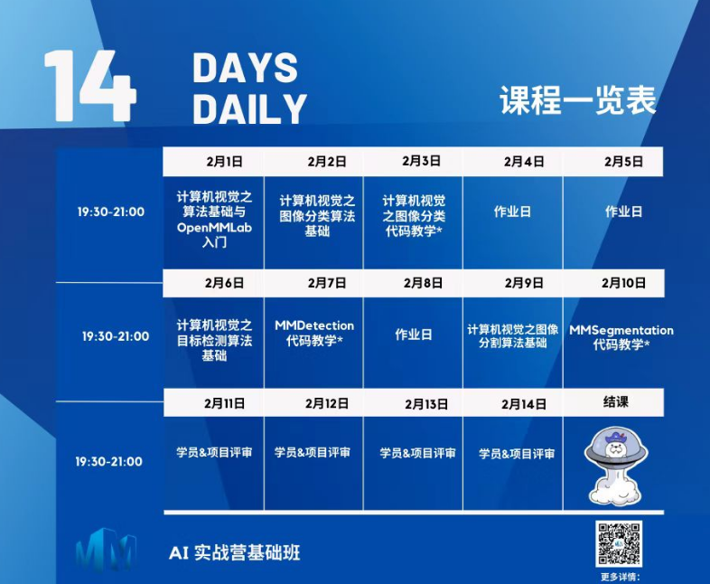

# OpenMMlab_AI_2023.2
2023年2月参加OpenMMlab举办的寒假AI实战营笔记+完成作业的代码

## 学习参考+任务安排

本次学习参与的是由OpenMMlab团队举办的实战营，通过为期14天的实战营我学到了计算机视觉领域中的重要领域的相关基础知识，如**图像分类**、**目标检测**、**图像分割**，同时也学习了如何上手使用代码完成自己的实战项目。一些课程的资料在下面：

ppt：[课程全部ppt](https://github.com/lyc686/OpenMMlab_AI_2023.2/tree/main/ppt)

b站回放：[OpenMMLab AI 实战营](https://space.bilibili.com/1293512903/channel/collectiondetail?sid=1068652)

相关学习推荐：

* 同济子豪兄（大佬）：[子豪兄b站主页](https://space.bilibili.com/1900783?spm_id_from=333.337.0.0)
* OpenMMlab主页：[OpenMMla主页](https://space.bilibili.com/1293512903)
* OpenMMlab Github仓库链接：[Github OpenMMlab](https://github.com/open-mmlab)
* OpenMMlab 此次AI实战营的仓库：[AI实战营github](https://github.com/open-mmlab/OpenMMLabCamp)

## 仓库中包含的内容

### 1.七次课程的全部笔记

* [计算机视觉基础知识+OpenMMlab基础知识](https://github.com/lyc686/OpenMMlab_AI_2023.2/blob/main/OpenMMlab_notes/First_lesson_2023.2.1.md)
* [计算机视觉图像分类基础知识](https://github.com/lyc686/OpenMMlab_AI_2023.2/blob/main/OpenMMlab_notes/Second_lesson_2023.2.2.md)
* [基于MMClassification的图像分类实战](https://github.com/lyc686/OpenMMlab_AI_2023.2/blob/main/OpenMMlab_notes/Third_lesson_2023.2.3.md)
* [计算机视觉目标检测基础知识](https://github.com/lyc686/OpenMMlab_AI_2023.2/blob/main/OpenMMlab_notes/Forth_lesson_2023.2.6.md)
* [基于MMDetection的目标检测实战](https://github.com/lyc686/OpenMMlab_AI_2023.2/blob/main/OpenMMlab_notes/Fifth_lesson_2023.2.7.md)
* [计算机视觉图像分割基础知识](https://github.com/lyc686/OpenMMlab_AI_2023.2/blob/main/OpenMMlab_notes/Sixth_lesson_2023.2.9.md)
* [基于MMSegmentation的图像分割实战](https://github.com/lyc686/OpenMMlab_AI_2023.2/blob/main/OpenMMlab_notes/Seventh_lesson_2023.2.10.md)

### 2.七次代码实战作业

* 图像分类实战（MMClassification）
  * [基于flower_5花卉数据集完成图像分类任务](https://github.com/lyc686/OpenMMlab_AI_2023.2/tree/main/homework/1_%E5%9F%BA%E7%A1%80)
  * [基于CIFAR-10数据集完成图像分类任务](https://github.com/lyc686/OpenMMlab_AI_2023.2/tree/main/homework/1_%E8%BF%9B%E9%98%B6)

* 目标检测实战（MMDetection）
  * [基于balloon数据集完成目标检测，并制作Splash特效视频](https://github.com/lyc686/OpenMMlab_AI_2023.2/tree/main/homework/2_%E5%9F%BA%E7%A1%80)
  * [基于PASCAL VOC2012数据集完成目标检测](https://github.com/lyc686/OpenMMlab_AI_2023.2/tree/main/homework/2_%E8%BF%9B%E9%98%B6)

* 图像分割实战（MMSegmentation）
  * [基于小鼠肾小球数据集完成语义分割](https://github.com/lyc686/OpenMMlab_AI_2023.2/tree/main/homework/3_%E5%9F%BA%E7%A1%80)
  * [基于PASCAL VOC2012数据集完成语义分割](https://github.com/lyc686/OpenMMlab_AI_2023.2/tree/main/homework/3_%E8%BF%9B%E9%98%B6)

## 总结

通过此次实战营的学习，使我不仅对于OpenMMlab团队创作的框架有了非常深入的理解，还对计算机视觉领域中图像分类、目标检测、语义分割的基础知识有了非常深刻的理解，感谢OpenMMlab团队举办的这次实战营，让我有机会听到大佬们的教学以及认识了很多人工智能领域内的朋友。
