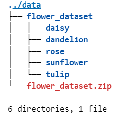
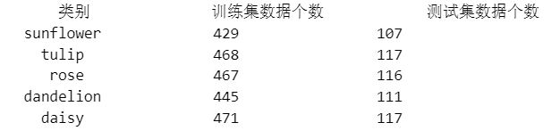

# OpenMMlab_AI_2023.2
作业一_基础版完整的代码以及工作流程在文件夹下.ipynb中，下面是对此次作业的简述

## 1.作业一相关笔记

* [计算机视觉基础知识+OpenMMlab基础知识](https://github.com/lyc686/OpenMMlab_AI_2023.2/blob/main/OpenMMlab_notes/First_lesson_2023.2.1.md)
* [计算机视觉图像分类基础知识](https://github.com/lyc686/OpenMMlab_AI_2023.2/blob/main/OpenMMlab_notes/Second_lesson_2023.2.2.md)
* [基于MMClassification的图像分类实战](https://github.com/lyc686/OpenMMlab_AI_2023.2/blob/main/OpenMMlab_notes/Third_lesson_2023.2.3.md)

## 2.作业讲解

本次任务是基于一个5种花卉的数据集完成图像分类任务。

### 1.首先解压缩数据集，查看文件结构

```python
!sudo snap install tree
!tree ../data -L 2
```



### 2.划分训练集和测试集

在这里我们按照以下步骤进行完成

* 在原数据集文件路径下创建训练集和测试集文件夹
* 在每个文件夹内创建原始数据集类别数量的文件夹用于存放各个类别的图像
* 随机打乱原始数据集的图像，并按照指定比例进行划分
* 将对应图片移动进入训练集和测试集
* 查看文件结构

```python
df = pd.DataFrame()
path_train = []
path_val = []
count = 0

print('{:^18} {:^18} {:^18}'.format('类别', '训练集数据个数', '测试集数据个数'))

for flower in classes: # 遍历每个类别

    # 读取该类别的所有图像文件名
    old_dir = os.path.join(dataset_path, flower)
    images_filename = os.listdir(old_dir)
    random.shuffle(images_filename) # 随机打乱

    # 划分训练集和测试集
    testset_numer = int(len(images_filename) * test_frac) # 测试集图像个数
    testset_images = images_filename[:testset_numer]      # 获取拟移动至 test 目录的测试集图像文件名
    trainset_images = images_filename[testset_numer:]     # 获取拟移动至 train 目录的训练集图像文件名
    # 将训练集和测试集对应的图像[空格]类别写入列表中
    for i in trainset_images:
        path_train.append(f'{train_val_path}{flower}'+'/'+i + f' {count}')
    for i in testset_images:
        path_val.append(f'{train_val_path}{flower}'+'/'+i + f' {count}')
    
    count += 1    
    
    # 移动图像至 test 目录
    for image in testset_images:
        old_img_path = os.path.join(dataset_path, flower, image)         # 获取原始文件路径
        new_test_path = os.path.join(dataset_path, 'val', flower, image) # 获取 test 目录的新文件路径
        shutil.move(old_img_path, new_test_path) # 移动文件

    # 移动图像至 train 目录
    for image in trainset_images:
        old_img_path = os.path.join(dataset_path, flower, image)           # 获取原始文件路径
        new_train_path = os.path.join(dataset_path, 'train', flower, image) # 获取 train 目录的新文件路径
        shutil.move(old_img_path, new_train_path) # 移动文件
    
    # 删除旧文件夹
    assert len(os.listdir(old_dir)) == 0 # 确保旧文件夹中的所有图像都被移动走
    shutil.rmtree(old_dir) # 删除文件夹
    
    # 工整地输出每一类别的数据个数
    print('{:^18} {:^18} {:^18}'.format(flower, len(trainset_images), len(testset_images)))
    
    # 保存到表格中
    df = df.append({'class':flower, 'trainset':len(trainset_images), 'testset':len(testset_images)}, ignore_index=True)


# 数据集各类别数量统计表格，导出为 csv 文件
df['total'] = df['trainset'] + df['testset']
df.to_csv('数据量统计.csv', index=False)
```



### 3.使用MMClassification完成图像分类任务

配置环境

```python
!pip install openmim mmengine
!mim install  mmcv-full mmcls

# 验证安装是否成功
import mmcv
import mmcls
```

下载训练好的预训练模型

```python
!mim download mmcls --config resnet18_8xb32_in1k --dest .
```

按照需求修改配置文件

```python
model = dict(
    type='ImageClassifier',
    backbone=dict(
        type='ResNet',
        depth=18,
        num_stages=4,
        out_indices=(3, ),
        style='pytorch'),
    neck=dict(type='GlobalAveragePooling'),
    head=dict(
        type='LinearClsHead',
        num_classes=5,
        in_channels=512,
        loss=dict(type='CrossEntropyLoss', loss_weight=1.0),
        topk=(1, 5)))

data = dict(
    samples_per_gpu=32,
    workers_per_gpu=2,
    train=dict(
        type='CustomDataset',
        data_prefix='data/flower_dataset/train',
        pipeline=[
            dict(type='LoadImageFromFile'),
            dict(type='RandomResizedCrop', size=224),
            dict(type='RandomFlip', flip_prob=0.5, direction='horizontal'),
            dict(
                type='Normalize',
                mean=[123.675, 116.28, 103.53],
                std=[58.395, 57.12, 57.375],
                to_rgb=True),
            dict(type='ImageToTensor', keys=['img']),
            dict(type='ToTensor', keys=['gt_label']),
            dict(type='Collect', keys=['img', 'gt_label'])
        ]),
    val=dict(
        type='CustomDataset',
        data_prefix='data/flower_dataset/val',
        # ann_file='data/flower_dataset/val.txt',
        pipeline=[
            dict(type='LoadImageFromFile'),
            dict(type='Resize', size=(256, -1)),
            dict(type='CenterCrop', crop_size=224),
            dict(
                type='Normalize',
                mean=[123.675, 116.28, 103.53],
                std=[58.395, 57.12, 57.375],
                to_rgb=True),
            dict(type='ImageToTensor', keys=['img']),
            dict(type='Collect', keys=['img'])
        ]),
    test=dict(
        type='CustomDataset',
        data_prefix='data/flower_dataset/val',
        # ann_file='data/flower_dataset/val.txt',
        pipeline=[
            dict(type='LoadImageFromFile'),
            dict(type='Resize', size=(256, -1)),
            dict(type='CenterCrop', crop_size=224),
            dict(
                type='Normalize',
                mean=[123.675, 116.28, 103.53],
                std=[58.395, 57.12, 57.375],
                to_rgb=True),
            dict(type='ImageToTensor', keys=['img']),
            dict(type='Collect', keys=['img'])
        ]))
evaluation = dict(interval=1, metric='accuracy')
optimizer = dict(type='SGD', lr=0.0125, momentum=0.9, weight_decay=0.0001)
optimizer_config = dict(grad_clip=None)
lr_config = dict(policy='step', step=[30, 60, 90])
runner = dict(type='EpochBasedRunner', max_epochs=10)
checkpoint_config = dict(interval=5)
log_config = dict(interval=20, hooks=[dict(type='TextLoggerHook')])
dist_params = dict(backend='nccl')
log_level = 'INFO'
load_from = 'resnet18_8xb32_in1k_20210831-fbbb1da6.pth'
resume_from = None
workflow = [('train', 1)]
```

对模型进行微调执行训练

```python
!mim train mmcls resnet18_8xb32_in1k.py
```

### 4.测试训练效果

```python
from mmcls.apis import init_model, inference_model

from mmcls.apis import show_result_pyplot

model = init_model('resnet18_8xb32_in1k.py', 'work_dirs/resnet18_8xb32_in1k/latest.pth')
result = inference_model(model, 'daisy_1.png')
print(result)

show_result_pyplot(model, 'daisy_1.png', result)
```


