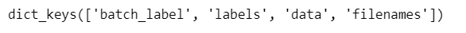

# OpenMMlab_AI_2023.2
作业一完整的代码以及工作流程在文件夹下.ipynb中，下面是对此次作业的简述

## 1.作业一相关笔记

* [计算机视觉基础知识+OpenMMlab基础知识](https://github.com/lyc686/OpenMMlab_AI_2023.2/blob/main/OpenMMlab_notes/First_lesson_2023.2.1.md)
* [计算机视觉图像分类基础知识](https://github.com/lyc686/OpenMMlab_AI_2023.2/blob/main/OpenMMlab_notes/Second_lesson_2023.2.2.md)
* [基于MMClassification的图像分类实战](https://github.com/lyc686/OpenMMlab_AI_2023.2/blob/main/OpenMMlab_notes/Third_lesson_2023.2.3.md)

## 2.作业讲解

本次任务是基于CIFA_10的数据集完成图像分类任务。

这个数据库由Alex Krizhevsky, Vinod Nair, and Geoffrey Hinton收集整理。包含了6000张32*32的彩色图像，50000张用于训练，10000张用于测试。主页地址在这里。为了支持循环测试，50000张训练图片又分为5个子集，命名为data_batch_1~5。每个子集都包含正好10000张图片，但有的子集可能包含某个类别的图片多一点，包含其它类别的图片则少一点，但总的来看，每个类别都是正好5000张图片，也就是总共有10个类别

### 1.反序列化读取文件内容

```python
import pickle as pk
import numpy as np
import os
from matplotlib.pyplot import imread 

def unpickle(file):
    fo = open(file, 'rb')
    dict = pk.load(fo, encoding='latin1')
    fo.close()
    return dict

Xtr = unpickle('./data/cifar-10-batches-py/data_batch_1')
```

查看训练集中一个batch中的内容

```python
Xtr.keys()
```



```python
len(Xtr['data'])
```


```python
import types

print(type(Xtr['data']), type(Xtr['labels']), type(Xtr['batch_label']), type(Xtr['filenames']))
Xtr['labels'][0:10]
Xtr['data']
```


### 2.打印数据集中图片进行探索

cifar10中图片3**32**32尺寸，但是每个图像的数组['data']中的前32个值表示R通道的像素值，中间32个值表示G通道的像素值，最后32个值表示B通道的像素值，所以需要一些交换像素值的方法使其变成正常图像输出。

返回字典类，每个块的文件包含一个字典类，包含以下元素：


data: 一个100003072的numpy数组（unit8）每个行存储3232的彩色图片，3072=1024*3，分别是red, green, blue。存储方式以行为主。


labels:使用0-9进行索引。


数据集包含的另一个文件batches.meta同样包含python字典，用于加载label_names。如：label_names[0] == “airplane”, label_names[1] == “automobile”

在这里我们按照以下步骤进行完成

```python
import numpy as np

imgs = Xtr['data']
# 指定图片大小，图像大小为20宽、5高的绘图(单位为英寸inch)
plt.figure(figsize=(20, 5))

# 打印20张图片信息
# enumerate可以同时获取列表的索引和内容
for i, imgs in enumerate(imgs[:20]):
    img = np.reshape(imgs, (3, 32, 32)) # 讲每一行的像素值变成RGB对应形式
    img = img.transpose((1, 2, 0)) # 交换1,3通道
    # img = img * np.array((0.229, 0.224, 0.225)) + np.array((0.485, 0.456, 0.406))# 归一化，里面的数值是约定俗成效果最好的
    # img = img.clip(0, 1) # 图像平滑，小于0的部分变成0，大于1大部分变成1
    # 将整个figure分成2行10列，绘制第i+1个子图。
    plt.subplot(2, 10, i+1)
    plt.imshow(img)
    plt.axis('off')
```


### 3.将图像全部按照对应.jpg图像和文件名转存到自定义的数据集文件夹下

查看训练集一个batch序列中包含的信息

```python
from PIL import Image
import numpy as np
import pandas as pd
from tqdm import tqdm
import math
import matplotlib.pyplot as plt
%matplotlib inline
classes = Meta['label_names']
print(classes)

for i in range(Meta['num_cases_per_batch']-9990):
    for j, index in enumerate(Xtr.keys()):
        if j != 0:
            print(index, ": ", Xtr[f'{index}'][i])
        else:
            print(index, ": ", Xtr[f'{index}'][15:16])
```


将batch中全部信息存储在一个csv文件中

```python
from PIL import Image
import numpy as np
import pandas as pd
from tqdm import tqdm
import math
import matplotlib.pyplot as plt
%matplotlib inline
classes = Meta['label_names']
print(classes)

from_batch = []
path = []
labels_id = []
labels = []
data = []

for i in range(5):
    for j in range(Meta['num_cases_per_batch']):
        for k, index in enumerate(Xtr[i].keys()):
            if index == 'batch_label':
                str = Xtr[i][f'{index}'][15:16]
                from_batch.append(str)
            elif index == 'labels':
                str = Xtr[i][f'{index}'][j]
                labels_id.append(str)
                str2 = Meta['label_names'][str]
                labels.append(str2)
            elif index == 'filenames':
                str2 = Xtr[i]['labels'][j]
                str = "data/cifar10_dataset/train/"+Meta['label_names'][str2]+'/'+Xtr[i][f'{index}'][j]
                path.append(str)
            elif index == 'data':
                str = str = Xtr[i][f'{index}'][j]
                data.append(str)


# 定义一个pandas的表格来存放保存图像的信息
df = pd.DataFrame()
df['来自训练集batch'] = from_batch
df['图像路径'] = path
df['标注类别ID'] = labels_id
df['标注类别名称'] = labels
df['像素值'] = data
```

查看存储效果

```python
df.shape
df
```


进行像素值和图像的转换

```python
# # pillow保存为.jpg格式图片
from PIL import Image

for i in range(5):
    for j in range(Meta['num_cases_per_batch']*5):
        for k, index in enumerate(Xtr[i].keys()):
            img = np.reshape(df['像素值'][j], (3, 32, 32))
            img = img.transpose(1, 2, 0)
            img = Image.fromarray(img)
            img.save(f"{df['图像路径'][j]}")
```

每个类抽取10张图片查看保存效果

```python
import numpy as np
import cv2 as cv

# imgs = Xtr['data']
# 指定图片大小，图像大小为20宽、5高的绘图(单位为英寸inch)
plt.figure(figsize=(10, 10))

# 打印100张图片信息
for i, imgs in enumerate(pict):
    img_path = "data/cifar10_dataset/train/"+pict[i]
    # print(img_path)
    img_bgr = cv.imread(img_path)
    img_rgb = cv.cvtColor(img_bgr, cv.COLOR_BGR2RGB)
    # 将整个figure分成10行10列，绘制第i+1个子图。
    plt.subplot(10, 10, i+1)
    plt.imshow(img_rgb)
    plt.axis('off')
```


### 4.模型训练

配置训练环境

```python
!pip install openmim mmengine
!mim install  mmcv-full mmcls

# 验证是否安装成功
import mmcv
import mmcls
```

下载训练好的预训练模型进行训练

```python
!mim download mmcls --config mobilenet-v2_8xb32_in1k --dest .
```

修改配置文件

```python
model = dict(
    type='ImageClassifier',
    backbone=dict(type='MobileNetV2', widen_factor=1.0),
    neck=dict(type='GlobalAveragePooling'),
    head=dict(
        type='LinearClsHead',
        num_classes=10,
        in_channels=1280,
        loss=dict(type='CrossEntropyLoss', loss_weight=1.0),
        topk=(1, 5)))

load_from = 'mobilenet_v2_batch256_imagenet_20200708-3b2dc3af.pth'

data = dict(
    samples_per_gpu=32,
    workers_per_gpu=2,
    train=dict(
        type='CustomDataset',
        data_prefix='data/cifar10_dataset/train',
        pipeline=[
            dict(type='LoadImageFromFile'),
            dict(type='RandomResizedCrop', size=224, backend='pillow'),
            dict(type='RandomFlip', flip_prob=0.5, direction='horizontal'),
            dict(
                type='Normalize',
                mean=[123.675, 116.28, 103.53],
                std=[58.395, 57.12, 57.375],
                to_rgb=True),
            dict(type='ImageToTensor', keys=['img']),
            dict(type='ToTensor', keys=['gt_label']),
            dict(type='Collect', keys=['img', 'gt_label'])
        ]),
    val=dict(
        type='CustomDataset',
        data_prefix='data/cifar10_dataset/val',
        pipeline=[
            dict(type='LoadImageFromFile'),
            dict(type='Resize', size=(256, -1), backend='pillow'),
            dict(type='CenterCrop', crop_size=224),
            dict(
                type='Normalize',
                mean=[123.675, 116.28, 103.53],
                std=[58.395, 57.12, 57.375],
                to_rgb=True),
            dict(type='ImageToTensor', keys=['img']),
            dict(type='Collect', keys=['img'])
        ]),
    test=dict(
        type='CustomDataset',
        data_prefix='data/cifar10_dataset/val',
        pipeline=[
            dict(type='LoadImageFromFile'),
            dict(type='Resize', size=(256, -1), backend='pillow'),
            dict(type='CenterCrop', crop_size=224),
            dict(
                type='Normalize',
                mean=[123.675, 116.28, 103.53],
                std=[58.395, 57.12, 57.375],
                to_rgb=True),
            dict(type='ImageToTensor', keys=['img']),
            dict(type='Collect', keys=['img'])
        ]))

evaluation = dict(interval=1, metric='accuracy')
optimizer = dict(type='SGD', lr=0.005, momentum=0.9, weight_decay=4e-05)
optimizer_config = dict(grad_clip=None)
lr_config = dict(policy='step', gamma=0.98, step=1)
runner = dict(type='EpochBasedRunner', max_epochs=10)
checkpoint_config = dict(interval=5)
log_config = dict(interval=10, hooks=[dict(type='TextLoggerHook')])
dist_params = dict(backend='nccl')
log_level = 'INFO'
resume_from = None
workflow = [('train', 1)]
```

执行训练

```python
!mim train mmcls mobilenet-v2_cifar10.py
```


### 5.测试训练效果

载入训练日志表格

```python
log_path = 'work_dirs/mobilenet-v2_cifar10/20230206_203013.log.json'

with open(log_path, "r") as f:
    json_list = f.readlines()
 
df_log = pd.DataFrame()
for each in json_list[2:]:
    df_log = df_log.append(eval(each), ignore_index=True)
```


可视化损失函数

```python
import pandas as pd

import matplotlib.pyplot as plt
%matplotlib inline


plt.figure(figsize=(16, 8))

x = df_train['epoch']
y = df_train['loss']

plt.plot(x, y, label='训练集')

plt.tick_params(labelsize=20)
plt.xlabel('epoch', fontsize=20)
plt.ylabel('loss', fontsize=20)
plt.title('训练集损失函数', fontsize=25)
plt.savefig('work_dirs/mobilenet-v2_cifar10/训练集损失函数.pdf', dpi=120, bbox_inches='tight')

plt.show()
```


以top-1和top-5的准确率作为测试集分类评估指标

```python
from matplotlib import colors as mcolors
import random
random.seed(124)
colors = ['b', 'g', 'r', 'c', 'm', 'y', 'k', 'tab:blue', 'tab:orange', 'tab:green', 'tab:red', 'tab:purple', 'tab:brown', 'tab:pink', 'tab:gray', 'tab:olive', 'tab:cyan', 'black', 'indianred', 'brown', 'firebrick', 'maroon', 'darkred', 'red', 'sienna', 'chocolate', 'yellow', 'olivedrab', 'yellowgreen', 'darkolivegreen', 'forestgreen', 'limegreen', 'darkgreen', 'green', 'lime', 'seagreen', 'mediumseagreen', 'darkslategray', 'darkslategrey', 'teal', 'darkcyan', 'dodgerblue', 'navy', 'darkblue', 'mediumblue', 'blue', 'slateblue', 'darkslateblue', 'mediumslateblue', 'mediumpurple', 'rebeccapurple', 'blueviolet', 'indigo', 'darkorchid', 'darkviolet', 'mediumorchid', 'purple', 'darkmagenta', 'fuchsia', 'magenta', 'orchid', 'mediumvioletred', 'deeppink', 'hotpink']
markers = [".",",","o","v","^","<",">","1","2","3","4","8","s","p","P","*","h","H","+","x","X","D","d","|","_",0,1,2,3,4,5,6,7,8,9,10,11]
linestyle = ['--', '-.', '-']

def get_line_arg():
    '''
    随机产生一种绘图线型
    '''
    line_arg = {}
    line_arg['color'] = random.choice(colors)
    # line_arg['marker'] = random.choice(markers)
    line_arg['linestyle'] = random.choice(linestyle)
    line_arg['linewidth'] = random.randint(1, 4)
    # line_arg['markersize'] = random.randint(3, 5)
    return line_arg

plt.figure(figsize=(16, 8))

x = df_test['epoch']
for y in metrics:
    plt.plot(x, df_test[y], label=y, **get_line_arg())

plt.tick_params(labelsize=20)
plt.ylim([0, 100])
plt.xlabel('epoch', fontsize=20)
plt.ylabel(y, fontsize=20)
plt.title('测试集分类评估指标', fontsize=25)
plt.savefig('work_dirs/mobilenet-v2_cifar10/测试集分类评估指标.pdf', dpi=120, bbox_inches='tight')

plt.legend(fontsize=20)

plt.show()
```


单张图片进行测试

```python
from mmcls.apis import init_model, inference_model
from mmcls.apis import show_result_pyplot

model = init_model('mobilenet-v2_cifar10.py', 'work_dirs/mobilenet-v2_cifar10/latest.pth')
result = inference_model(model, 'airplane.png')
print(result)
show_result_pyplot(model, 'airplane.png', result)
```


输出测试图片的Grad-CAM热力图可视化模型关注特征

```python
!python ../../mmclassification/tools/visualizations/vis_cam.py \
        airplane.png \
        mobilenet-v2_cifar10.py \
        work_dirs/mobilenet-v2_cifar10/latest.pth \
        --target-category 0 \
        --method GradCAM \
        --save-path airplane_cam.jpg
```

```python
Image.open('airplane_cam.jpg')
```


