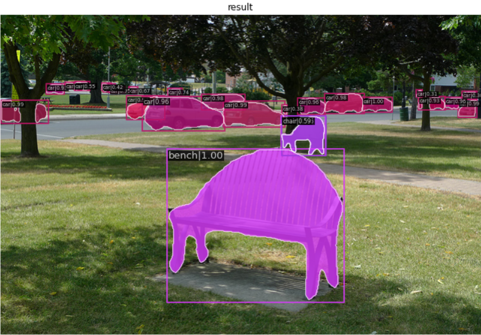
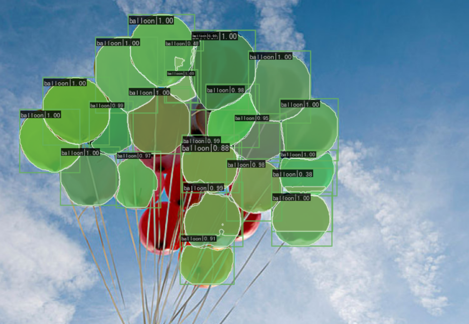

# OpenMMlab_AI_2023.2

参数文件：

1. 作业二基础版的.pth参数文件放在如下网盘链接

链接：https://pan.baidu.com/s/1nlJOlSvEkUpPWYuMBsVwiQ?pwd=e0pw 
提取码：e0pw 


作业二_基础版完整的代码以及工作流程在文件夹下.ipynb中，下面是对此次作业的简述

## 1.作业二相关笔记

* [计算机视觉目标检测基础知识](https://github.com/lyc686/OpenMMlab_AI_2023.2/blob/main/OpenMMlab_notes/Forth_lesson_2023.2.6.md)
* [基于MMDetection的目标检测实战](https://github.com/lyc686/OpenMMlab_AI_2023.2/blob/main/OpenMMlab_notes/Fifth_lesson_2023.2.7.md)

## 2.作业讲解

本次任务是基于一个balloon气球的数据集完成目标检测任务。

balloon是带有mask的气球数据集，其中训练集包含61张图片，验证集包含13张图片。

### 1.安装所需的工具包

```python
!pip install openmim mmengine
!mim install  mmcv-full mmdet

# 验证安装成功
import mmcv
import mmdet
```

### 2.下载一个训练好的预训练模型

```python
!mim download mmdet --config  mask_rcnn_r50_fpn_2x_coco --dest ./checkpoint
```

### 3.在一张图片上测试检测效果

```python
from mmdet.apis import init_detector, inference_detector

from mmdet.apis import show_result_pyplot

model = init_detector('checkpoint/mask_rcnn_r50_fpn_2x_coco.py', 'checkpoint/mask_rcnn_r50_fpn_2x_coco_bbox_mAP-0.392__segm_mAP-0.354_20200505_003907-3e542a40.pth')
result = inference_detector(model, 'test_images/demo.jpg')
print(result)


show_result_pyplot(model, 'test_images/demo.jpg', result)
```



### 4.观察balloon数据集

```python
# 简单查看数据集的图片
from PIL import Image
Image.open('data/balloon/val/14898532020_ba6199dd22_k.jpg')
```


### 4.将balloon数据集构建为COCO格式数据集

COCO数据集格式：

* mmdetection

  * data

  * COCO

    * annotations

      * train.json

      * val.josn

    * train
      * XXX.jpg
    * val
      * XXX.jpg

查看数据集中给出的json格式标注文件

```python
# 查看单张图片的标签格式
import json

with open('data/balloon/val/via_region_data.json') as f:
    data = json.load(f)
anno1 = list(data.keys())[0]
# print(data)
# print(data.keys())
print(anno1)
print(json.dumps(data[anno1], indent=2))
```


将标注文件转换为COCO格式

```python
import os.path as osp
import mmcv

def convert_balloon_to_coco(ann_file, out_file, image_prefix):
    data_infos = mmcv.load(ann_file)

    annotations = []
    images = []
    obj_count = 0
    for idx, v in enumerate(mmcv.track_iter_progress(data_infos.values())):
        # 获取原始标注文件json对应目录下的图片信息
        filename = v['filename']
        img_path = osp.join(image_prefix, filename)
        # 获取图像尺寸
        height, width = mmcv.imread(img_path).shape[:2]
    # print(filename, "：" ,mmcv.imread(img_path).shape[:2])

        images.append(dict(
            id=idx,
            file_name=filename,
            height=height,
            width=width))

        bboxes = []
        labels = []
        masks = []
        for _, obj in v['regions'].items():
            # 设置断言，当obj['region_attributes']为空的时候正常执行，否则中断
            assert not obj['region_attributes']
            obj = obj['shape_attributes']
            px = obj['all_points_x']
            py = obj['all_points_y']
            # zip() 函数用于将可迭代的对象作为参数，将对象中对应的元素打包成一个个元组，然后返回由这些元组组成的列表。
            # a = [1,2,3] b = [4,5,6] zip(a,b) -> [(1, 4), (2, 5), (3, 6)]
            poly = [(x + 0.5, y + 0.5) for x, y in zip(px, py)]
            # 把一个一个元组组成的列表变成一个列表，相当于两层for嵌套
            poly = [p for x in poly for p in x]

            x_min, y_min, x_max, y_max = (
                min(px), min(py), max(px), max(py))
    # print(poly)

            data_anno = dict(
                image_id=idx,
                id=obj_count,
                category_id=1,
                bbox=[x_min, y_min, x_max - x_min, y_max - y_min],
                area=(x_max - x_min) * (y_max - y_min),
                segmentation=[poly],
                iscrowd=0)
            annotations.append(data_anno)
            obj_count += 1

    coco_format_json = dict(
        images=images,
        annotations=annotations,
        categories=[{'id':1, 'name': 'balloon'}])
    mmcv.dump(coco_format_json, out_file)

# 执行转换函数
convert_balloon_to_coco('data/balloon/train/via_region_data.json', 'data/balloon/annotations/train.json', 'data/balloon/train')
convert_balloon_to_coco('data/balloon/val/via_region_data.json', 'data/balloon/annotations/val.json', 'data/balloon/val')
```

打印COCO格式json文件查看

```python
# 查看单张图片的标签格式
import json

with open('data/balloon/annotations/val.json') as f:
    data = json.load(f)
anno1 = list(data.keys())[0]
# print(data)
# print(data.keys())
print(anno1)
print(json.dumps(data[anno1], indent=2))
```


### 5.修改配置文件

使用_base_继承的方式修改配置文件

```python
_base_ = ['mask_rcnn_r50_fpn_2x_coco.py']

model = dict(
    roi_head=dict(
        bbox_head=dict(num_classes=1),
        mask_head=dict(num_classes=1)
    )
)

dataset_type = 'CustomDataset'
data_root = 'data/balloon/'

data = dict(
    samples_per_gpu=8,
    workers_per_gpu=2,
    train=dict(
        ann_file='data/balloon/annotations/train.json',
        img_prefix='data/balloon/train'
    ),
    val=dict(
        type='CocoDataset',
        ann_file='data/balloon/annotations/val.json',
        img_prefix='data/balloon/val'
    ),
    test=dict(
        type='CocoDataset',
        ann_file='data/balloon/annotations/val.json',
        img_prefix='data/balloon/val'
       )
)
evaluation = dict(metric=['bbox', 'segm'])
optimizer = dict(type='SGD', lr=0.02 / 8)

runner = dict(type='EpochBasedRunner', max_epochs=10)
checkpoint_config = dict(interval=5)
log_config = dict(interval=10, hooks=[dict(type='TextLoggerHook')])

load_from = 'checkpoint/mask_rcnn_r50_fpn_2x_coco_bbox_mAP-0.392__segm_mAP-0.354_20200505_003907-3e542a40.pth'
```

### 6.训练

```python
!mim train mmdet checkpoint/balloon.py
```


### 7.测试训练效果

测试单张图片

```python
from mmdet.apis import init_detector, inference_detector
from mmdet.apis import show_result_pyplot

model = init_detector('checkpoint/balloon.py', 'work_dirs/balloon/latest.pth')
result = inference_detector(model, 'test_images/balloon.jpg')
#print(result)
show_result_pyplot(model, 'test_images/balloon.jpg', result)
print(type(result))
print(len(result))
```



### 8.预测视频文件

```python
input_video = 'test_images/balloon_v.mp4'
model = init_detector('checkpoint/balloon.py', 'work_dirs/balloon/latest.pth')
```

```python
import numpy as np
from PIL import Image

def mmdet_frame(img, frame_id):
    '''
    输入摄像头画面bgr-array
    '''
    img_bgr = img
    #!mim test mmdet checkpoint/balloon.py --checkpoint work_dirs/balloon/latest.pth --show-dir remain/pred
    result = inference_detector(model, img)
    show_result_pyplot(model, img_bgr, result, out_file=f'remain_2/pred/{frame_id:06d}.jpg')
    
save_path = "remain_2/test"
# 读入待预测视频
imgs = mmcv.VideoReader(input_video)

prog_bar = mmcv.ProgressBar(len(imgs))

# 对视频逐帧处理
for frame_id, img in enumerate(imgs):

    ## 处理单帧画面
    cv.imwrite(f'{save_path}/{frame_id:06d}.jpg', img)
    img = mmdet_frame(img, frame_id)

    prog_bar.update() # 更新进度条

# 把每一帧串成视频文件
mmcv.frames2video("remain_2/pred", 'output/Red_mmdet.mp4', fps=imgs.fps, fourcc='mp4v')

# shutil.rmtree(remain) # 删除存放每帧画面的临时文件夹
# print('删除临时文件夹', remain)
```


### 9.对视频进行Splash特效制作

```python
# Copyright (c) OpenMMLab. All rights reserved.
import argparse

import cv2
import mmcv
#from mmcv.transforms import Compose
from mmengine.utils import track_iter_progress
from mmdet.apis import inference_detector, init_detector

import numpy as np
import torch


def parse_args():
    parser = argparse.ArgumentParser(description='MMDetection video demo')
    parser.add_argument('video', help='Video file')
    parser.add_argument('config', help='Config file')
    parser.add_argument('checkpoint', help='Checkpoint file')
    parser.add_argument(
        '--device', default='cpu', help='Device used for inference')
    parser.add_argument(
        '--score-thr', type=float, default=0.3, help='Bbox score threshold')
    parser.add_argument('--out', type=str, help='Output video file')
    parser.add_argument('--show', action='store_true', help='Show video')
    parser.add_argument(
        '--wait-time',
        type=float,
        default=1,
        help='The interval of show (s), 0 is block')
    args = parser.parse_args()
    return args


def main():
    args = parse_args()
    assert args.out or args.show, \
        ('Please specify at least one operation (save/show the '
         'video) with the argument "--out" or "--show"')

    # build the model from a config file and a checkpoint file
    model = init_detector(args.config, args.checkpoint, device=args.device)
    
    video_reader = mmcv.VideoReader(args.video)
    video_writer = None

    if args.out:
        fourcc = cv2.VideoWriter_fourcc(*'mp4v')
        video_writer = cv2.VideoWriter(
            args.out, fourcc, video_reader.fps,
            (video_reader.width, video_reader.height))   

    for frame in track_iter_progress(video_reader):
        result = inference_detector(model, frame)        
        mask = None
        masks = result[1][0]
        for i in range(len(masks)):
            if result[0][0][i][-1] >= args.score_thr:
                if not mask is None:
                    mask = mask | masks[i]
                else:
                    mask = masks[i]
                    
        masked_b = frame[:, :, 0] * mask
        masked_g = frame[:, :, 1] * mask
        masked_r = frame[:, :, 2] * mask
        masked = np.concatenate([masked_b[:, :, None],masked_g[:, :, None],masked_r[:, :, None]], axis=2)
        
        un_mask = 1 - mask
        frame_b = frame[:, :, 0] * un_mask
        frame_g = frame[:, :, 1] * un_mask
        frame_r = frame[:, :, 2] * un_mask    

        frame = np.concatenate([frame_b[:, :, None],frame_g[:, :, None],frame_r[:, :, None]], axis=2).astype(np.uint8)
        frame = mmcv.bgr2gray(frame, keepdim=True)
        frame = np.concatenate([frame, frame, frame], axis=2)
        
        frame += masked
        
        if args.show:
            cv2.namedWindow('video', 0)
            mmcv.imshow(frame, 'video', args.wait_time)
        if args.out:
            video_writer.write(frame)
        
    if video_writer:
        video_writer.release()
    cv2.destroyAllWindows()
                    
if __name__ == '__main__':
    main()

"""
终端执行指令
python .\splash_video.py --out splash_video.mp4 .\test_video.mp4 .\configs\balloon.py .\checkpoints\latest.pth
"""
```


### 10.对另一个视频使用另一种方式实现Splash特效

```python
import os

# 指定数据集路径
dataset_path = './remain_2/pred/'
os.chdir(dataset_path)
print("len:", len(os.listdir()))
pred_list = os.listdir()
print(pred_list)

def change_img_gray():
    for c in range(len(pred_list)):
        result = inference_detector(model, f"remain_2/test/{pred_list[c]}")
        image = Image.open(f"remain_2/test/{pred_list[c]}")
        height, width = mmcv.imread(f"remain_2/test/{pred_list[c]}").shape[:2]
        #将图片转换为numpy数组
        np_img = np.array(image)
        np_img_black = np.array(image)

        for i in range (0, height):
            for j in range(0, width):
                if result[1][0][0][i,j]== False:
                    np_img[i,j] = [255,255,255]
                    np_img_black[i,j] = [0,0,0]
                if result[1][0][0][i,j]== True:
                    np_img_black[i,j] = [255,255,255]

        #格式转换操作，确保可以从numpy数组转换为img
        np_img = np_img.astype(np.uint8)

        #numpy转换为img
        img_kou = Image.fromarray(np_img)
        img_kou.save(f"remain_2/result/step1/{pred_list[c]}")
        
        #格式转换操作，确保可以从numpy数组转换为img
        np_img_black = np_img_black.astype(np.uint8)

        #numpy转换为img
        img_kou_black = Image.fromarray(np_img_black)
        img_kou_black.save(f"remain_2/result/step2/{pred_list[c]}")
        

        img_p = cv.imread(f"remain_2/test/{pred_list[c]}")
        img = cv.imread(f"remain_2/result/step2/{pred_list[c]}")
        img_p = cv.cvtColor(img_p, 6)
        cv.imwrite(f"remain_2/result/step3/{pred_list[c]}", img_p)

        mask = cv.inRange(img, 200, 255)
        img1 = cv.imread(f"remain_2/test/{pred_list[c]}")
        img2 = cv.imread(f"remain_2/pred/{pred_list[c]}")
        img3 = cv.bitwise_and(img1, img2, mask=mask)
        img_gray = cv.imread(f"remain_2/result/step3/{pred_list[c]}")
        img_result = cv.imread(f"remain_2/result/step1/{pred_list[c]}")

        for i in range(0, height):
            for j in range(0, width):
                if (img_result[i, j] != [255]).all():
                    img_gray[i, j] = img_result[i, j]
        cv.imwrite(f"remain_2/result/step4/{pred_list[c]}", img_gray)

change_img_gray()        
```


