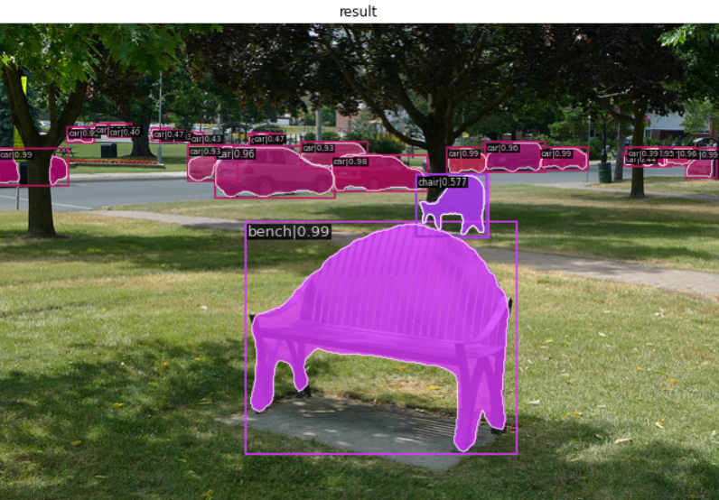
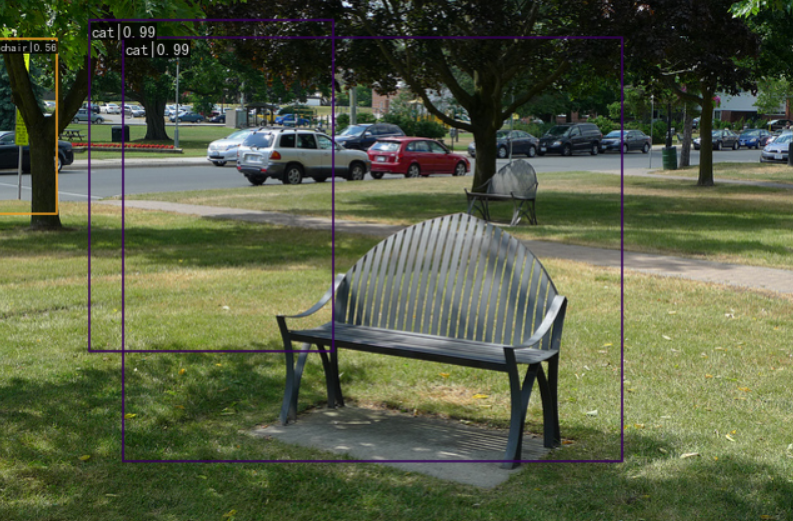
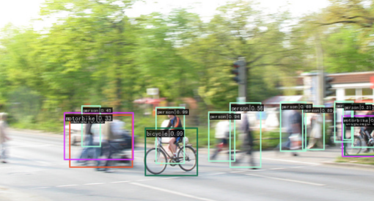
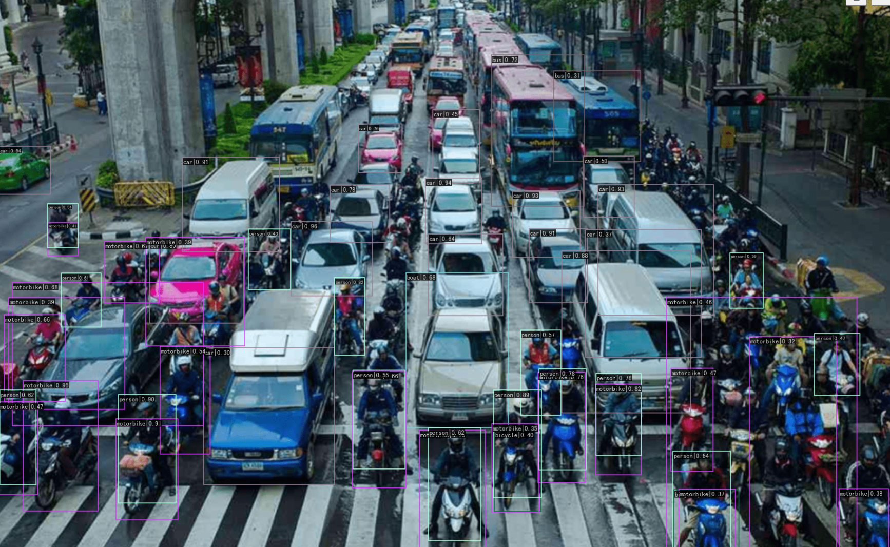
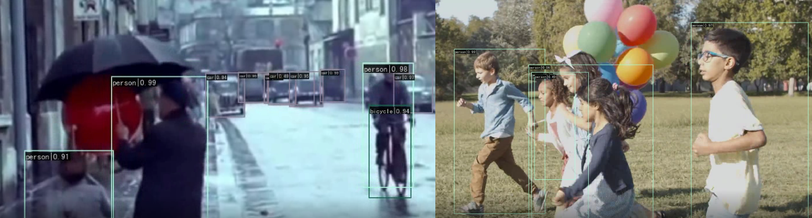
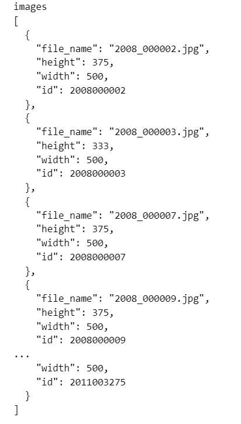

# OpenMMlab_AI_2023.2

参数文件：

1. 作业二进阶版的.pth参数文件放在如下网盘链接

链接：https://pan.baidu.com/s/17PbLI8LMV5XapEhsYiPKvw?pwd=y139 
提取码：y139 

作业二_进阶版完整的代码以及工作流程在文件夹下.ipynb中，下面是对此次作业的简述

## 1.作业er相关笔记

* [计算机视觉目标检测基础知识](https://github.com/lyc686/OpenMMlab_AI_2023.2/blob/main/OpenMMlab_notes/Forth_lesson_2023.2.6.md)
* [基于MMDetection的目标检测实战](https://github.com/lyc686/OpenMMlab_AI_2023.2/blob/main/OpenMMlab_notes/Fifth_lesson_2023.2.7.md)

## 2.作业讲解

本次任务是基于PASCAL VOC2012的数据集完成目标检测任务。

### 1.安装所需工作包

```python
!pip install openmim mmengine
!mim install  mmcv-full mmdet

# 验证安装成功
import mmcv
import mmdet
```

### 2.下载训练好的预训练模型

```python
!mim download mmdet --config mask_rcnn_r101_caffe_fpn_1x_coco --dest ./checkpoint
```

### 3.在一张图片上测试检测效果

```python
from mmdet.apis import init_detector, inference_detector

from mmdet.apis import show_result_pyplot

model = init_detector('checkpoint/mask_rcnn_r101_caffe_fpn_1x_coco.py', 'checkpoint/mask_rcnn_r101_caffe_fpn_1x_coco_20200601_095758-805e06c1.pth')
result = inference_detector(model, 'test_images/demo.jpg')
print(result)

show_result_pyplot(model, 'test_images/demo.jpg', result)
```



### 4.通过VOC数据格式完成训练

修改_base_继承关系文件

* faster_rcnn_x101_64x4d_fpn_1x_coco.py

```python
_base_ = './faster_rcnn_r50_fpn_1x_coco.py'
model = dict(
    backbone=dict(
        type='ResNeXt',
        depth=101,
        groups=64,
        base_width=4,
        num_stages=4,
        out_indices=(0, 1, 2, 3),
        frozen_stages=1,
        norm_cfg=dict(type='BN', requires_grad=True),
        style='pytorch',
        init_cfg=dict(
            type='Pretrained', checkpoint='open-mmlab://resnext101_64x4d')))

load_from = 'checkpoint/faster_rcnn_x101_64x4d_fpn_1x_coco_20200204-833ee192.pth'
```

* faster_rcnn_r50_fpn_1x_coco.py

```python
_base_ = [
    '../_base_/models/faster_rcnn_r50_fpn.py',
    '../_base_/datasets/voc0712.py',
    # '../_base_/datasets/coco_detection.py',
    '../_base_/schedules/schedule_1x.py', '../_base_/default_runtime.py'
]
```

* faster_rcnn_r50_fpn.py

```python
# model settings
model = dict(
    type='FasterRCNN',
    backbone=dict(
        type='ResNet',
        depth=50,
        num_stages=4,
        out_indices=(0, 1, 2, 3),
        frozen_stages=1,
        norm_cfg=dict(type='BN', requires_grad=True),
        norm_eval=True,
        style='pytorch',
        init_cfg=dict(type='Pretrained', checkpoint='torchvision://resnet50')),
    neck=dict(
        type='FPN',
        in_channels=[256, 512, 1024, 2048],
        out_channels=256,
        num_outs=5),
    rpn_head=dict(
        type='RPNHead',
        in_channels=256,
        feat_channels=256,
        anchor_generator=dict(
            type='AnchorGenerator',
            scales=[8],
            ratios=[0.5, 1.0, 2.0],
            strides=[4, 8, 16, 32, 64]),
        bbox_coder=dict(
            type='DeltaXYWHBBoxCoder',
            target_means=[.0, .0, .0, .0],
            target_stds=[1.0, 1.0, 1.0, 1.0]),
        loss_cls=dict(
            type='CrossEntropyLoss', use_sigmoid=True, loss_weight=1.0),
        loss_bbox=dict(type='L1Loss', loss_weight=1.0)),
    roi_head=dict(
        type='StandardRoIHead',
        bbox_roi_extractor=dict(
            type='SingleRoIExtractor',
            roi_layer=dict(type='RoIAlign', output_size=7, sampling_ratio=0),
            out_channels=256,
            featmap_strides=[4, 8, 16, 32]),
        bbox_head=dict(
            type='Shared2FCBBoxHead',
            in_channels=256,
            fc_out_channels=1024,
            roi_feat_size=7,
            num_classes=20,
            bbox_coder=dict(
                type='DeltaXYWHBBoxCoder',
                target_means=[0., 0., 0., 0.],
                target_stds=[0.1, 0.1, 0.2, 0.2]),
            reg_class_agnostic=False,
            loss_cls=dict(
                type='CrossEntropyLoss', use_sigmoid=False, loss_weight=1.0),
            loss_bbox=dict(type='L1Loss', loss_weight=1.0))),
    # model training and testing settings
    train_cfg=dict(
        rpn=dict(
            assigner=dict(
                type='MaxIoUAssigner',
                pos_iou_thr=0.7,
                neg_iou_thr=0.3,
                min_pos_iou=0.3,
                match_low_quality=True,
                ignore_iof_thr=-1),
            sampler=dict(
                type='RandomSampler',
                num=256,
                pos_fraction=0.5,
                neg_pos_ub=-1,
                add_gt_as_proposals=False),
            allowed_border=-1,
            pos_weight=-1,
            debug=False),
        rpn_proposal=dict(
            nms_pre=2000,
            max_per_img=1000,
            nms=dict(type='nms', iou_threshold=0.7),
            min_bbox_size=0),
        rcnn=dict(
            assigner=dict(
                type='MaxIoUAssigner',
                pos_iou_thr=0.5,
                neg_iou_thr=0.5,
                min_pos_iou=0.5,
                match_low_quality=False,
                ignore_iof_thr=-1),
            sampler=dict(
                type='RandomSampler',
                num=512,
                pos_fraction=0.25,
                neg_pos_ub=-1,
                add_gt_as_proposals=True),
            pos_weight=-1,
            debug=False)),
    test_cfg=dict(
        rpn=dict(
            nms_pre=1000,
            max_per_img=1000,
            nms=dict(type='nms', iou_threshold=0.7),
            min_bbox_size=0),
        rcnn=dict(
            score_thr=0.05,
            nms=dict(type='nms', iou_threshold=0.5),
            max_per_img=100)
        # soft-nms is also supported for rcnn testing
        # e.g., nms=dict(type='soft_nms', iou_threshold=0.5, min_score=0.05)
    ))
```

修改分类类别和颜色

* class_names.py

```python
def voc_classes():
    return [
        'aeroplane', 'bicycle', 'bird', 'boat', 'bottle', 'bus', 'car', 'cat',
        'chair', 'cow', 'diningtable', 'dog', 'horse', 'motorbike', 'person',
        'pottedplant', 'sheep', 'sofa', 'train', 'tvmonitor'
    ]  
```

* voc.py

```python
@DATASETS.register_module()
class VOCDataset(XMLDataset):

    CLASSES = ('aeroplane', 'bicycle', 'bird', 'boat', 'bottle', 'bus', 'car',
               'cat', 'chair', 'cow', 'diningtable', 'dog', 'horse',
               'motorbike', 'person', 'pottedplant', 'sheep', 'sofa', 'train',
               'tvmonitor')
    # CLASSES = ( 'insufficient_solder', 'partial_wetting', 'poor_wetting', 'die_tilt', 'no_stage', 'solder_overflow', 'non_wetting' )
    PALETTE = [(106, 0, 228), (119, 11, 32), (165, 42, 42), (0, 0, 192),
               (197, 226, 255), (0, 60, 100), (0, 0, 142), (255, 77, 255),
               (153, 69, 1), (120, 166, 157), (0, 182, 199), (0, 226, 252),
               (182, 182, 255), (0, 0, 230), (220, 20, 60), (163, 255, 0),
               (0, 82, 0), (3, 95, 161), (0, 80, 100), (183, 130, 88)]
```

修改配置文件

* voc0712.py

```python
# dataset settings
dataset_type = 'VOCDataset'
data_root = 'data/VOCdevkit/'
img_norm_cfg = dict(
    mean=[123.675, 116.28, 103.53], std=[58.395, 57.12, 57.375], to_rgb=True)
train_pipeline = [
    dict(type='LoadImageFromFile'),
    dict(type='LoadAnnotations', with_bbox=True),
    dict(type='Resize', img_scale=(1000, 600), keep_ratio=True),
    dict(type='RandomFlip', flip_ratio=0.5),
    dict(type='Normalize', **img_norm_cfg),
    dict(type='Pad', size_divisor=32),
    dict(type='DefaultFormatBundle'),
    dict(type='Collect', keys=['img', 'gt_bboxes', 'gt_labels']),
]
test_pipeline = [
    dict(type='LoadImageFromFile'),
    dict(
        type='MultiScaleFlipAug',
        img_scale=(1000, 600),
        flip=False,
        transforms=[
            dict(type='Resize', keep_ratio=True),
            dict(type='RandomFlip'),
            dict(type='Normalize', **img_norm_cfg),
            dict(type='Pad', size_divisor=32),
            dict(type='ImageToTensor', keys=['img']),
            dict(type='Collect', keys=['img']),
        ])
]
data = dict(
    samples_per_gpu=32,
    workers_per_gpu=2,
    train=dict(
        type='RepeatDataset',
        times=3,
        dataset=dict(
            type=dataset_type,
            ann_file=[
                #data_root + 'VOC2007/ImageSets/Main/trainval.txt',
                #data_root + 'VOC2012/ImageSets/Main/trainval.txt'
                data_root + 'VOC2012/ImageSets/Main/train.txt'
            ],
            img_prefix=[data_root + 'VOC2012/'],
            pipeline=train_pipeline)),
    val=dict(
        type=dataset_type,
        ann_file=data_root + 'VOC2012/ImageSets/Main/val.txt',
        img_prefix=data_root + 'VOC2012/',
        pipeline=test_pipeline),
    test=dict(
        type=dataset_type,
        ann_file=data_root + 'VOC2012/ImageSets/Main/val.txt',
        img_prefix=data_root + 'VOC2012/',
        pipeline=test_pipeline))
evaluation = dict(interval=1, metric='mAP')
```

修改训练epoch数

* default_runtime.py

```python
checkpoint_config = dict(interval=5)
# yapf:disable
log_config = dict(
    interval=50,
    hooks=[
        dict(type='TextLoggerHook'),
        # dict(type='TensorboardLoggerHook')
    ])
# yapf:enable
custom_hooks = [dict(type='NumClassCheckHook')]

dist_params = dict(backend='nccl')
log_level = 'INFO'
load_from = None
resume_from = None
workflow = [('train', 1)]

# disable opencv multithreading to avoid system being overloaded
opencv_num_threads = 0
# set multi-process start method as `fork` to speed up the training
mp_start_method = 'fork'

# Default setting for scaling LR automatically
#   - `enable` means enable scaling LR automatically
#       or not by default.
#   - `base_batch_size` = (8 GPUs) x (2 samples per GPU).
auto_scale_lr = dict(enable=False, base_batch_size=16)
```

修改学习率

* schedule_1x.py

```python
# optimizer
optimizer = dict(type='SGD', lr=0.02/8, momentum=0.9, weight_decay=0.0001)
optimizer_config = dict(grad_clip=None)
# learning policy
lr_config = dict(
    policy='step',
    warmup='linear',
    warmup_iters=500,
    warmup_ratio=0.001,
    step=[8, 11])
runner = dict(type='EpochBasedRunner', max_epochs=10)
```

### 5.训练

```python
# 在mmdetection目录下命令行执行
!python3 ./tools/train.py configs/faster_rcnn/faster_rcnn_x101_64x4d_fpn_1x_coco.py
```

### 6.测试训练效果

```python
from mmdet.apis import init_detector, inference_detector

from mmdet.apis import show_result_pyplot

model = init_detector('work_dirs/faster_rcnn_x101_64x4d_fpn_1x_coco/faster_rcnn_x101_64x4d_fpn_1x_coco.py', 'work_dirs/faster_rcnn_x101_64x4d_fpn_1x_coco/latest.pth')
result = inference_detector(model, '../OpenMMlab_AI_2023.2/run/test_images/demo.jpg')
print(result)

show_result_pyplot(model, '../OpenMMlab_AI_2023.2/run/test_images/demo.jpg', result)
show_result_pyplot(model, '../OpenMMlab_AI_2023.2/run/test_images/demo.jpg', result, out_file=f'../OpenMMlab_AI_2023.2/run/test_images/mmdet_demo.jpg')
```



```python
result = inference_detector(model, '../OpenMMlab_AI_2023.2/run/test_images/bicycle.jpg')
show_result_pyplot(model, '../OpenMMlab_AI_2023.2/run/test_images/bicycle.jpg', result)
show_result_pyplot(model, '../OpenMMlab_AI_2023.2/run/test_images/bicycle.jpg', result, out_file=f'../OpenMMlab_AI_2023.2/run/test_images/mmdet_bicycle.jpg')
```



```python
result = inference_detector(model, '../OpenMMlab_AI_2023.2/run/test_images/car.jpg')
show_result_pyplot(model, '../OpenMMlab_AI_2023.2/run/test_images/car.jpg', result)
show_result_pyplot(model, '../OpenMMlab_AI_2023.2/run/test_images/car.jpg', result, out_file=f'../OpenMMlab_AI_2023.2/run/test_images/mmdet_car.jpg')
```



### 7.预测视频

```python
input_video = '../OpenMMlab_AI_2023.2/run/test_images/test_video.mp4'

from mmdet.apis import init_detector, inference_detector
from mmdet.apis import show_result_pyplot

model = init_detector('work_dirs/faster_rcnn_x101_64x4d_fpn_1x_coco/faster_rcnn_x101_64x4d_fpn_1x_coco.py', 'work_dirs/faster_rcnn_x101_64x4d_fpn_1x_coco/latest.pth')

import numpy as np
from PIL import Image

def mmdet_frame(img, frame_id):
    '''
    输入摄像头画面bgr-array
    '''
    img_bgr = img
    #!mim test mmdet checkpoint/balloon.py --checkpoint work_dirs/balloon/latest.pth --show-dir remain/pred
    result = inference_detector(model, img)
    show_result_pyplot(model, img_bgr, result, out_file=f'../OpenMMlab_AI_2023.2/run/remain_voc/pred/{frame_id:06d}.jpg')
    
save_path = "../OpenMMlab_AI_2023.2/run/remain_voc/test"

# 读入待预测视频
imgs = mmcv.VideoReader(input_video)

prog_bar = mmcv.ProgressBar(len(imgs))

# 对视频逐帧处理
for frame_id, img in enumerate(imgs):

    ## 处理单帧画面
    cv.imwrite(f'{save_path}/{frame_id:06d}.jpg', img)
    img = mmdet_frame(img, frame_id)

    prog_bar.update() # 更新进度条

# 把每一帧串成视频文件
mmcv.frames2video("../OpenMMlab_AI_2023.2/run/remain_voc/pred", '../OpenMMlab_AI_2023.2/run/output/VOC_test_mmdet.mp4', fps=imgs.fps, fourcc='mp4v')

# shutil.rmtree(remain) # 删除存放每帧画面的临时文件夹
# print('删除临时文件夹', remain)
```





### 8.另一种方式：将标注文件转换成COCO格式进行训练

```python
import json
import os
import time
import json
import xml.etree.ElementTree as ET
import argparse
import shutil
import os.path as osp
import cv2 as cv
import torch
import numpy as np
from PIL import Image


# 用于将VOC2012标注文件转换成COCO格式
def transform_voc2coco():
    voc_root = r"E:\python_dataset\VOC2012"
    project_root = r"E:\python_dataset\COCO"
    # # 获取工程的根绝对路径
    # project_root = os.path.realpath(os.curdir)
    # while True:
    #     if ".idea" in os.listdir(project_root):
    #         break
    #     else:
    #         project_root = os.path.join(project_root, "..")

    # 构建COCO完整目录
    coco_root = os.path.join(project_root, r"data\voc_coco")
    coco_train = os.path.join(coco_root, "train")
    coco_val = os.path.join(coco_root, "val")
    coco_anno = os.path.join(coco_root, "annotations")
    coco_train_anno = os.path.join(coco_anno, "train.json")
    coco_val_anno = os.path.join(coco_anno, "val.json")
    if not os.path.exists(coco_root):
        os.makedirs(coco_root)
        os.mkdir(coco_train)
        os.mkdir(coco_val)
        os.mkdir(coco_anno)

    coco_train_num = len(os.listdir(coco_train))
    coco_val_num = len(os.listdir(coco_val))
    print(f"train number: {coco_train_num}")
    print(f"val number: {coco_val_num}")

    # voc数据集目录
    voc_anno_dir = os.path.join(voc_root, "Annotations")
    voc_images_dir = os.path.join(voc_root, "JPEGImages")
    voc_train_txt = os.path.join(voc_root, "ImageSets/Main/train.txt")
    voc_val_txt = os.path.join(voc_root, "ImageSets/Main/val.txt")

    overwrite_images = True
    # 复制voc图片到coco
    if overwrite_images:
        # 复制训练集图片
        with open(voc_train_txt, "r") as f:
            lines = f.readlines()
            for line in lines:
                image_name = line.strip() + ".jpg"
                image_path = os.path.join(voc_images_dir, image_name)
                shutil.copy(image_path, os.path.join(coco_train, image_name))

        # 复制验证集图片
        with open(voc_val_txt, "r") as f:
            lines = f.readlines()
            for line in lines:
                image_name = line.strip() + ".jpg"
                image_path = os.path.join(voc_images_dir, image_name)
                shutil.copy(image_path, os.path.join(coco_val, image_name))

    def _extract_anno(fp, mode: str = "train"):
        txt_file = voc_train_txt if mode == "train" else voc_val_txt

        # 预定义VOC检测的20个类别以及超类
        supercategorys = ["vehicles", "household", "animals", "person"]
        vehicles = ["car", "bus", "bicycle", "motorbike", "aeroplane", "boat", "train"]
        household = ["chair", "sofa", "diningtable", "tvmonitor", "bottle", "pottedplant"]
        animals = ["cat", "dog", "cow", "horse", "sheep", "bird"]
        person = ["person"]
        classes = ["aeroplane", "bicycle", "bird", "boat", "bottle", "bus", "car", "cat", "chair", "cow", "diningtable",
                   "dog", "horse", "motorbike", "person", "pottedplant", "sheep", "sofa", "train", "tvmonitor"]

        # 预构建coco格式的json文件
        json_file = {"images": [], "annotations": [],
                     "categories": [{"id": i, "name": class_,
                                     "supercategory": ""} for i, class_ in enumerate(classes)]}
        for i, class_ in enumerate(classes):
            if class_ in vehicles:
                json_file["categories"][i]["supercategory"] = supercategorys[0]
            elif class_ in household:
                json_file["categories"][i]["supercategory"] = supercategorys[1]
            elif class_ in animals:
                json_file["categories"][i]["supercategory"] = supercategorys[2]
            elif class_ in person:
                json_file["categories"][i]["supercategory"] = supercategorys[3]
            else:
                raise "unsupported class"

        # 写入json文件
        i = 0
        with open(txt_file, "r") as f_:
            lines = f_.readlines()
            for line in lines:
                image_xml = line.strip() + ".xml"
                image_xml_path = os.path.join(voc_anno_dir, image_xml)
                xml_obj = ET.parse(image_xml_path)
                root = xml_obj.getroot()
                img_dir = {"file_name": "", "width": 0, "height": 0, "objects": []}
                # i = 0
                for eles in root:
                    if eles.tag == "filename":
                        img_dir["file_name"] = eles.text
                    elif eles.tag == "size":
                        for ele in eles:
                            img_dir["width"] = int(ele.text) if ele.tag == "width" else int(img_dir["width"])
                            img_dir["height"] = int(ele.text) if ele.tag == "height" else int(img_dir["height"])
                    elif eles.tag == "object":
                        obj_dir = {"name": "", "bndbox": [], "image_id": int(img_dir["file_name"].split(".")[0]),
                                   "id": i}
                        i = i + 1
                        for ele in eles:
                            obj_dir["name"] = ele.text if ele.tag == "name" else obj_dir["name"]
                            if ele.tag == "bndbox":
                                for pos in ele:
                                    if pos.tag == "xmin":
                                        xmin = int(pos.text)
                                    elif pos.tag == "xmax":
                                        xmax = int(pos.text)
                                    elif pos.tag == "ymin":
                                        ymin = int(pos.text)
                                    elif pos.tag == "ymax":
                                        ymax = int(pos.text)
                                    else:
                                        raise "unsupported pose"
                                obj_dir["bndbox"] = [xmin, ymin, xmax - xmin, ymax - ymin]
                        img_dir["objects"].append(obj_dir)
                        json_file["annotations"].append({"id": obj_dir["id"],
                                                         "image_id": obj_dir["image_id"],
                                                         "category_id": classes.index(obj_dir["name"]),
                                                         "segmentation": [],
                                                         "area": float(obj_dir["bndbox"][2] * obj_dir["bndbox"][3]),
                                                         "bbox": obj_dir["bndbox"],
                                                         "iscrowd": 0})
                    else:
                        continue
                json_file["images"].append({"file_name": img_dir["file_name"],
                                            "height": img_dir["height"],
                                            "width": img_dir["width"],
                                            "id": int(img_dir["file_name"].split(".")[0])})
            json.dump(json_file, fp)

    # 生成coco的annotation标注文件
    override_anno = True
    # 有一个文件不存在或者需要覆盖掉之前的标注
    if not os.path.exists(coco_train_anno) or not os.path.exists(coco_val_anno) or override_anno:
        with open(coco_train_anno, "w") as f:
            _extract_anno(f, "train")

        with open(coco_val_anno, "w") as f:
            _extract_anno(f, "val")

    print("-" * 30 + "finish" + "-" * 30)

    return "transform_voc2coco()"


# 程序执行部分
if __name__ == '__main__':
    print("--------------------------")
    print("torch version:", torch.__version__, "\n", "cv version", cv.__version__)
    print("--------------------------")
    begin_time = time.time()
    # 执行函数
    # show()
    # convert_balloon_to_coco('data/balloon/train/via_region_data.json', 'data/balloon/annotations/train.json','data/balloon/train')
    # convert_balloon_to_coco('data/balloon/val/via_region_data.json', 'data/balloon/annotations/val.json','data/balloon/val')
    fun_name = transform_voc2coco()
    finish_time = time.time()

    print(f"当前正在执行{fun_name}()函数")
    print("程序开始时间：", begin_time, "\n", "程序截至时间：", finish_time)
    print("总耗时：", finish_time - begin_time)
```

查看json文件内容

```python
# 查看单张图片的标签格式
import json

with open('data/voc_coco/annotations/val_1.json') as f:
    data = json.load(f)
anno1 = list(data.keys())[0]
# print(data)
# print(data.keys())
print(anno1)
print(json.dumps(data[anno1], indent=2))
```



使用_base_继承的方式修改配置文件

```python
_base_ = ['mask_rcnn_r101_caffe_fpn_1x_coco.py']

model = dict(roi_head=dict(bbox_head=dict(num_classes=20)), mask_head=dict(num_classes=20))

dataset_type = 'CocoDataset'
data_root = 'data/voc_coco/'
data = dict(
    samples_per_gpu=32,
    workers_per_gpu=2,
    train=dict(
        ann_file='data/voc_coco/annotations/train.json',
        img_prefix='data/voc_coco/train',
        classes=("aeroplane", "bicycle", "bird", "boat", "bottle", "bus", "car", "cat", "chair", "cow", "diningtable",
                   "dog", "horse", "motorbike", "person", "pottedplant", "sheep", "sofa", "train", "tvmonitor")
    ),
    val=dict(
        type='CocoDataset',
        ann_file='data/voc_coco/annotations/val.json',
        img_prefix='data/voc_coco/val',
        classes=("aeroplane", "bicycle", "bird", "boat", "bottle", "bus", "car", "cat", "chair", "cow", "diningtable",
                   "dog", "horse", "motorbike", "person", "pottedplant", "sheep", "sofa", "train", "tvmonitor")
        ),
    test=dict(
        type='CocoDataset',
        ann_file='data/voc_coco/annotations/val.json',
        img_prefix='data/voc_coco/val',
        classes=("aeroplane", "bicycle", "bird", "boat", "bottle", "bus", "car", "cat", "chair", "cow", "diningtable",
                   "dog", "horse", "motorbike", "person", "pottedplant", "sheep", "sofa", "train", "tvmonitor")
    ))
evaluation = dict(metric=['bbox', 'segm'])
optimizer = dict(type='SGD', lr=0.02/8, momentum=0.9, weight_decay=0.0001)

runner = dict(type='EpochBasedRunner', max_epochs=5)
checkpoint_config = dict(interval=1)
log_config = dict(interval=100, hooks=[dict(type='TextLoggerHook')])

load_from = 'checkpoint/mask_rcnn_r101_caffe_fpn_1x_coco_20200601_095758-805e06c1.pth'
```

