# OpenMMlab_AI_2023.2

参数文件：

1. 作业三基础版的.pth参数文件放在如下网盘链接

链接：https://pan.baidu.com/s/1Qi-BaWbv_9-R5DD9g2Kq2g?pwd=yl0d 
提取码：yl0d 

## 1.作业三相关笔记

* [计算机视觉图像分割基础知识](https://github.com/lyc686/OpenMMlab_AI_2023.2/blob/main/OpenMMlab_notes/Sixth_lesson_2023.2.9.md)
* [基于MMSegmentation的图像分割实战](https://github.com/lyc686/OpenMMlab_AI_2023.2/blob/main/OpenMMlab_notes/Seventh_lesson_2023.2.10.md)

## 2.作业讲解

本次任务是基于一个小鼠肾小球的数据集完成语义分割检测任务。

### 1.安装所需工具包

```python
!pip3 install install torch==1.10.1+cu113 torchvision==0.11.2+cu113 torchaudio==0.10.1+cu113 -f https://download.pytorch.org/whl/cu113/torch_stable.html

!pip install -U openmim
!mim install openmim mmengine
# !mim install 'mmcv>=2.0.0rc1'
!mim install 'mmcv==2.0.0rc4' mmcv-full

!pip install opencv-python pillow matplotlib seaborn tqdm 'mmdet>=3.0.0rc1' -i https://pypi.tuna.tsinghua.edu.cn/simple

# 从 github 上下载最新的 mmsegmentation 源代码
!git clone https://github.com/open-mmlab/mmsegmentation.git -b dev-1.x

# 进入主目录
import os
os.chdir('mmsegmentation')

!pip install -v -e .

pip install mmsegmentation
```

检查是否安装成功

```python
# 检查 Pytorch
import torch, torchvision
print('Pytorch 版本', torch.__version__)
print('CUDA 是否可用',torch.cuda.is_available())
```

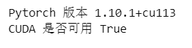

```python
# 检查 mmcv
import mmcv
from mmcv.ops import get_compiling_cuda_version, get_compiler_version
print('MMCV版本', mmcv.__version__)
print('CUDA版本', get_compiling_cuda_version())
print('编译器版本', get_compiler_version())
```

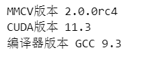

```python
# 检查 mmsegmentation
import mmseg
from mmseg.utils import register_all_modules
from mmseg.apis import inference_model, init_model
print('mmsegmentation版本', mmseg.__version__)
```

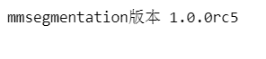

### 2.下载训练好的预训练模型

```python
!mim download mmsegmentation --config pspnet_r50-d8_4xb2-80k_cityscapes-512x1024 --dest ./checkpoint
```

### 3.查看数据集图像个数

```python
PATH_IMAGE = 'data/Glomeruli-dataset/images'
PATH_MASKS = 'data/Glomeruli-dataset/masks'

print('图像个数', len(os.listdir(PATH_IMAGE)))
print('标注个数', len(os.listdir(PATH_MASKS)))
```


### 4.查看单张图像机器语义分割标注

```python
# 指定图像文件名
file_name = 'SAS_21883_001_10.png'

img_path = os.path.join(PATH_IMAGE, file_name)
mask_path = os.path.join(PATH_MASKS, file_name)

print('图像路径', img_path)
print('标注路径', mask_path)

img = cv2.imread(img_path)
mask = cv2.imread(mask_path)

# 可视化语义分割标注
plt.imshow(mask*255)
plt.show()
```


```python
plt.imshow(img)
plt.imshow(mask*255, alpha=0.5) # alpha 高亮区域透明度，越小越接近原图
plt.title(file_name)
plt.axis('off')
plt.show()
```

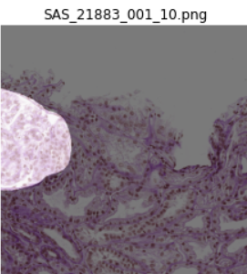

### 5.可视化20张有前景标注的-图像的标注结果

```python
# n行n列可视化
n = 7

# 标注区域透明度
opacity = 0.5

fig, axes = plt.subplots(nrows=n, ncols=n, sharex=True, figsize=(12,12))

i = 0

for file_name in os.listdir(PATH_IMAGE):
    
    # 载入图像和标注
    img_path = os.path.join(PATH_IMAGE, file_name)
    mask_path = os.path.join(PATH_MASKS, file_name)
    img = cv2.imread(img_path)
    mask = cv2.imread(mask_path)
    # 控制多行绘制
    if 1 in mask:
        axes[i//n, i%n].imshow(img)
        axes[i//n, i%n].imshow(mask*255, alpha=opacity)
        axes[i//n, i%n].axis('off') # 关闭坐标轴显示
        i += 1
    if i > n**2-1:
        break
fig.suptitle('Image and Semantic Label', fontsize=30)
plt.tight_layout()
plt.show()
```

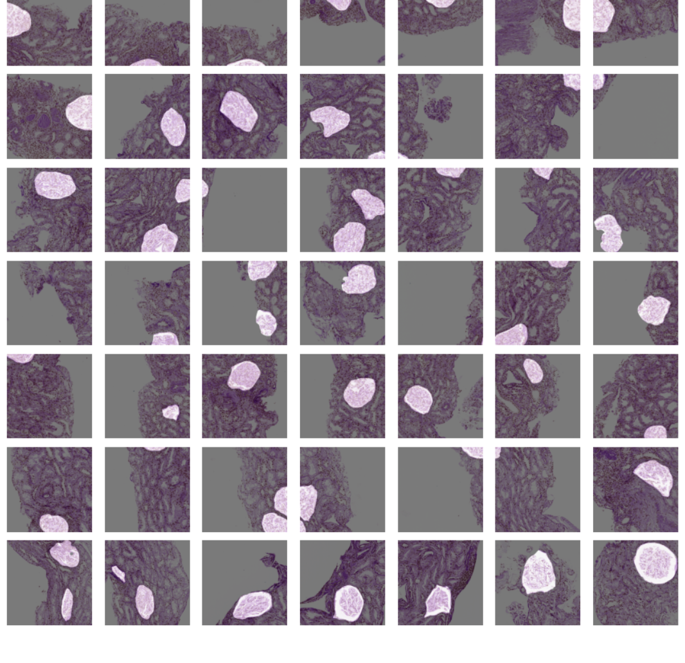

### 6.不论是否有前景标注都可视化

```python
# n行n列可视化
n = 10

# 标注区域透明度
opacity = 0.5

fig, axes = plt.subplots(nrows=n, ncols=n, sharex=True, figsize=(12,12))

for i, file_name in enumerate(os.listdir(PATH_IMAGE)[:n**2]):
    
    # 载入图像和标注
    img_path = os.path.join(PATH_IMAGE, file_name)
    mask_path = os.path.join(PATH_MASKS, file_name)
    img = cv2.imread(img_path)
    mask = cv2.imread(mask_path)
    
    # 可视化
    axes[i//n, i%n].imshow(img)
    axes[i//n, i%n].imshow(mask*255, alpha=opacity)
    axes[i//n, i%n].axis('off') # 关闭坐标轴显示
fig.suptitle('Image and Semantic Label', fontsize=30)
plt.tight_layout()
plt.show()
```

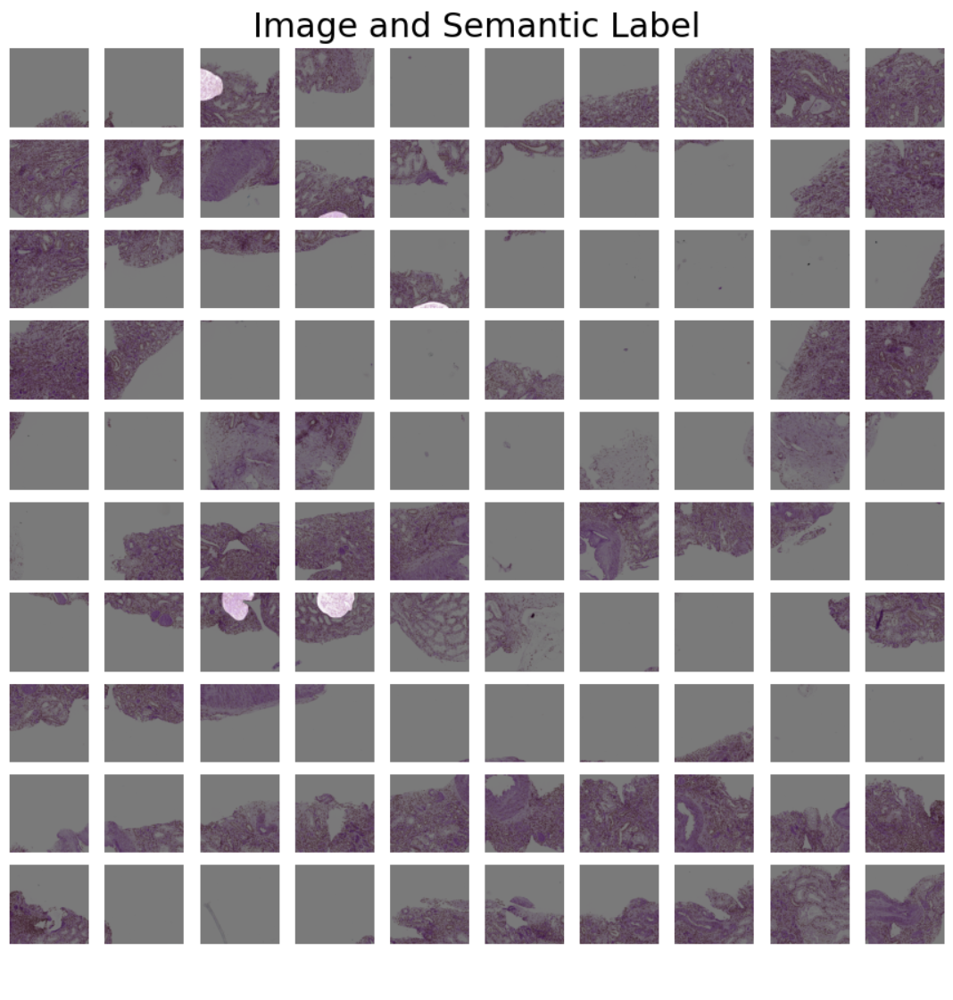

### 7.划分训练集和测试集

```python
import os
import random

PATH_IMAGE = 'data/Glomeruli-dataset/images'

all_file_list = os.listdir(PATH_IMAGE)
all_file_num = len(all_file_list)
random.shuffle(all_file_list) # 随机打乱全部数据文件名列表

# 指定训练集和测试集比例
train_ratio = 0.8
test_ratio = 1 - train_ratio
train_file_list = all_file_list[:int(all_file_num*train_ratio)]
test_file_list = all_file_list[int(all_file_num*train_ratio):]

print('数据集图像总数', all_file_num)
print('训练集划分比例', train_ratio)
print('训练集图像个数', len(train_file_list))
print('测试集图像个数', len(test_file_list))
```

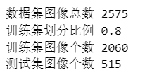

划分成两个.txt文件

```python
with open('data/Glomeruli-dataset/splits/train.txt', 'w') as f:
    f.writelines(line.split('.')[0] + '\n' for line in train_file_list)
with open('data/Glomeruli-dataset/splits/val.txt', 'w') as f:
    f.writelines(line.split('.')[0] + '\n' for line in test_file_list)
```

### 8.修改配置文件

设置类别和标注颜色

```python
# 数据集图片和标注路径
data_root = 'data/Glomeruli-dataset'
img_dir = 'images'
ann_dir = 'masks'

# 类别和对应的颜色
classes = ('background', 'glomeruili')
palette = [[128, 128, 128], [151, 189, 8]]
```

修改配置文件

```python
cfg.norm_cfg = dict(type='BN', requires_grad=True) # 只使用GPU时，BN取代SyncBN
cfg.crop_size = (256, 256)
cfg.model.data_preprocessor.size = cfg.crop_size
cfg.model.backbone.norm_cfg = cfg.norm_cfg
cfg.model.decode_head.norm_cfg = cfg.norm_cfg
cfg.model.auxiliary_head.norm_cfg = cfg.norm_cfg
# modify num classes of the model in decode/auxiliary head
cfg.model.decode_head.num_classes = 2
cfg.model.auxiliary_head.num_classes = 2

# 修改数据集的 type 和 root
cfg.dataset_type = 'StanfordBackgroundDataset'
cfg.data_root = data_root

cfg.train_dataloader.batch_size = 8

cfg.train_pipeline = [
    dict(type='LoadImageFromFile'),
    dict(type='LoadAnnotations'),
    dict(type='RandomResize', scale=(320, 240), ratio_range=(0.5, 2.0), keep_ratio=True),
    dict(type='RandomCrop', crop_size=cfg.crop_size, cat_max_ratio=0.75),
    dict(type='RandomFlip', prob=0.5),
    dict(type='PackSegInputs')
]

cfg.test_pipeline = [
    dict(type='LoadImageFromFile'),
    dict(type='Resize', scale=(320, 240), keep_ratio=True),
    # add loading annotation after ``Resize`` because ground truth
    # does not need to do resize data transform
    dict(type='LoadAnnotations'),
    dict(type='PackSegInputs')
]


cfg.train_dataloader.dataset.type = cfg.dataset_type
cfg.train_dataloader.dataset.data_root = cfg.data_root
cfg.train_dataloader.dataset.data_prefix = dict(img_path=img_dir, seg_map_path=ann_dir)
cfg.train_dataloader.dataset.pipeline = cfg.train_pipeline
cfg.train_dataloader.dataset.ann_file = 'splits/train.txt'

cfg.val_dataloader.dataset.type = cfg.dataset_type
cfg.val_dataloader.dataset.data_root = cfg.data_root
cfg.val_dataloader.dataset.data_prefix = dict(img_path=img_dir, seg_map_path=ann_dir)
cfg.val_dataloader.dataset.pipeline = cfg.test_pipeline
cfg.val_dataloader.dataset.ann_file = 'splits/val.txt'

cfg.test_dataloader = cfg.val_dataloader


# 载入预训练模型权重
cfg.load_from = './checkpoint/pspnet_r50-d8_512x1024_80k_cityscapes_20200606_112131-2376f12b.pth'

# 工作目录
cfg.work_dir = './work_dirs/tutorial'

# 训练迭代次数
cfg.train_cfg.max_iters = 800
# 评估模型间隔
cfg.train_cfg.val_interval = 400
# 日志记录间隔
cfg.default_hooks.logger.interval = 100
# 模型权重保存间隔
cfg.default_hooks.checkpoint.interval = 400

# 随机数种子
cfg['randomness'] = dict(seed=0)
```

### 9.训练

```python
# 载入 config 配置文件
from mmengine import Config
cfg = Config.fromfile('./checkpoint/new_cfg.py')

from mmengine.runner import Runner
from mmseg.utils import register_all_modules

# register all modules in mmseg into the registries
# do not init the default scope here because it will be init in the runner
register_all_modules(init_default_scope=False)
runner = Runner.from_cfg(cfg)

runner.train()
```

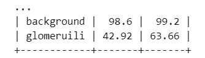

### 10.测试训练效果

载入训练好的模型

```python
import numpy as np
import matplotlib.pyplot as plt
%matplotlib inline

from mmseg.apis import init_model, inference_model, show_result_pyplot
import mmcv
import cv2

# 载入 config 配置文件
from mmengine import Config
cfg = Config.fromfile('./checkpoint/new_cfg.py')

from mmengine.runner import Runner
from mmseg.utils import register_all_modules


# 初始化模型
checkpoint_path = './work_dirs/tutorial/iter_800.pth'
model = init_model(cfg, checkpoint_path, 'cuda:0')
```

载入图像进行预测

```python
img = mmcv.imread('./data/Glomeruli-dataset/images/VUHSK_1702_39.png')

result = inference_model(model, img)
```

可视化语义分割结果

```python
# 可视化预测结果
visualization = show_result_pyplot(model, img, result, opacity=0.7, out_file='./output/pred.jpg')
plt.imshow(mmcv.bgr2rgb(visualization))

plt.imshow(pred_mask)

plt.show()
```

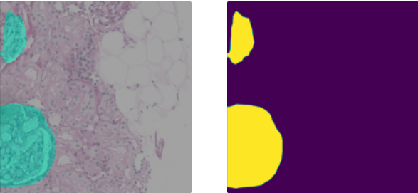

### 11.打印混淆矩阵

```python
# 真实为前景，预测为前景
TP = (label_mask == 1) & (pred_mask==1)
# 真实为背景，预测为背景
TN = (label_mask == 0) & (pred_mask==0)
# 真实为前景，预测为背景
FN = (label_mask == 1) & (pred_mask==0)
# 真实为背景，预测为前景
FP = (label_mask == 0) & (pred_mask==1)

confusion_map = TP * 255 + FP * 150 + FN * 80 + TN * 10

confusion_map = TP * 255 + FP * 150 + FN * 80 + TN * 10
```

```python
from sklearn.metrics import confusion_matrix

confusion_matrix_model = confusion_matrix(label_mask.flatten(), pred_mask.flatten())

import itertools
def cnf_matrix_plotter(cm, classes, cmap=plt.cm.Blues):
    """
    传入混淆矩阵和标签名称列表，绘制混淆矩阵
    """
    plt.figure(figsize=(10, 10))
    
    plt.imshow(cm, interpolation='nearest', cmap=cmap)
    # plt.colorbar() # 色条
    tick_marks = np.arange(len(classes))
    
    plt.title('Confusion Matrix', fontsize=30)
    plt.xlabel('Pred', fontsize=25, c='r')
    plt.ylabel('True', fontsize=25, c='r')
    plt.tick_params(labelsize=16) # 设置类别文字大小
    plt.xticks(tick_marks, classes, rotation=90) # 横轴文字旋转
    plt.yticks(tick_marks, classes)
    
    # 写数字
    threshold = cm.max() / 2.
    for i, j in itertools.product(range(cm.shape[0]), range(cm.shape[1])):
        plt.text(j, i, cm[i, j],
                 horizontalalignment="center",
                 color="white" if cm[i, j] > threshold else "black",
                 fontsize=12)

    plt.tight_layout()

    plt.savefig('混淆矩阵.pdf', dpi=300) # 保存图像
    plt.show()
    
cnf_matrix_plotter(confusion_matrix_model, classes, cmap='Blues')
```

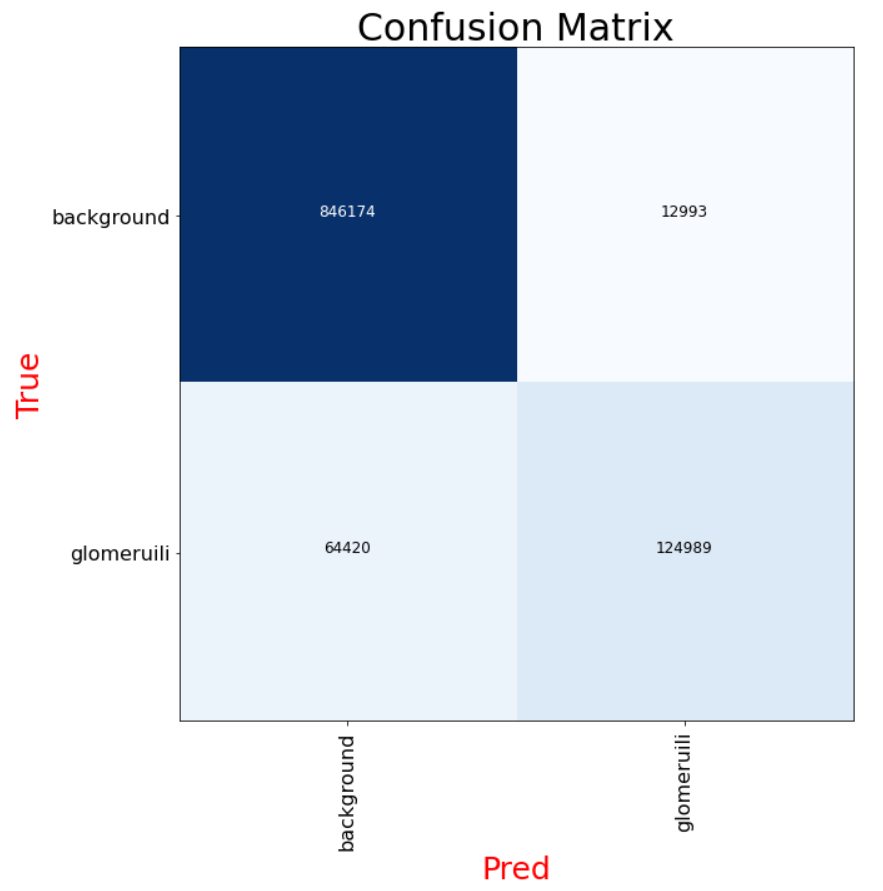

### 12.测试集性能评估

```python
# 数据集配置文件
!wget https://zihao-openmmlab.obs.cn-east-3.myhuaweicloud.com/20230130-mmseg/dataset/StanfordBackgroundDataset.py -O ./mmseg/datasets/StanfordBackgroundDataset.py

# 修改 ../mmsegmentation/mmseg/datasets/__init__.py，添加数据集
!wget https://zihao-openmmlab.obs.cn-east-3.myhuaweicloud.com/20230130-mmseg/dataset/__init__.py -O ./mmseg/datasets/__init__.py
```

测试集精读指标

```python
!python ./tools/test.py ./checkpoint/new_cfg.py ./work_dirs/tutorial/iter_800.pth
```

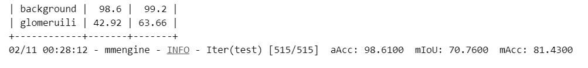

测试集速度指标

```python
!python ./tools/analysis_tools/benchmark.py ./checkpoint/new_cfg.py ./work_dirs/tutorial/iter_800.pth
```

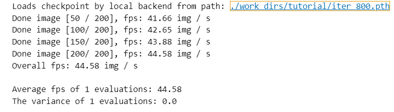
