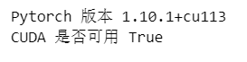
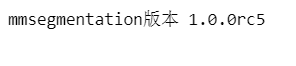

# OpenMMlab_AI_2023.2

参数文件：

1. 作业三进阶版的.pth参数文件放在如下网盘链接

链接：https://pan.baidu.com/s/1LIjCflS568z_01Mm_kkHEw?pwd=t7xq 
提取码：t7xq 

## 1.作业三相关笔记

* [计算机视觉图像分割基础知识](https://github.com/lyc686/OpenMMlab_AI_2023.2/blob/main/OpenMMlab_notes/Sixth_lesson_2023.2.9.md)
* [基于MMSegmentation的图像分割实战](https://github.com/lyc686/OpenMMlab_AI_2023.2/blob/main/OpenMMlab_notes/Seventh_lesson_2023.2.10.md)

## 2.作业讲解

本次任务是基于PASCAL VOC2012的数据集完成语义分割检测任务。

### 1.安装所需工具包

```python
!pip3 install install torch==1.10.1+cu113 torchvision==0.11.2+cu113 torchaudio==0.10.1+cu113 -f https://download.pytorch.org/whl/cu113/torch_stable.html

!pip install -U openmim
!mim install openmim mmengine
# !mim install 'mmcv>=2.0.0rc1'
!mim install 'mmcv==2.0.0rc4' mmcv-full

!pip install opencv-python pillow matplotlib seaborn tqdm 'mmdet>=3.0.0rc1' -i https://pypi.tuna.tsinghua.edu.cn/simple

# 从 github 上下载最新的 mmsegmentation 源代码
!git clone https://github.com/open-mmlab/mmsegmentation.git -b dev-1.x

# 进入主目录
import os
os.chdir('mmsegmentation')

!pip install -v -e .

pip install mmsegmentation
```

检查是否安装成功

```python
# 检查 Pytorch
import torch, torchvision
print('Pytorch 版本', torch.__version__)
print('CUDA 是否可用',torch.cuda.is_available())
```



```python
# 检查 mmcv
import mmcv
from mmcv.ops import get_compiling_cuda_version, get_compiler_version
print('MMCV版本', mmcv.__version__)
print('CUDA版本', get_compiling_cuda_version())
print('编译器版本', get_compiler_version())
```


```python
# 检查 mmsegmentation
import mmseg
from mmseg.utils import register_all_modules
from mmseg.apis import inference_model, init_model
print('mmsegmentation版本', mmseg.__version__)
```



### 2.下载训练好的预训练模型

```python
!mim download mmsegmentation --config pspnet_r50-d8_4xb2-80k_cityscapes-512x1024 --dest ./checkpoint
```

### 3.查看数据集图像个数

```python
PATH_IMAGE = 'data/VOCdevkit/VOC2012/JPEGImages'
PATH_MASKS = 'data/VOCdevkit/VOC2012/SegmentationClass'

print('图像个数', len(os.listdir(PATH_IMAGE)))
print('标注个数', len(os.listdir(PATH_MASKS)))
```


### 4.查看单张图像机器语义分割标注

```python
# 指定图像文件名
imgfile_name = '2007_000129.jpg'
maskfile_name = '2007_000129.png'

img_path = os.path.join(PATH_IMAGE, imgfile_name)
mask_path = os.path.join(PATH_MASKS, maskfile_name)

print('图像路径', img_path)
print('标注路径', mask_path)

img = cv2.imread(img_path)
mask = cv2.imread(mask_path)

# 可视化图像
plt.figure(figsize=(40, 10))

# 打印原图和mask图片信息

plt.subplot(2, 10, 1)
img = cv2.cvtColor(img, cv2.COLOR_BGR2RGB)
plt.imshow(img)
plt.axis('off')
plt.subplot(2, 10, 2)
mask = cv2.cvtColor(mask, cv2.COLOR_BGR2RGB)
plt.imshow(mask)
# plt.axis(‘off’) 关闭坐标轴
plt.axis('off')
```


```python
plt.imshow(img)
plt.imshow(mask*255, alpha=0.5) # alpha 高亮区域透明度，越小越接近原图
plt.title(file_name)
plt.axis('off')
plt.show()
```


### 5.可视化100张有前景标注的-图像的标注结果

```python
# n行n列可视化
n = 7

# 标注区域透明度
opacity = 0.5

fig, axes = plt.subplots(nrows=n, ncols=n, sharex=True, figsize=(12,12))

i = 0

for file_name in os.listdir(PATH_MASKS):

    # 载入图像和标注
    img_path = os.path.join(PATH_IMAGE, file_name)
    mask_path = os.path.join(PATH_MASKS, file_name)
    # 由于两个数据集的图像后缀不一样所以转换一下
    img_path = img_path.split('.')[0]+'.jpg'
    img = cv2.imread(img_path)
    mask = cv2.imread(mask_path)
    # 控制多行绘制
    if 128 in mask:
        axes[i//n, i%n].imshow(img)
        axes[i//n, i%n].imshow(mask*255, alpha=opacity)
        axes[i//n, i%n].axis('off') # 关闭坐标轴显示
        i += 1
    if i > n**2-1:
        break
fig.suptitle('Image and Semantic Label', fontsize=30)
plt.tight_layout()
plt.show()
```


### 6.不论是否有前景标注都可视化

```python
# n行n列可视化
n = 10

# 标注区域透明度
opacity = 0.5

fig, axes = plt.subplots(nrows=n, ncols=n, sharex=True, figsize=(12,12))

for i, file_name in enumerate(os.listdir(PATH_MASKS)[:n**2]):

    # 载入图像和标注
    img_path = os.path.join(PATH_IMAGE, file_name)
    mask_path = os.path.join(PATH_MASKS, file_name)
    img_path = img_path.split('.')[0]+'.jpg'
    # print(img_path)
    # print(mask_path)
    img = cv2.imread(img_path)
    mask = cv2.imread(mask_path)

    # 可视化
    axes[i//n, i%n].imshow(img)
    axes[i//n, i%n].imshow(mask*255, alpha=opacity)
    axes[i//n, i%n].axis('off') # 关闭坐标轴显示
fig.suptitle('Image and Semantic Label', fontsize=30)
plt.tight_layout()
plt.show()
```


### 7.查看训练集和测试集

```python
import os
import random

PATH_TRAIN = 'data/VOCdevkit/VOC2012/ImageSets/Segmentation/train.txt'
PATH_VAL = 'data/VOCdevkit/VOC2012/ImageSets/Segmentation/va.txt'

!wc -l 'data/VOCdevkit/VOC2012/ImageSets/Segmentation/train.txt'
!wc -l 'data/VOCdevkit/VOC2012/ImageSets/Segmentation/val.txt'
```


### 8.修改配置文件

设置类别和颜色

```python
# 数据集图片和标注路径
data_root = 'data/VOCdevkit/VOC2012'
img_dir = 'JPEGImages'
ann_dir = 'SegmentationClass'

# 类别和对应的颜色
classes = ('background', 'aeroplane', 'bicycle', 'bird', 'boat', 'bottle', 'bus', 'car', 'cat', 'chair', 'cow', 'diningtable', 'dog', 'horse', 'motorbike', 'person', 'pottedplant', 'sheep', 'sofa', 'train', 'tvmonitor')
palette = [(0, 0, 0), (128, 0, 0), (0, 128, 0), (128, 128, 0), (0, 0, 128), (128, 0, 128), (0, 128, 128), (128, 128, 128), (64, 0, 0), (192, 0, 0), (64, 128, 0), (192, 128, 0), (64, 0, 128), (192, 0, 128), (64, 128, 128), (192, 128, 128), (0, 64, 0), (128, 64, 0), (0, 192, 0), (128, 192, 0), (0, 64, 128)]
```

指定图像扩展名

```python
from mmseg.registry import DATASETS
from mmseg.datasets import BaseSegDataset

@DATASETS.register_module()
class StanfordBackgroundDataset(BaseSegDataset):
  METAINFO = dict(classes = classes, palette = palette)
  def __init__(self, **kwargs):
    super().__init__(img_suffix='.jpg', seg_map_suffix='.png', **kwargs)
```

修改配置文件

```python
from mmengine import Config
cfg = Config.fromfile('./checkpoint/pspnet_r50-d8_4xb2-80k_cityscapes-512x1024.py')

cfg.norm_cfg = dict(type='BN', requires_grad=True) # 只使用GPU时，BN取代SyncBN
cfg.crop_size = (256, 256)
cfg.model.data_preprocessor.size = cfg.crop_size
cfg.model.backbone.norm_cfg = cfg.norm_cfg
cfg.model.decode_head.norm_cfg = cfg.norm_cfg
cfg.model.auxiliary_head.norm_cfg = cfg.norm_cfg
# modify num classes of the model in decode/auxiliary head
cfg.model.decode_head.num_classes = 21
cfg.model.auxiliary_head.num_classes = 21

# 修改数据集的 type 和 root
cfg.dataset_type = 'StanfordBackgroundDataset'
cfg.data_root = data_root

cfg.train_dataloader.batch_size = 8

cfg.train_pipeline = [
    dict(type='LoadImageFromFile'),
    dict(type='LoadAnnotations'),
    dict(type='RandomResize', scale=(320, 240), ratio_range=(0.5, 2.0), keep_ratio=True),
    dict(type='RandomCrop', crop_size=cfg.crop_size, cat_max_ratio=0.75),
    dict(type='RandomFlip', prob=0.5),
    dict(type='PackSegInputs')
]

cfg.test_pipeline = [
    dict(type='LoadImageFromFile'),
    dict(type='Resize', scale=(320, 240), keep_ratio=True),
    # add loading annotation after ``Resize`` because ground truth
    # does not need to do resize data transform
    dict(type='LoadAnnotations'),
    dict(type='PackSegInputs')
]


cfg.train_dataloader.dataset.type = cfg.dataset_type
cfg.train_dataloader.dataset.data_root = cfg.data_root
cfg.train_dataloader.dataset.data_prefix = dict(img_path=img_dir, seg_map_path=ann_dir)
cfg.train_dataloader.dataset.pipeline = cfg.train_pipeline
cfg.train_dataloader.dataset.ann_file = 'ImageSets/Segmentation/train.txt'

cfg.val_dataloader.dataset.type = cfg.dataset_type
cfg.val_dataloader.dataset.data_root = cfg.data_root
cfg.val_dataloader.dataset.data_prefix = dict(img_path=img_dir, seg_map_path=ann_dir)
cfg.val_dataloader.dataset.pipeline = cfg.test_pipeline
cfg.val_dataloader.dataset.ann_file = 'ImageSets/Segmentation/val.txt'

cfg.test_dataloader = cfg.val_dataloader


cfg.optimizer.lr = 0.01/8
cfg.optim_wrapper.optimizer.lr = 0.01/8

# 载入预训练模型权重
cfg.load_from = './checkpoint/pspnet_r50-d8_512x1024_80k_cityscapes_20200606_112131-2376f12b.pth'

# 工作目录
cfg.work_dir = './work_dirs/voc2012'

# 训练迭代次数
cfg.train_cfg.max_iters = 4000
# 评估模型间隔
cfg.train_cfg.val_interval = 1000
# 日志记录间隔
cfg.default_hooks.logger.interval = 500
# 模型权重保存间隔
cfg.default_hooks.checkpoint.interval = 1000

# 随机数种子
cfg['randomness'] = dict(seed=0)
```

### 9.训练

```python
# 载入 config 配置文件
from mmengine import Config
cfg = Config.fromfile('./checkpoint/voc2012_cfg.py')

from mmengine.runner import Runner
from mmseg.utils import register_all_modules

# register all modules in mmseg into the registries
# do not init the default scope here because it will be init in the runner
register_all_modules(init_default_scope=False)
runner = Runner.from_cfg(cfg)

runner.train()
```


### 10.测试训练效果

载入训练好的模型

```python
import numpy as np
import matplotlib.pyplot as plt
%matplotlib inline

from mmseg.apis import init_model, inference_model, show_result_pyplot
import mmcv
import cv2

# 载入 config 配置文件
from mmengine import Config
cfg = Config.fromfile('./checkpoint/voc2012_cfg.py')

from mmengine.runner import Runner
from mmseg.utils import register_all_modules

# register all modules in mmseg into the registries
# do not init the default scope here because it will be init in the runner

register_all_modules(init_default_scope=False)
runner = Runner.from_cfg(cfg)

# 初始化模型
checkpoint_path = './work_dirs/voc2012/iter_2400.pth'
model = init_model(cfg, checkpoint_path, 'cuda:0')
```

载入测试图像

```python
img = mmcv.imread('./data/VOCdevkit/VOC2012/JPEGImages/2007_000738.jpg')

result = inference_model(model, img)

# 可视化预测结果
visualization = show_result_pyplot(model, img, result, opacity=0.4, out_file='./output/pred.jpg')
plt.imshow(mmcv.bgr2rgb(visualization))

plt.imshow(pred_mask)
plt.show()
```


### 11.将模型部署到ONNX服务器上

随机一个符合要求的输入用于跑通模型

```python
x = torch.randn(1, 3, 256, 256).to(device)

output = model(x)
output.shape
```


pytorch模型转ONNX

```python
!pip install onnx onnxruntime -i https://pypi.tuna.tsinghua.edu.cn/simple

x = torch.randn(1, 3, 256, 256).to(device)

with torch.no_grad():
    torch.onnx.export(
        model,                   # 要转换的模型
        x,                       # 模型的任意一组输入
        'voc_cfg.onnx', # 导出的 ONNX 文件名
        opset_version=11,        # ONNX 算子集版本
        input_names=['input'],   # 输入 Tensor 的名称（自己起名字）
        output_names=['output']  # 输出 Tensor 的名称（自己起名字）
    )
```

观察报错发现由于自适应池化层不支持所以导出失败，想法是冻结这些个不能够部署到ONNX服务器上的层或者换一个服务器部署。


